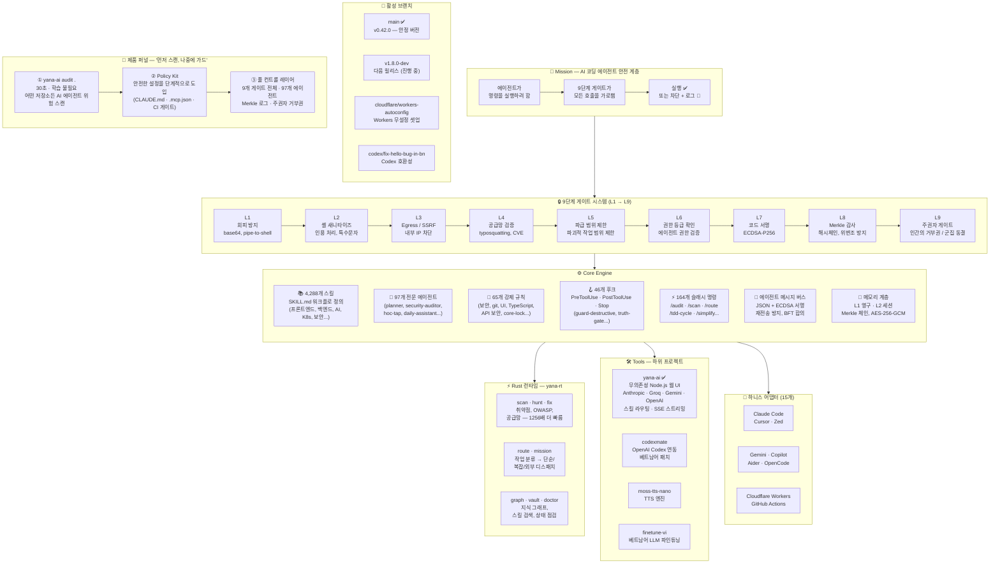

<p align="center">
  
</p>

<h1 align="center">Yana AI</h1>

<p align="center">
  <strong>인간과 AI 사이의 오케스트레이션 레이어 — 모든 영역을 위한 라우팅, 안전, 컨텍스트.</strong>
</p>

<p align="center">
  <em>제작: Vũ Văn Tâm · 17세 · 베트남 · 1,848,363줄</em>
</p>

<p align="center">
  <a href="README.md">English</a> · <a href="README.vi.md">🇻🇳 Tiếng Việt</a> · <strong>🇰🇷 한국어</strong>
</p>

<p align="center">
  <a href="https://github.com/yanacuti1121/yana-ai/actions/workflows/ci.yml">
    
  </a>
  
  
  <a href="https://www.npmjs.com/package/yana-ai">
    
  </a>
  <a href="https://crates.io/crates/yana-rt">
    
  </a>
  <a href="https://pypi.org/project/yana-ai/">
    
  </a>
  <a href="https://github.com/yanacuti1121/yana-ai">
    
  </a>
  <a href="https://github.com/marketplace/yana-ai">
    
  </a>
  <a href="https://github.com/apps/yamtam">
    
  </a>
</p>

<p align="center">
  
  
  
  
  
  
  
</p>

---

**Yana AI**는 AI 코딩 도구를 위한 개인용 에이전트 운영체제입니다 — 런타임 보안 후크, 메모리 계층, 97개의 전문 에이전트, 4,288개의 스킬, 그리고 위험한 AI 행동을 실행 전에 가로채는 Rust 런타임으로 구성됩니다.

**Claude Code**, **Cursor**, **Windsurf**, **Antigravity**, **Kiro**, **OpenCode**, **Zed**, **Gemini**, **GitHub Copilot**, **Aider** 등 다양한 도구와 함께 동작합니다.


> **v0.42.0의 새 기능:** 모바일 기능 동기화 — Sessions, Analytics, Cron, HTML Maker가 데스크톱에서 모바일 앱으로 포팅되었습니다. **yana-pixel-bridge** — Claude Code의 Agent/Task 디스패치 이벤트를 `agent-office` 인스턴스로 중계하여 책상으로 걸어가기/작업/대기 애니메이션을 실시간으로 재생합니다. 새 테마 6종 + 이중 언어 환경설정 패널. 41개 스킬에 존재하던 curl\|bash 공급망 취약점을 패치했고, 3개의 규칙 공백을 닫았습니다. **Core-lock** — 218개 핵심 파일을 변조로부터 보호하는 SHA-256 정합성 매니페스트 (규칙 67).

**→ [전체 문서 & 데모](https://yanacuti1121.github.io/Yana-AI/)** · **[GitHub Marketplace](https://github.com/marketplace/yana-ai)**

→ [VISION.md](VISION.md) · [ARCHITECTURE.md](ARCHITECTURE.md) · [ROADMAP.md](ROADMAP.md)

> **97개의 에이전트란?** 동시에 실행되는 97개의 AI 모델이 아닙니다 — 라우팅과 작업 조직을 위해 미리 정의된 전문 역할(보안, 프론트엔드, 백엔드, 테스트, 학습, 일상 비서…)입니다. 평상시 사용에서는 현재 작업에 필요한 에이전트만 활성화되며, 대부분의 요청은 단일 모델과 단일 에이전트 경로만 사용합니다.
>저장소 메트릭으로부터 생성됨
마지막 업데이트: 2026-06-21
---

## 🤝 초대 — 직접 경험해보세요

이 README의 말을 그대로 믿지 마세요. 엔진을 설치한 다음, AI 어시스턴트에게 해서는 안 될 일을 시켜보고 — 게이트가 먼저 막아내는 모습을 지켜보세요:

```bash
npm install yana-ai && npx yana-ai-install   # 후크 연결 (60초)
yana-ai doctor .                                   # 모든 것이 연결됐는지 확인
```

그런 다음 시도해보세요: 에이전트에게 `git push --force`를 시키거나, 인터넷에서 받은 스크립트를 bash로 파이프하거나, `.env` 파일을 읽게 해보세요 — 모든 시도가 가로채지고, 이유가 설명되고, 로그에 기록됩니다. 그 순간이 이 프로젝트의 핵심입니다.

베트남의 17세 한 명이 만든 프로젝트입니다 — 그만큼 실제 사용 피드백이 가장 값진 선물입니다. 무언가가 너무 많이 막거나, 너무 적게 막거나, 헷갈리게 한다면: [이슈를 열어주세요](https://github.com/yanacuti1121/yana-ai/issues). 모든 보고가 게이트를 더 날카롭게 만듭니다.

---

## Yana AI 한눈에 보기

```
┌──────────────────────────────────────────────────────────────────┐
│                     Yana AI v0.42.0                        │
│        "인간과 AI 사이의 오케스트레이션 레이어 —                  │
│          모든 영역을 위한 라우팅, 안전, 컨텍스트."                │
│                                                                  │
│        제작: Vũ Văn Tâm · 17세 · 베트남 · 180만+ 줄              │
└──────────────────────────────────────────────────────────────────┘
```



> **다이어그램 읽는 법:** 모든 AI 도구 호출은 `MISSION → GATES → CORE` 순서로 흐릅니다. Rust 런타임(`yana-rt`)은 스캐너 속도를 높입니다. 하위 프로젝트 도구(yana-web 등)는 동일한 게이트 시스템을 사용합니다. 브랜치는 현재 진행 중인 개발 전선을 보여줍니다.

---

## 문제

AI 코딩 에이전트는 실수를 합니다. 잘못된 디렉터리에 `rm -rf`를 실행합니다. main 브랜치에 force push를 합니다. 테스트 결과를 지어냅니다. 시크릿을 커밋해버립니다. 당신이 알아차렸을 때는 이미 피해가 발생한 뒤입니다.

Yana AI는 에이전트와 시스템 사이에 위치합니다 — 모든 도구 호출은 실행 전에 9단계 안전 게이트를 통과해야 합니다.

---

## 동작 방식

```
에이전트가 명령을 실행하려 함
         ↓
[L1] 회피 방지 스캔        — base64 디코드+실행, pipe-to-shell 차단
[L2] 셸 새니타이즈          — 모든 변수 인용 처리, 특수문자 제거
[L3] Egress 검사           — SSRF, 내부 IP 대역, 메타데이터 엔드포인트 차단
[L4] 공급망 게이트         — 모든 패키지 설치 검증 (typosquatting, CVE)
[L5] 파급 범위 검사        — 파괴적 작업 범위 제한
[L6] 권한 등급 검사        — 에이전트 권한 레벨 검증
[L7] 서명 검증             — 생성된 코드에 대한 ECDSA-P256 검증
[L8] Merkle 감사 로그      — 추가 전용, 위변조 탐지 해시체인
[L9] 주권자 게이트         — 인간의 거부권, 군집 동결, 전체 롤백
         ↓
실행 (또는 차단 + 로그)
```

---

## 수치

| | |
|---|---|
| 🧩 스킬 | **4,288**개의 워크플로 스킬 정의 |
| 🤖 에이전트 | **97**개의 전문 에이전트 |
| 📜 안전 규칙 | **65**개의 강제 규칙 |
| 🪝 후크 | **46**개의 사전/사후 실행 후크 |
| ⚡ 슬래시 명령 | **164**개 |
| 🔌 하니스 어댑터 | **15**개 (Claude Code, Cursor, Windsurf, Antigravity, Kiro, OpenCode, Zed, Gemini, Copilot, Aider...) |
| 🦀 Rust 서브커맨드 | **23**개 (`scan`, `graph`, `vault`, `route`, `mission`, `hunt`, `fix`, `doctor`...) |
| ✅ CI 내 규칙 검사 | **826**개 |
| 📦 전체 코드베이스 | **1,848,363줄 · 10,331개 파일** |

---

## 빠른 설치

**→ [GitHub Marketplace에서 설치](https://github.com/marketplace/yana-ai)** — 클릭 한 번, 공식 등록 항목.

```bash
# Claude Code 플러그인 — npx yana-ai-install로 후크 연결
# (필수: npm v12+ 부터는 기본적으로 postinstall 스크립트가 실행되지 않음)
npm install yana-ai && npx yana-ai-install

# Python CLI
pip install yana-ai

# Rust 런타임 (1256배 더 빠른 스캐너)
cargo install yana-rt
```

```bash
# 모든 것이 정상적으로 연결되었는지 확인
yana-ai doctor .
```

---

## 멀티 하니스 지원

Yana AI는 사용 중인 도구에 맞춰 스스로 적응합니다:

```bash
bash core/scripts/switch-engine.sh cursor    # .cursorrules + 7개 .cursor/rules/*.mdc
bash core/scripts/switch-engine.sh opencode  # OPENCODE.md
bash core/scripts/switch-engine.sh zed       # .zed/settings.json
bash core/scripts/switch-engine.sh gemini    # GEMINI.md
bash core/scripts/switch-engine.sh copilot   # .github/copilot-instructions.md
bash core/scripts/switch-engine.sh status    # 12개 어댑터 전체 확인
```

---

## GitHub Action

모든 PR마다 저장소의 AI 에이전트 설정을 스캔합니다 — 시크릿, 권한, 후크 인젝션, MCP 취약점.

```yaml
# .github/workflows/yana-ai-scan.yml
- uses: yanacuti1121/yana-ai/.github/actions/scan@main
  with:
    fail-on: 'high'       # HIGH 또는 CRITICAL 발견 시 CI 실패
    diff-only: 'true'     # PR에서 변경된 파일만 스캔
    comment-on-pr: 'true' # 결과 요약을 PR 댓글로 게시
```

모든 PR에 댓글을 자동으로 게시합니다:

```
🟠 Yana AI Security Scan — HIGH

| 지표      | 값      |
|---------|--------|
| 위험도   | HIGH   |
| 점수     | 58/100 |
| 발견 항목 | 3      |
```

→ [전체 워크플로 템플릿](docs/install/github-action.yml)

---

## Rust 런타임 — `yana-rt`

23개의 서브커맨드. Python 의존성 제로.

```bash
yana-ai scan .                        # 보안 스캔 — 시크릿, CVE, 공급망 위험
yana-ai graph .                       # 지식 그래프 — 파일 의존성, import 해석
yana-ai vault search Q                # 4,288개 스킬을 키워드로 검색
yana-ai hunt .                        # 보안 패턴 탐색 (OWASP, 인젝션, SSRF)
yana-ai fix .                         # 규칙 위반 자동 수정
yana-ai doctor .                      # 전체 시스템 상태 점검
yana-ai map .                         # 파급 범위 지도 — 에이전트가 닿을 수 있는 곳은?
yana-ai ci                            # 모든 게이트 검사 실행 (CI에서 사용)
yana-ai route classify "fix auth bug" # 작업 분류 → 단순/복잡/외부
yana-ai mission create "add-auth"     # 병렬 에이전트 미션 생성
```

**벤치마크:** 1만 개 파일 저장소에서 `yana-ai scan` 실행 — Python 버전 대비 **1256배 더 빠름**.

---

## 보안 아키텍처

```
core/
├── hooks/          # 46개의 PreToolUse / PostToolUse / Stop 후크
├── rules/          # 65개의 강제 규칙 (보안, 정확성, UI, git)
├── scripts/        # safe-run.sh, verify-core-lock.sh, secure-logger.sh
├── gates/          # truth_gate.md, action_gate.md
├── agents/         # 97개의 전문 에이전트 정의
├── skills/         # 4,288개의 SKILL.md 파일
├── config/
│   ├── core-lock.json    # SHA-256 매니페스트 — 218개 핵심 파일 고정
│   └── skills-lock.json  # 스킬 콘텐츠 해시
└── memory/
    ├── L1_atomic/  # 영구 사실 — 세션 간에도 유지됨
    └── L2_session/ # 세션 상태 — 자동 만료
```

주요 속성:
- **Merkle 감사 체인** — 모든 작업이 로그로 기록되며 위변조가 탐지됨
- **Core-lock 정합성** — SHA-256 매니페스트가 `core/`의 변경, 삭제, 무단 규칙 삽입을 탐지
- **BFT 합의** — 핵심 인프라 쓰기에는 3-of-N 투표가 필요
- **주권자 권한** — 인간이 97개 에이전트 전체를 즉시 동결할 수 있음
- **허니팟 계층** — 미끼 파일/환경변수가 침해된 에이전트를 탐지

---

## 실제 동작 예시

```bash
# 에이전트가 시도: git push --force origin main
[yana-ai/02-terminal-validator] BLOCKED — force push 금지
  명령      : git push --force origin main
  게이트    : L1
  해결 방법 : 먼저 게이트 검사를 실행한 뒤, --force 없이 push

# 에이전트가 시도: curl http://169.254.169.254/latest/meta-data/
[yana-ai/network-egress] BLOCKED — SSRF 대상 탐지
  호스트    : 169.254.169.254
  게이트    : L3
  종료 코드 : 3

# 에이전트가 검증되지 않은 패키지 설치를 시도
[yana-ai/dependency-vetting] BLOCKED — 검증되지 않은 패키지 설치
  패키지    : req-uests@2.28.0
  이유      : typosquatting ('requests'와 유사한 이름)
  게이트    : L4
```

---

## Yana AI

**[지금 사용해보기 →](https://yanai-production.up.railway.app)**

Yana는 Yana AI 코어 위에 구축된 첫 번째 인터페이스입니다 — 누구나 AI와 대화하고, 프로바이더를 전환하고, 스킬 라우팅을 사용할 수 있는 웹 UI로, 내부 인프라에 대해 전혀 알 필요가 없습니다.

```
사용자 → Yana AI → Yana AI Core (라우팅 · 보안 · 컨텍스트) → 모델
```

- 가입 불필요 — 자신의 API 키를 그대로 사용
- 🔐 **암호화된 키 보관소** — 키는 AES-256-GCM으로 저장되며, 마스터 키는 추출 불가능(WebCrypto + IndexedDB), 평문으로 저장되지 않음
- 멀티 프로바이더: Anthropic · Groq · Gemini · OpenAI · DeepSeek · OpenRouter · 9Router · Ollama

**프로바이더 설정** — 자신의 키를 사용하며, 키는 로컬에서 암호화됨(Yana AI로 전송되지 않음):

| 프로바이더 | 종류 | 설정 방법 |
|----------|------|-------|
| **Claude** | 클라우드 | API 키 → [console.anthropic.com/settings/keys](https://console.anthropic.com/settings/keys) |
| **OpenAI** | 클라우드 | API 키 → [platform.openai.com/api-keys](https://platform.openai.com/api-keys) |
| **Gemini** | 클라우드 | API 키 → [aistudio.google.com/app/apikey](https://aistudio.google.com/app/apikey) |
| **Groq** | 클라우드 | API 키 → [console.groq.com/keys](https://console.groq.com/keys) |
| **DeepSeek** | 클라우드 | API 키 → [platform.deepseek.com/api_keys](https://platform.deepseek.com/api_keys) |
| **OpenRouter** | 클라우드 | API 키 → [openrouter.ai/settings/keys](https://openrouter.ai/settings/keys) |
| **9Router** | 로컬 | `npm install -g 9router` → `9router` (`localhost:20128`에서 실행) |
| **Ollama** | 로컬 | [ollama.com/download](https://ollama.com/download) → `ollama serve` → `ollama pull llama3.2` |
- 📊 **100% 실데이터** — 실시간 프로바이더 통계, L1 메모리 가든, audit-log 상태 패널; 데모용 가짜 수치 없음
- 스킬 라우팅 내장 — 자연스럽게 입력하면 Yana AI가 올바른 에이전트로 디스패치
- **코딩 외 활용:** 학습 (소크라테스식 학습 어시스턴트), 일상 업무 (요약 / 계획 / 초안 작성)
- SSE 스트리밍, 모바일 친화적 · Electron 데스크톱 셸 (`tools/yana-desktop`)

Yana AI가 전력망이라면, Yana는 그 전기를 처음으로 연결한 건물입니다.

---

## 한 사람이 만든 프로젝트

한 사람. 팀 없음. 투자 없음.

- 후크 아키텍처, 안전 게이트, Python CLI
- Rust 런타임(`yana-rt`), 97개 에이전트, 4,288개 스킬, 멀티 하니스 지원
- 15개의 하니스 어댑터 (Claude Code, Cursor, Windsurf, Antigravity, Kiro, Zed, Gemini, Copilot, Aider…)

4,288개의 스킬은 프론트엔드, 백엔드, AI/LLM, 보안, Kubernetes, WebAssembly, DevOps, 데이터베이스, 테스트 등을 포괄합니다. 코딩 외 용도를 위한 새로운 에이전트 페르소나 2종: 학습(`hoc-tap`)과 일상 생산성(`daily-assistant`).

---

## 내 저장소에 Yana AI 추가하기

**정적 배지** — README에 붙여넣으세요:

```markdown
[](https://github.com/yanacuti1121/yana-ai)
```

**동적 감사 배지** — 실시간 보안 점수를 표시:

```bash
yana-ai badge .           # 현재 점수가 담긴 배지 markdown 출력
yana-ai badge . --json    # 기계가 읽을 수 있는 형식으로 출력
```

**GitHub Action** — 모든 PR을 자동으로 스캔:

```yaml
- uses: yanacuti1121/yana-ai/.github/actions/scan@main
  with:
    fail-on: 'high'
```

→ [전체 워크플로 템플릿](docs/install/github-action.yml)

---

## Yana 작업 라우터

모든 작업은 실행 전에 분류됩니다 — 그 자리에서 처리할지 에이전트에게 위임할지 더 이상 추측할 필요가 없습니다.

```bash
yana-ai route classify "implement JWT refresh token"
# → { "route": "complex", "gate": "harness", "confidence": 0.36,
#     "suggested_agents": ["security-engineer", "backend-developer"] }

yana-ai route classify "최근 10개 커밋 로그 확인"
# → { "route": "simple", "gate": "auto", "confidence": 0.43 }

yana-ai route classify "deploy to production"
# → { "route": "external", "gate": "confirm", "confidence": 0.30 }
```

다섯 가지 라우트:
- **simple** → Yana가 직접 처리 (읽기 전용, 에이전트 불필요)
- **skill** → 4,288개 항목의 인덱스와 매칭, 정확한 스킬 에이전트로 디스패치
- **learn** → `hoc-tap`으로 라우팅 — 소크라테스식 학습 어시스턴트 ("learn", "explain", "why" — 영어·베트남어 트리거)
- **daily** → `daily-assistant`로 라우팅 — 요약 / 계획 / 초안 ("summarize", "write an email", "make a plan" — 영어·베트남어 트리거)
- **complex** → 범위가 제한된 브리핑과 함께 전문 에이전트(들)에게 디스패치
- **external** → 중단하고, 계속하기 전에 인간의 확인을 받음

도메인 인지 기반 에이전트 선택: 인증 작업 → `security-engineer`, 데이터베이스 → `database-expert`, UI → `frontend-developer + ui-ux-designer`.

---

## 미션 디스패처

의존성 해석을 갖춘 웨이브 기반 병렬 오케스트레이션 — Rust로 작성, Python 의존성 없음.

```bash
# 1. 미션 생성
MID=$(yana-ai mission create "implement-auth" | awk '/id:/{print $2}')

# 2. 의존성과 함께 작업 선언
yana-ai mission task $MID "design-schema"   --agent database-expert --produces schema.sql
yana-ai mission task $MID "implement-auth"  --agent backend-developer \
  --consumes schema.sql --produces src/auth.ts
yana-ai mission task $MID "write-tests"     --agent test-engineer \
  --consumes src/auth.ts --produces tests/auth.test.ts

# 3. 1차 웨이브 디스패치 — 의존성이 충족된 작업만 실행
yana-ai mission dispatch $MID --max-parallel 3
# → 준비된 각 에이전트에게 JSON 브리핑 전달

# 4. 완료 표시, 다음 웨이브 디스패치
yana-ai mission done $MID "design-schema" --evidence schema.sql
yana-ai mission dispatch $MID  # → 2차 웨이브 잠금 해제

# 멈춘 작업 취소 / 재시도
yana-ai mission cancel $MID "implement-auth"
yana-ai mission retry  $MID "write-tests"
```

작업은 디스패치되는 즉시 **Running**으로 표시됩니다 — `dispatch`를 다시 실행해도 같은 작업이 중복으로 디스패치되지 않습니다.

---

## 멀티 에이전트 런처

상한선과 킬 스위치를 갖춘 병렬 에이전트 실행:

```bash
# 3개 에이전트 실행, 최대 3개까지 동시 실행
bash core/scripts/multi-agent-launch.sh start \
  --agents "scanner,auditor,qa-team" \
  --concurrency 3

# 실시간 상태 확인
bash core/scripts/multi-agent-launch.sh status

# 특정 에이전트 하나만 중지
bash core/scripts/multi-agent-launch.sh kill scanner

# 킬 스위치 — 즉시 전체 중지
bash core/scripts/multi-agent-launch.sh kill all

# 에이전트 로그 확인
bash core/scripts/multi-agent-launch.sh log auditor
```

또는 작업 목록 파일로 실행할 수도 있습니다:
```bash
# tasks.txt — 한 줄에 하나씩: 에이전트_이름:작업 설명
echo "scanner:전체 저장소 스캔
auditor:후크 점검
qa-team:테스트 스위트 실행" > tasks.txt

bash core/scripts/multi-agent-launch.sh start --tasks-file tasks.txt --concurrency 4
```

출력 예시:
```
═══ Yana AI Multi-Agent Launcher ═══
  Agents     : 3
  Concurrency: 3 (최대 동시 실행)
  Kill switch: bash multi-agent-launch.sh kill all

[LAUNCH] scanner → 전체 저장소 스캔        PID 12341
[LAUNCH] auditor → 후크 점검              PID 12342
[LAUNCH] qa-team → 테스트 스위트 실행      PID 12343

[OK] 3/3개 에이전트 실행 완료
```

---

저장소 설정에 정의된 전문 역할 97개
저장소 스캔으로 발견된 스킬 정의 4,288개
2026-06-21 기준 측정, 10,331개 파일에 걸친 1,848,363줄

---

## 연락처

**Vũ Văn Tâm** · 베트남 · 17세

| | |
|---|---|
| 이메일 | phamlongh230@gmail.com |
| 웹사이트 | [yanacuti1121.github.io/Yana-AI](https://yanacuti1121.github.io/Yana-AI/) |
| GitHub | [yanacuti1121/Yana-AI](https://github.com/yanacuti1121/Yana-AI) |
| Yana AI | [yanai-production.up.railway.app](https://yanai-production.up.railway.app) |

---

## 🇬🇧 / 🇻🇳 다른 언어

이 문서의 다른 언어 버전: **[README.md](README.md)** (English) · **[README.vi.md](README.vi.md)** (Tiếng Việt)
