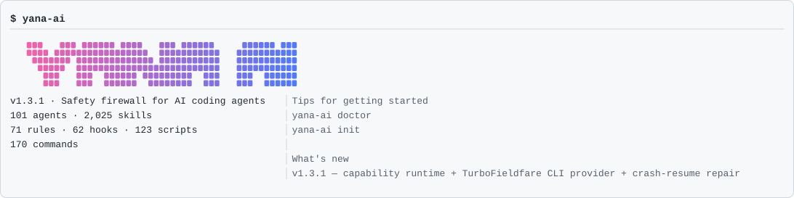

<p align="center">
  <picture>
    <source media="(prefers-color-scheme: dark)" srcset="docs/yana-banner-dark.svg">
    
  </picture>
</p>

<p align="center">
  <a href="README.md">English</a> · <a href="README.vi.md">Tiếng Việt</a> · <a href="README.ko.md"><strong>한국어</strong></a> · <a href="README.zh.md">中文</a>
</p>

<h1 align="center">Yana AI 🐰</h1>

<p align="center">
  <a href="https://github.com/yanacuti1121/Yana-AI/actions/workflows/ci.yml"></a>
  <a href="https://crates.io/crates/yana-rt"></a>
  <a href="https://pypi.org/project/yana-ai/"></a>
  <a href="LICENSE"></a>
  <a href="CONTRIBUTING.md"></a>
</p>

<p align="center"><em>Vũ Văn Tâm 제작 · 베트남</em></p>

---

## 하나의 런타임. 모든 AI. 인간이 통제합니다.

Yana는 서로 독립적인 AI 모델과 에이전트를 하나의 거버넌스가 적용된, 지속되는 시스템으로 통합합니다 — 최종 권한은 언제나 인간에게 있습니다.

AI 모델은 추론, 계획, 코딩, 도구 사용에 강력합니다. 하지만 지능만으로는 신뢰할 수 있는 AI 시스템이 만들어지지 않습니다. 모델은 바뀌고, 컨텍스트는 사라지고, 에이전트는 종료되고, 프로바이더는 장애를 일으키고, 도구마다 권한이 다르며, 작업은 여러 세션·머신·AI 환경에 걸쳐 이어집니다.

**Yana는 이 조각들을 하나로 묶어주는 control plane을 제공합니다.**

```
                         HUMAN
                    final authority
                          │
                          ▼
                    ┌───────────┐
                    │   YANA    │
                    │ControlPlane│
                    └─────┬─────┘
                          │
      ┌───────────────────┼───────────────────┐
      │                   │                   │
      ▼                   ▼                   ▼
 Intelligence        Continuity          Governance
 models/providers   missions/memory    authority/policy
      │                   │                   │
      └───────────────────┼───────────────────┘
                          ▼
                 Canonical Capabilities
                          │
                          ▼
                  Bounded Execution
                          │
                          ▼
                    Real Environment
```

### 지능은 권한이 아닙니다

이것이 Yana의 근본 원칙입니다. AI 모델은 무엇을 하고 싶은지 스스로 결정할 수 있습니다. 그렇다고 해서 그것을 실행할 권한이 있다는 뜻은 아닙니다.

모델에게 셸, 파일시스템, 프로세스, 리포지토리, 개발 환경에 대한 무제한 접근을 허용하는 대신, Yana는 다음을 분리합니다:

```
INTELLIGENCE (지능)
"나는 무엇을 해야 하는가?"
        │
        ▼
PROPOSAL (제안)
"이 도구를 실행하고 싶다."
        │
        ▼
AUTHORITY (권한)
"이것이 허용되는가?"
        │
        ▼
CAPABILITY (능력)
"이것은 정확히 어떤 권한을 의미하는가?"
        │
        ▼
POLICY / HUMAN APPROVAL (정책 / 인간 승인)
"지금 실행해도 되는가?"
        │
        ▼
BOUNDED EXECUTION (제한된 실행)
"허용된 작업만 정확히 수행한다."
```

다시 말해: **모델은 지능을 제공하고, Yana는 capability를 통제하며, 인간이 최종 권한을 갖습니다.**

### 단순한 에이전트 프레임워크 그 이상

대부분의 에이전트 프레임워크는 *에이전트를 얼마나 강력하게 만들 수 있는가?* 라는 질문만 던집니다. Yana는 더 큰 시스템 차원의 질문을 던집니다: *여러 모델, 여러 에이전트, 여러 도구, 여러 워크스페이스, 장기 실행 작업을 하나의 시스템으로 운영하면서도 그 권한을 통제 가능하게 유지하려면 어떻게 해야 하는가?*

이 차이가 아키텍처 자체를 바꿉니다. Yana는 하나의 고정된 AI를 중심으로 만들어지지 않았습니다 — 모델과 에이전트는 지속되는 시스템 안에서 언제든 교체 가능한 작업자가 될 수 있습니다. **모델은 일시적일 수 있습니다. 에이전트도 일시적일 수 있습니다. Yana는 이들을 둘러싼 지속적인 control plane입니다.**

그 아래에는: 개별 도구 호출이 아니라 에이전트 생명주기를 관리하는 로컬 management plane(Yana OS), 스킬(에이전트가 무엇을 아는지)과 capability(에이전트가 실제로 무엇을 실행해도 되는지)를 명확히 구분하는 경계, 그리고 지원되는 모든 harness — Claude Code, Codex, Cursor, Antigravity — 에 걸쳐 하나로 materialize되는 canonical `core/` 계층이 있습니다. 그래서 AI 엔진을 바꿔도 거버넌스를 처음부터 다시 만들 필요가 없습니다. 전체 내용은 아래 [심층 아키텍처](#심층-아키텍처)에서 확인하세요.

> 모델은 바뀔 수 있습니다. 권한은 바뀌지 않습니다.

---

*이 구분선 아래는 더 깊이 들어갑니다 — 설치, 위험한 명령을 실시간으로 막는 모습, 전체 런타임 아키텍처, 알려진 한계까지 — 현재 코드베이스를 기준으로 검증된 내용이며 희망 사항이 아닙니다.*

## 원하는 첫 번째 결과를 선택하세요

<table>
<tr>
<td width="33%" valign="top">

### 로컬 AI 실행

Rust 기반 터미널 workspace를 로컬 provider로 실행합니다.

```bash
cargo install yana-rt
yana-ai-rt --provider ollama
```

스트리밍, 취소, 탭, 세션, 모델 전환, 보호된 도구를 제공합니다.

</td>
<td width="33%" valign="top">

### 리포지토리 통제

지원되는 adapter surface를 기존 프로젝트에 적용합니다.

```bash
pip install yana-ai
cd your-project
yana-ai install
yana-ai doctor .
```

규칙, 훅, 에이전트, 스킬, 명령, 무결성 검사를 프로젝트 안에 둡니다.

</td>
<td width="33%" valign="top">

### 작업 오케스트레이션

네이티브 런타임으로 작업을 라우팅하고 dependency-aware mission을 만듭니다.

```bash
yana-rt route classify "fix auth"
yana-rt mission create "add-auth"
```

하나의 CLI에서 evidence, capability, memory, workspace, OS control을 사용합니다.

</td>
</tr>
</table>

> 처음이라면 [빠른 설치](#빠른-설치)부터 시작하세요. 플랫폼을 만든다면 [아키텍처 문서](docs/reference/architecture.md)를 읽으세요. 안전 경계를 평가한다면 기능 목록보다 먼저 [알려진 한계](#알려진-한계)를 확인하세요. 이 프로젝트가 어떻게 여기까지 왔는지 궁금하다면 [프로젝트 히스토리](docs/reference/history.ko.md)를 읽어보세요.

## 거버넌스가 실제로 작동하는 모습

에이전트가 위험한 작업을 시도하면 Yana가 가로채고, 이유를 설명하고, 기록합니다 — Claude Code와 Cursor에서는 강제 차단, Codex와 Antigravity에서는 권고(advisory) 수준입니다.

```bash
pip install yana-ai && yana-ai install   # 훅 연결 (60초)
```

> **알려진 문제, 2026-07-25에 수정됨:** 오래된 PyPI 설치본의 `yana-rt`가 자기 재귀로 CPU 100%를 유발할 수 있었습니다 — 사건 경위는 [CHANGELOG.md](CHANGELOG.md) 참고. `pip install -U yana-ai` (또는 처음부터 영향받지 않은 `cargo install yana-rt`)로 해결됩니다.

이제 에이전트에게 나쁜 짓을 시켜보고 지켜보세요.

<p align="center">
  
</p>

아래 모든 예시는 2026-07-04에 `core/hooks/guard-destructive.sh`를 실제로 실행한 결과를 그대로 붙여넣은 것이며, 홍보용 문구가 아닙니다 (이 가드가 아직 잡아내지 못하는 것은 [알려진 한계](docs/reference/known-limitations.md) 참고):

```bash
# Agent tries: git push --force origin main
Blocked: 'git push --force' (any flag spelling) is not allowed. The
orchestrator pushes branches; force-pushing risks overwriting shared history.

# Agent tries: rm -rf /some/path
Blocked: 'rm -rf' (recursive + force, any flag spelling) is irreversible.
Use targeted 'rm' with explicit paths, or ask the human to confirm first.

# Agent tries: git clean -f
Blocked: 'git clean -f' (any flag spelling) permanently deletes untracked
files. Ask the human to confirm before running this.
```

이것이 전체 핵심입니다: 결정론적(deterministic) 규칙, 로컬 실행, 판단 경로에 LLM 없음, 어떤 데이터도 당신의 컴퓨터를 벗어나지 않습니다. 어떤 것이 실제로 연결된 훅이고 어떤 것이 에이전트가 관례적으로 따르는 정책 문서인지는 [알려진 한계](docs/reference/known-limitations.md)에서 코드 자체를 직접 검증한 내용으로 확인하세요.

---

## Yana가 하나로 묶는 것

| 계층 | 개발자 가치 | 주요 surface |
| --- | --- | --- |
| **런타임** | 네이티브 chat, state, routing, health, 프로젝트 작업 | `yana-rt`, `yana-ai-rt` |
| **모델** | 클라우드를 배제하지 않는 로컬 우선 실행 | 19개 provider의 Rust catalog: 로컬 runtime 5개 + cloud/API adapter 14개 |
| **어댑터** | 지원되는 harness 전반의 하나의 통제된 프로젝트 contract | Claude Code, Codex, Cursor, Antigravity |
| **오케스트레이션** | Task, mission, memory, evidence, workspace | router, mission dispatcher, event bus |
| **거버넌스** | 결정론적 검사, audit chain, quarantine, HALT, human gate | capability, hook, Yana OS, Giám Thị |

```text
 Terminal · Discord · Electron Desktop       Claude Code · Codex · Cursor · Antigravity
                    │                                           │
                    └──────────── 통제된 진입 경로 ──────────────┘
                                         │
                              Giám Thị 최상위 권한
                         HALT · quarantine · human unlock
                                         │
                               Yana control plane
                    policy · identity · evidence · capability
                              ┌──────────┴──────────┐
                              │                     │
                    Rust TurnEngine          프로젝트 adapter
              stream · cancel · tool loop    hook · rule · gate
                     ┌────────┴────────┐
                provider plane    capability plane
                local + cloud      file · Git · process
```

권한 체계는 하나지만 모든 통합이 같은 메커니즘을 쓴다고 가장하지 않습니다. 터미널 채팅, Discord, Electron Desktop은 타입이 지정된 turn을 Rust `TurnEngine`으로 보냅니다. Claude Code, Codex, Cursor, Antigravity는 프로젝트 로컬 adapter, hook, rule, gate를 통해 통제되는 네이티브 harness로 남습니다. Rust runtime이 설정되지 않은 브라우저 전용 Yana 배포는 기존 JavaScript gateway를 계속 사용하며, README는 이를 완전히 통제된 경로라고 과장하지 않고 명시적인 boundary로 기록합니다.

### 하나의 런타임, 여러 인터페이스

| 인터페이스 | 연결 대상 | 거버넌스 경계 |
| --- | --- | --- |
| **터미널 + Desktop + 패키지 Web** | 표준 Rust catalog의 모든 로컬·클라우드 provider | 하나의 `TurnEngine`, 하나의 capability 권한 경로, 하나의 Giám Thị HALT 경계 |
| **Discord** | 인증 및 채널/사용자 allowlist가 적용된 원격 채팅 | 동일한 provider catalog와 `TurnEngine`을 사용하며 host/tool capability는 의도적으로 노출하지 않음 |
| **MCP (opt-in)** | 명령 검사와 통제된 repo, Git, host, process, workspace 작업을 위한 stdio tool | Cargo feature `mcp`로 빌드하며, 사람 승인이 필요한 workspace 작업은 MCP에서 거부됨 |
| **Claude Code, Codex, Cursor, Antigravity** | 네이티브 coding-agent harness | Yana 프로세스 내부에서 실행된다고 가장하지 않고 생성된 adapter, hook, rule, gate를 통해 통제 |

따라서 로컬 AI와 클라우드 AI는 하나의 런타임 계약을 공유하지만 하나의 신뢰 영역으로 합쳐지지는 않습니다. Provider 선택은 inference 위치만 바꾸며 Yana의 runtime authority나 canonical capability 경계를 바꾸지 않습니다.

모델 지능은 행동을 제안할 수 있습니다. 결정론적 코드와 인간의 권한이 그 행동을 허용할지 결정합니다.

## 심층 아키텍처

위의 hero는 원칙을 말하고, 이 섹션은 그것이 가리키는 더 자세한 그림입니다.

### AI 시스템을 위한 하나의 control plane

Yana는 보통 분리되어 있던 여러 관심사를 하나의 아키텍처 아래로 가져옵니다.

- **지능(Intelligence)** — 로컬 및 클라우드 모델 프로바이더(Claude, OpenAI, Gemini, DeepSeek, Groq, Ollama, LM Studio, llama.cpp 등)는 시스템 권한을 갖지 않은 채 추론만 제공합니다. 지능 프로바이더를 바꿔도 권한 체계는 바뀌지 않습니다.
- **실행(Execution)** — AI의 의도는 실제 환경에 닿기 전에 canonical capability로 변환됩니다(`model proposal → TurnEngine → RuntimeAuthority → canonical capability → policy/approval → bounded executor → host`). 도구 이름 자체가 스스로에게 권한을 부여할 수는 없습니다.
- **오케스트레이션(Orchestration)** — 개별 AI 턴은 task, mission, routing, event bus, workspace, checkpoint 같은 더 큰 작업 단위에 참여합니다 — 그래서 작업이 하나의 프롬프트-응답 사이클을 넘어 이어질 수 있습니다.
- **상태와 메모리** — session state, memory, mission state, workspace state는 개별 모델 세션 밖에서 보존됩니다. 작업을 수행하는 지능은 바뀔 수 있지만 그 주변의 운영 컨텍스트는 유지됩니다.
- **근거와 책임 추적성** — 실행은 evidence, provenance, audit, 연구 출처, 비용 집계, 정책 결정과 연결됩니다. 질문은 더 이상 "AI가 답을 냈는가?"에 그치지 않고 "무슨 일이 일어났는가, 왜 허용되었는가, 어떤 근거가 뒷받침하는가, 비용은 얼마였는가, 어떤 상태를 남겼는가?"로 확장됩니다.

### Yana OS — AI 시스템 관리

Yana OS는 Linux, macOS, Windows를 대체하지 않습니다 — Yana의 로컬 management plane으로서, 에이전트를 둘러싼 운영 상태를 추론합니다: 어떤 에이전트가 존재하는지, 어떤 identity와 autonomy 수준을 갖는지, 어떤 리소스를 보유하는지, 어떤 작업을 책임지는지, 정상 작동 중인지, 격리(quarantine)되거나 정지(HALT)되어야 하는지. 이는 거버넌스를 개별 도구 호출 단위를 넘어 에이전트 생명주기 관리(identity, agent lifecycle, autonomy, resources, health, monitoring, supervision, leases, governor, quarantine, HALT)로 확장합니다 — 다만 의도적으로 두 번째 실행 엔진이 되지는 않습니다. 실행은 여전히 canonical capability 경계에 속합니다.

### 인간의 권한은 모델보다 상위에 있습니다

```
                    HUMAN
                      │
                      ▼
                  GIÁM THỊ
                HALT / Control
                      │
                      ▼
             YANA CONTROL PLANE
                      │
                      ▼
               RuntimeAuthority
                      │
                      ▼
                Capabilities
                      │
                      ▼
                  Executor
                      │
                      ▼
                     Host
```

아무리 뛰어난 모델이라도 추론을 잘한다는 이유만으로 스스로 최고 권한이 되지는 않습니다. 서브에이전트는 인간의 권한을 자동으로 물려받지 않습니다. 한 번의 승인이 영구적인 권한을 만들지 않습니다. 그리고 시스템은 모델의 의도와 무관하게 실행 권한을 회수할 수 있습니다.

### Skill은 지식입니다. Capability는 권한입니다.

Yana는 방대한 에이전트, 스킬, 커맨드, 룰, 훅 생태계를 유지하지만, 이것들을 실행 권한과는 의도적으로 구분합니다. 스킬은 에이전트에게 작업 수행 방법을 가르칠 수 있지만, capability는 시스템이 실제로 그 작업을 해도 되는지를 결정합니다. 스킬이 천 개 있다고 해서 시스템 권한이 천 개 늘어나는 것은 아닙니다 — 덕분에 Yana의 지식 표면은 신뢰된 실행 표면과 같은 속도로 커질 필요 없이 성장할 수 있습니다.

### 하나의 canonical 운영 계층, 여러 AI 환경

Yana는 모든 AI 제품이 동일한 실행 메커니즘을 쓰도록 강요하지 않습니다. Terminal, Electron Desktop, packaged Web, Discord는 Yana의 Rust 런타임 경로를 사용합니다. 브라우저 전용 Web은 신뢰할 수 있는 런타임에 연결되지 않는 한 호환성 표면으로 남습니다. 다른 제품이 자체 런타임을 소유하는 경우 — Claude Code, Codex, Cursor, Antigravity — Yana는 엔진별 거버넌스 표면을 통해 통합됩니다. 통합 메커니즘은 바뀔 수 있지만 권한 원칙은 바뀌지 않습니다. 하나의 권한 체계가 하나의 가짜 통합 메커니즘을 요구하지는 않습니다.

Yana의 canonical `core/`는 재사용 가능한 운영 지식 — 에이전트, 스킬, 커맨드, 룰, 훅, 스크립트, 정책 — 을 정의하고, 이것이 서로 다른 AI harness(Claude Code, Codex, Cursor 등)로 materialize됩니다. AI 엔진을 바꾼다고 해서 주변 운영 환경을 처음부터 다시 만들 필요는 없습니다. 지능은 바뀔 수 있지만, 워크플로우·거버넌스 원칙·운영 지식·시스템 상태는 그대로 남습니다.

### 더 큰 그림

Yana의 장기적 가치는 단순히 AI 모델을 실행할 수 있다는 데 있지 않습니다 — 모델은 점점 더 교체 가능해지고 있습니다. 에이전트나 스킬의 개수에 있는 것도 아닙니다. 더 강력한 추상화는 그 모델들을 둘러싼 시스템 자체입니다: 교체 가능한 지능과 일시적인 에이전트 작업자를 감싸는 권한, 지속성, 실행.

### 30초 요약

Yana는 서로 독립적인 AI 모델과 에이전트를 하나의 거버넌스가 적용된, 지속되는 시스템으로 통합합니다. 지능을 둘러싼 control plane을 제공합니다: 추론을 위한 모델, 지식과 워크플로우를 위한 에이전트와 스킬, 지속성을 위한 미션과 메모리, 거버넌스가 적용된 실행을 위한 canonical capability.

AI는 추론하고 제안할 수 있습니다. Yana는 그 지능이 어떤 권한을 받을지 결정합니다. 인간이 최종 권한을 갖습니다.

> AI는 생각합니다. Yana는 시스템을 운영합니다. 인간은 계속 통제권을 갖습니다.

## 빠른 설치

**→ [pip install](https://pypi.org/project/yana-ai/)** — `pip install yana-ai`

> **참고 (2026-07-30): npm으로 배포하지 않습니다.** Yana AI는 더 이상 npm 레지스트리에 게시되지 않으며, 앞으로도 계획이 없습니다 — 전체 경위는 [VERSIONING.md](VERSIONING.md#why-product-has-no-registry) 참고. 아래 `pip` 또는 `cargo`를 사용하세요.

```bash
# Python CLI — yana-ai 명령을 설치합니다
pip install yana-ai
yana-ai install                # 현재 프로젝트에 훅을 연결합니다

# Rust 런타임 (범위가 제한된 명령에서 최대 ~12배 빠름 — BENCHMARK.md 참고)
cargo install yana-rt
```

```bash
# 모든 것이 제대로 연결되었는지 확인
yana-ai doctor .
```

### 요구 사항

- Python 3.11+ (pip 패키지용) 또는 Rust/Cargo (`cargo install yana-rt`용)
- Git
- 지원되는 4개 하니스 중 하나: [Claude Code](https://claude.ai/code), Cursor, Codex, Antigravity — 아래 [멀티 하니스 지원](#멀티-하니스-지원) 참고. 다른 도구는 아직 연결되어 있지 않습니다 — 새 도구를 추가한다는 것은 실제 어댑터를 작성하는 것이지, 단순히 지원한다고 주장하는 것이 아닙니다.

### 소스에서 클론하기

```bash
git clone https://github.com/yanacuti1121/yana-ai.git
cd yana-ai
npm install
bash install.sh                 # 훅 + 설정을 프로젝트에 복사
yana-ai doctor                  # 확인
```

---

## 멀티 하니스 지원

Yana AI는 사용하는 도구에 맞춰 적응합니다:

```bash
bash core/scripts/switch-engine.sh cursor      # .cursorrules + 실제 beforeShellExecution 훅
bash core/scripts/switch-engine.sh codex       # AGENTS.md
bash core/scripts/switch-engine.sh antigravity # .agent/rules/yana-ai.md
bash core/scripts/switch-engine.sh status      # 4개 어댑터 전체 확인
```

---

## 저장소 구조

위 표는 런타임 아키텍처를 설명합니다. 아래는 그것이 실제로 위치한
디렉터리 트리이며, 알파벳순이 아니라 각 경로가 하는 일에 따라
묶었습니다. 이름이 비슷한 두 쌍의 디렉터리는 실제로는 서로 다른
것이며, 구분이 중요한 곳에 아래에서 표시했습니다:

| 경로 | 내용 |
| --- | --- |
| `src/` | `yana-rt` Rust 바이너리. 아래 [`src/` 내부](#src-내부-yana-os와-다른-plane들) 참고. |
| `core/` | rule/hook/skill/agent 콘텐츠, 이를 강제하는 JS/shell 코드, audit + trust 상태(`core/memory/`). [안전 아키텍처](#안전-아키텍처) 참고. |
| `gates/` | Markdown으로 작성된 gate **정책 명세**(`action_gate.md`, `truth_gate.md` 등) — 이를 구현하는 JS/shell 코드인 `core/gates/`와는 다릅니다. |
| `scripts/` | `yana-rt` 바이너리를 빌드/래핑하는 데 특화된 소수의 스크립트 — `core/scripts/`의 일반 hook/안전 스크립트 130개 이상과는 다릅니다. |
| `memory/` | 최상위 L1 atomic fact와 L2 session 상태 — `core/memory/`의 audit 로그 및 trust ledger와는 다릅니다. |
| `scanner/` | `src/scanner/`가 컴파일하고 실행하는 YAML 위험 검사 규칙 정의(`shell-risk-checks.yml`, `auth-credential-checks.yml` 등). |
| `policy/`, `guards/`, `router/`, `prompts/` | 그 외 선언형 설정: 정책 템플릿, guard 인덱스, `route.rs` 뒤에 있는 모델 라우팅 정책, system prompt. |
| `tools/yana-web/` | 브라우저 대시보드(Node 서버 + 클라이언트). |
| `tools/yana-desktop/` | Electron 데스크톱 셸. |
| `tools/` (그 외) | 독립 유틸리티: `airllm-bridge`, `codexmate`, `moss-tts-nano`, `yana-pixel-bridge`, 그리고 몇 개의 일회성 스크립트. |
| `bin/yana` | 설치된 CLI 진입점. |
| `adapters/` | harness별 adapter 문서(Claude Code, Codex, Cursor, Antigravity). |
| `docs/` | 아키텍처 노트, ADR, 인시던트 기록, docs 사이트 콘텐츠. |
| `site/` | Astro로 빌드한 마케팅/docs 웹사이트. |
| `examples/` | spec 예제, context-pack, 그리고 scanner 자체 테스트가 스캔 대상으로 쓰는 의도적으로 취약한 테스트 저장소. |
| `demo/` | 이 README 상단의 터미널 데모를 녹화하는 스크립트. |
| `tests/` | Python 테스트 스위트. |
| `ops/` | 릴리스 서명 및 release-gate 서비스 스크립트. |
| `releases/`, `artifacts/` | 릴리스 로그와 빌드 아티팩트. |
| `reports/`, `ledger/` | 스캔 리포트 스키마/템플릿과 토큰 사용량 추적 스키마. |
| `github-app/` | GitHub App 통합. |
| `vendor/` | Yana AI가 적용하는 외부 프로젝트의 vendored 참조 사본, `hermes-agent`, `openclaw`, `penpot` 포함. |

다섯 번째, 독립적으로 버전이 매겨지는 축인 PyPI 배포 Python 패키지는
별도의 최상위 디렉터리가 아니라 `src/yana_ai/`에 있습니다.

### `src/` 내부: Yana OS와 다른 plane들

`yana-rt`는 하나의 바이너리이지만 하나의 모듈은 아닙니다. 위에서 설명한
turn runtime(`runtime/`, `model/`, `capability/`, `chat/`, `remote/`,
`mcp.rs`) 외에도 `src/` 안에는 네 개의 plane이 더 있습니다:

**Yana OS**(`src/os/`, 내부적으로 "Program K")는 turn 루프와 분리된
로컬 관리 plane입니다:

- `identity/` — guest / operator / sovereign 인증 tier
- `autonomy.rs` — 자율성 사다리(감독 없이 agent가 할 수 있는 범위)
- `governor.rs` — 그 사다리 위에 있는 행동 제한
- `credential.rs` — credential 처리
- `resource/` — CPU/RAM/PID quota
- `supervisor.rs` — HALT 락 파일을 읽고 씀; 이것이 런타임의 authority
  chain이 매 turn마다 호출하는 함수이며, 아래에서 설명하는 독립
  watcher가 쓰는 것과 같은 파일입니다
- `service/`(`manager.rs`, `runtime.rs`, `attribution.rs`) — 데몬
  생명주기 관리
- `agent.rs`, `health.rs`, `monitor.rs`, `monitor_service.rs`,
  `state.rs`, `status.rs`, `roadmap.rs`, `platform/`

**보안 및 audit**(`guard/`, `scanner/`, `score/`, `evidence/`,
`provenance/`, `filescan/`)는 `yana-rt audit`, `yana-rt hunt`, 커밋
전 rule 스캔을 지원하는 도구입니다: 가장 빈번한 PreToolUse hook을
네이티브 Rust로 포팅한 것, rule 매칭 엔진, CRITICAL/HIGH/MEDIUM/LOW
심각도 채점기, Truth Gate provenance, 그리고 `core/lib/*_adapted/`로
포팅된 코드가 vendor한 원본과 여전히 일치하는지 확인하는 검사입니다.

**Workspace 및 memory**(`workspace/`, `memory.rs`, `vault/`,
`session_context.rs`)는 통합된 로컬 이벤트 저장소, L1/L2 fact 시스템,
자체 검색 인덱스를 가진 secret vault, 그리고 모든 클라이언트(chat,
MCP, Desktop)가 turn을 구성할 때 쓰는 단일 `SessionContext` 타입입니다.

**운영 도구**는 나머지 CLI 표면입니다: `init`, `doctor`, `fix`,
`watch`, `monitor`, `observability`, `config`, `cost`, `route`,
`plugin`, `task`, `skill_quality`, `spec`, `graph`, `hunt`, `ci`,
`design`, `mission`, `bus`, 그리고 `flock_v1`(이 목록의 나머지가 동시
writer 아래에서 상태를 손상시키지 않도록 의존하는 프로세스 간 파일
락).

다섯 번째, 독립적인 축인 `src/yana_ai/`(`rt.py`, `cli.py`)는 PyPI로
배포되는 Python CLI입니다. Rust 바이너리와 별도로 패키징되고
버전이 매겨집니다; `VERSIONING.md` 참고.

---

## Rust 런타임 — `yana-rt`

전체 feature build의 source에는 34개 서브커맨드가 정의되어 있습니다. Python 의존성 없음. 기본 build는 runtime 명령 32개를 노출하고 Clap이 보이는 `help` 항목을 추가하며, `mcp`와 `remote`는 feature-gated입니다.

```bash
yana-ai chat                          # 표준 provider catalog를 사용하는 통제된 streaming chat
yana-ai presentation                  # 질문 → 미리보기 → 확인 → 편집 가능한 PPTX 다운로드
yana-ai audit .                       # 보안 스캔 — secrets, CVE, 공급망 위험
yana-ai graph .                       # 지식 그래프 — 파일 의존성, import 해석
yana-ai vault search Q                # 2,025개 스킬을 키워드로 검색
yana-ai hunt .                        # 보안 패턴 탐지 (OWASP, injection, SSRF)
yana-ai fix .                         # 규칙 위반 자동 수정
yana-ai doctor .                      # 전체 시스템 상태 점검
yana-ai map .                         # blast radius 맵 — 에이전트가 건드릴 수 있는 범위
yana-ai ci                            # 모든 게이트 검사 실행 (CI에서 사용)
yana-ai route classify "fix auth bug" # 작업 분류 → simple/complex/external
yana-ai mission create "add-auth"     # 병렬 에이전트 미션 생성
```

### Presentation Studio — 원본 자료에서 편집 가능한 슬라이드까지

`yana-ai presentation`은 단순히 “슬라이드 몇 장을 작성해 줘”라고 한 번
요청하는 기능이 아닙니다. 학생, 교사, 기술 브리핑 사용자처럼 AI가 파일을
만들기 전에 전체 계획을 검토하려는 사람을 위한 human-gated workflow입니다.

```text
명확한 질문
        ↓
TXT / Markdown / HTML / DOCX / PPTX / PDF 원본 읽기
        ↓
전체 슬라이드 개요 생성 및 표시
        ↓
확인 · 수정 · 취소
        ↓
편집 가능한 PPTX bundle을 Downloads에 저장
```

Yana는 주제, 청중, 언어, 슬라이드 수, 시각 스타일, 학습 목표, 원본 문서,
인용 여부, 발표자 노트를 먼저 묻습니다. 사용자가 표시된 개요를 확인하기
전에는 어떤 프레젠테이션 파일도 작성하지 않습니다.

```bash
pip install 'yana-ai[presentation]'
yana-ai presentation --provider ollama --model qwen3:14b  # 완전한 로컬 실행
yana-ai presentation --no-ai --dry-run                    # 개요만 미리보기
yana-ai presentation --pdf                                # LibreOffice로 PDF 추가
```

Presentation Studio는 chat과 동일한 표준 provider catalog 및 `yana-rt` turn
runtime을 사용합니다. Ollama가 기본 로컬 provider이며 cloud provider는 사용자가
명시적으로 선택할 때만 사용됩니다. API key는 argv가 아니라 stdin으로 runtime에
전달되고, 원본 문서는 실행 명령이 아닌 신뢰할 수 없는 참고 자료로 표시됩니다.

확인된 실행은 `~/Downloads/Yana-Presentations/` 아래에 덮어쓰지 않는 새
디렉터리를 만들며, 편집 가능한 `.pptx`, brief/slide/note/provider/model/생성
모드를 보존하는 `presentation.json`, 선택적 `.pdf`를 저장합니다. 모델 오류는
기본적으로 fail-closed이며, `--no-ai` 또는 명시적인 `--fallback`에서만
deterministic 결과를 허용합니다.

형식 요구 사항, 자동화, 개인정보 경계, PDF 지원은
[Presentation Studio 전체 가이드](docs/operations/presentation-studio.md)를 참고하세요.

**현재 성능 스냅샷** (2026-08-26, Apple M4 MacBook Air, 16 GB RAM,
macOS 27 beta, release build에서 측정; 과거 방법론과 baseline은
`BENCHMARK.md` 참고):

| 실행 경로 | `yana-rt` | Python 기준 구현 | 현재 결과 |
|---|---:|---:|---|
| 프로세스 시작 | **4.21 ms** | — | 7월 baseline 4.15 ms와 사실상 동일 |
| `doctor` | **255 ms** | 365 ms | Rust가 1.43배 빠르지만 현재 check 수는 10개, Python은 16개 |
| `ci check` | 414 ms | **40 ms** | Rust가 10.34배 느리고, Python이 warning 3개를 반환할 때 finding 0개를 반환 |
| `scan core/skills` | **4.45초** | 8.89초 | Rust가 2.00배 빠름 |
| 기본 전체 저장소 `scan` | 14.61초 | **7.90초** | 현재 Python이 1.85배 빠름 |
| lock이 없는 HALT hook | **3.80 ms** | — | 7월 baseline 4.97 ms보다 빠름 |
| Token-budget guard | **3.48 ms** | — | native fast path 적용 후 65 ms에서 감소 |

Release binary는 약 14 MiB입니다. Skills scan의 peak RSS는 Rust 15.3 MiB,
Python 25.3 MiB이고, 기본 전체 scan은 각각 23.0 MiB와 34.1 MiB였습니다.
이는 로컬 측정값이며 크로스 플랫폼 성능 주장으로 사용하지 않습니다. Linux와
Windows 수치는 아직 측정하지 않았습니다.

**이 측정에서 준비된 개선 작업:** 최적화 전에 `ci check` finding parity 복구,
Python `doctor`에는 있지만 Rust 경로에는 없는 6개 check 정합화, Rust 전체 저장소
scanner profiling, 현재 release build의 warning 140줄 감소입니다. 프로세스 시작,
HALT enforcement, token-budget enforcement는 현재 추가 최적화가 필요하지 않습니다.

---

## 안전 아키텍처

```
core/
├── hooks/          # 63개 PreToolUse / PostToolUse / Stop 훅
├── rules/          # 71개 시행 규칙 (보안, 정확성, UI, git)
├── scripts/        # safe-run.sh, verify-core-lock.sh, secure-logger.sh
├── gates/          # truth_gate.md, action_gate.md
├── agents/         # 101개 전문 에이전트 정의
├── skills/         # 2,025개 SKILL.md 파일
├── config/
│   ├── core-lock.json    # SHA-256 매니페스트 — 핵심 파일 280개 고정
│   └── skills-lock.json  # 스킬 콘텐츠 해시
└── memory/
    ├── L1_atomic/  # 영구 사실 — 세션 간 유지
    └── L2_session/ # 세션 상태 — 자동 만료
```

핵심 속성, 설명 문서가 아니라 실제 코드로 검증됨:
- **위변조 감지 해시 체인 audit log** — 모든 행동이 해시 체인 JSONL 항목으로 기록됨(각 항목은 이전 항목의 해시를 포함하는 선형 체인 — 예전 README가 잘못 불렀던 Merkle tree가 아님); 기존 라인을 변조하면 체인을 다시 계산할 때 감지됨 (`verify-audit-chain.sh`)
- **Core-lock integrity** — SHA-256 매니페스트(`core-lock.json`)가 `core/rules`, `core/hooks`, `core/gates`, `core/scripts`의 drift, 삭제, 검토 안 된 파일 삽입을 감지
- **인프라 변경 전 리뷰** — `core/rules/**`, `core/hooks/**`, `core/gates/**`, `core/agents/**`에 변경이 들어가기 전, 독립적인 리뷰어 에이전트 두 명(security-auditor와 짝을 이루는 리뷰어)이 디스패치됨; 둘 중 하나라도 Safety 수준의 발견 사항이 있으면 사람이 해결할 때까지 변경이 차단됨
- **Human gate** — 되돌릴 수 없는 작업(force-push, publish, deploy, delete)은 이전 승인이 아니라 현재 세션에서의 명시적인 사람 확인이 필요함
- **독립 정지 감시자 ("giám thị")** — opt-in, 설치 시 한 번 안내됨. Claude 세션 바깥에서 실제 OS 스케줄러(macOS LaunchAgent / cron)로 실행되며, 몇 시간마다 core-lock integrity, audit-chain integrity, 보안에 민감한 경로의 최근 변경을 점검함. 이상이 발견되면 lock 파일을 기록해 이후 그 저장소를 대상으로 하는 모든 세션의 모든 tool call을 즉시 거부함 — 우회 플래그도 없고, 이 훅이나 감시자 자신을 포함해 그 락을 해제하는 코드 경로도 없음. 락에 적힌 이유를 읽은 사람이 직접 파일을 지워야만 재개됨. 이 비대칭은 의도된 것: 세션을 멈출 수 있는 것과 다시 시작할 수 있는 것이 같지 않아야, (침해당했든 단순히 잘못됐든) 에이전트가 스스로 채점하고 스스로 락을 풀 수 없음.

---

## 실제로는 이렇게 동작합니다

이 README 맨 위 데모(`core/hooks/guard-destructive.sh`, 2026-07-04)와 동일한, 실제로 실행해 검증한 출력입니다 — 두 번 말하지 않으려고 여기서는 반복하지 않습니다. 이 가드가 *아직* 잡아내지 못하는 것은 아래 [알려진 한계](#알려진-한계)를, 전체 기술 내용은 [docs/reference/known-limitations.md](docs/reference/known-limitations.md)를 참고하세요.

---

## 알려진 한계

과장 없이 솔직하게: 훅을 설명하는 문서가 아니라 실제 살아있는 훅에 대해 직접 검증한 내용입니다.

- **`guard-destructive.sh`는 셸 파서가 아니라 명령 문자열 가드입니다.** 공백 기준으로 토큰을 나누고 알려진 위험한 형태(`rm -rf`, `git push --force`, `git clean -f`, `git reset --hard`, main/master로의 직접 push)를 매칭합니다. 2026-07-05 기준(하루 동안 4차례의 적대적 검토)으로 전체 토큰 quote(`"..."`, `'...'`, `$'...'`), 백슬래시 이스케이프, `${IFS}` 스타일 변수 분할을 정규화하고, git/rm 호출 옆의 brace-expansion 형태는 바로 거부합니다 — 하지만 토큰 중간의 quote 조각 연결(공백 없이 한 단어 안에서 따옴표 있는 부분과 없는 부분이 번갈아 나오는 경우, 예: `--forc"e"` — 실제 셸은 이를 `--force`로 해석하지만 이 가드는 그렇지 않음)은 **아직** 처리하지 못합니다. 이를 닫으려면 토큰 비교를 하나 더 추가하는 게 아니라 문자 단위 quote-상태 파서가 필요합니다: 이는 이미 닫혔다고 조용히 주장할 문제가 아니라 장기적인 설계 과제로 남아 있습니다. 의도적으로 만든 명령은 여전히 이 가드를 피해갈 수 있습니다; 일반적으로 명령을 입력하는 에이전트는 잡힙니다.
- **SSRF 검증은 Claude, Codex 및 Claude 플러그인 매니페스트에서 활성화되었지만 공급망 보호 범위는 여전히 런타임 표면에 따라 다릅니다.** `tool-validator.sh`는 지원되는 Bash/write/WebFetch 표면을 보호합니다. `dependency-safety-gate.sh`와 `supply-chain-guard.sh`는 여전히 플러그인 전용이므로 활성 설치 표면을 확인하기 전에는 typosquat 또는 패키지 설치 차단을 보장해서는 안 됩니다. 생성된 실행 경로 근거는 `docs/operations/hook-execution-path-audit.md`에 있습니다.
- **`core/`와 `.claude/`는 설계상 같은 소스의 두 사본입니다**, 우발적인 중복이 아닙니다. `core/`가 정본이고 `.claude/`는 Claude Code가 런타임에 읽는 것이며, `core/config/core-lock.json`이 둘의 SHA-256 해시를 고정합니다. 중복된 콘텐츠로 보인다면 그것은 의도된 것이지 "정리해야 할" 버그가 아닙니다.
- **macOS는 기본적으로 GNU `timeout`/`gtimeout`을 제공하지 않습니다.** 이것이 항상 존재한다고 가정했던 훅은 영향받는 기기에서 발견되어 수정될 때까지(2026-07-04) 어떤 보호된 훅도 조용히 실행하지 못했습니다. 이제는 조용히 아무것도 하지 않는 대신 타임아웃 상한 없이 실행하도록 우아하게 저하되지만, 이런 유형의 "환경을 가정한" 버그는 이 훅들을 fork하거나 확장할 때 정확히 주의해야 할 부분입니다.

여기에 없는 문제를 발견하셨나요? [이슈를 열어주세요](https://github.com/yanacuti1121/yana-ai/issues). 실제 사례 보고야말로 이런 가드가 더 날카로워지는 방법이지, 해야 할 일에 대한 문서를 더 추가하는 것이 아닙니다.

---

## Yana 작업 라우터

모든 작업은 실행 전에 분류됩니다: 인라인으로 처리할지 에이전트를 디스패치할지 더 이상 추측할 필요가 없습니다.

```bash
yana-ai route classify "implement JWT refresh token"
# → { "route": "complex", "gate": "harness", "confidence": 0.36,
#     "suggested_agents": ["security-engineer", "backend-developer"] }

yana-ai route classify "xem git log 10 commit"
# → { "route": "simple", "gate": "auto", "confidence": 0.43 }

yana-ai route classify "deploy to production"
# → { "route": "external", "gate": "confirm", "confidence": 0.30 }
```

여섯 가지 경로:
- **simple** → Yana가 직접 처리 (읽기 전용, 에이전트 불필요)
- **skill** → 2,025개 항목 인덱스와 매칭, 정확한 스킬 에이전트 디스패치
- **learn** → `hoc-tap`(소크라테스식 학습 도우미)로 라우팅 (영어/베트남어로 "learn", "explain", "why" 등에서 트리거)
- **daily** → `daily-assistant`로 라우팅, 요약 / 계획 / 초안 작성 (영어/베트남어로 "summarize", "write an email", "make a plan" 등에서 트리거)
- **complex** → 범위가 지정된 브리프와 함께 전문 에이전트(들) 디스패치
- **external** → 중단하고 진행 전 사람에게 확인

도메인 인식 에이전트 선택: 인증 작업 → `security-engineer`, 데이터베이스 → `database-expert`, UI → `frontend-developer + ui-ux-designer`.

---

## 미션 디스패처

의존성 해결을 갖춘 웨이브 기반 병렬 오케스트레이션, Rust로 작성, Python 없음.

```bash
# 1. 미션 생성
MID=$(yana-ai mission create "implement-auth" | awk '/id:/{print $2}')

# 2. 의존성과 함께 작업 선언
yana-ai mission task $MID "design-schema"   --agent database-expert --produces schema.sql
yana-ai mission task $MID "implement-auth"  --agent backend-developer \
  --consumes schema.sql --produces src/auth.ts
yana-ai mission task $MID "write-tests"     --agent test-engineer \
  --consumes src/auth.ts --produces tests/auth.test.ts

# 3. 웨이브 1 디스패치 — 의존성이 충족된 작업만
yana-ai mission dispatch $MID --max-parallel 3
# → 준비된 각 에이전트를 위한 JSON 브리프

# 4. 완료 표시, 다음 웨이브 디스패치
yana-ai mission done $MID "design-schema" --evidence schema.sql
yana-ai mission dispatch $MID  # → 웨이브 2 잠금 해제

# 멈춘 작업 취소 / 재시도
yana-ai mission cancel $MID "implement-auth"
yana-ai mission retry  $MID "write-tests"
```

디스패치 시 작업은 **Running**으로 표시됨: `dispatch`를 다시 실행해도 같은 작업이 중복 디스패치되지 않습니다.

---

## 멀티 에이전트 런처

강력한 제한과 킬 스위치로 여러 에이전트를 병렬 실행:

```bash
# 에이전트 3개 실행, 최대 3개까지 동시 실행
bash core/scripts/multi-agent-launch.sh start \
  --agents "scanner,auditor,qa-team" \
  --concurrency 3

# 실시간 상태
bash core/scripts/multi-agent-launch.sh status

# 특정 에이전트 하나 중지
bash core/scripts/multi-agent-launch.sh kill scanner

# 킬 스위치 — 즉시 모두 중지
bash core/scripts/multi-agent-launch.sh kill all

# 에이전트 로그 확인
bash core/scripts/multi-agent-launch.sh log auditor
```

또는 작업 목록 파일로 실행:
```bash
# tasks.txt — 한 줄에 작업 하나: agent_name:작업 설명
echo "scanner:scan the whole repo
auditor:check the hooks
qa-team:run the test suite" > tasks.txt

bash core/scripts/multi-agent-launch.sh start --tasks-file tasks.txt --concurrency 4
```

`status`는 6가지 상태를 보여줍니다: `working`(살아있고 로그가 최근에 갱신됨), `blocked`(살아있지만 로그가 `YANA_AGENT_STALE_SECONDS`초, 기본값 30초 동안 변경되지 않아 멈췄을 수 있음), `done`(0으로 종료), `failed`(0이 아닌 값으로 종료), `unknown`(프로세스는 사라졌지만 자체 종료 코드를 기록한 적이 없음, 예: SIGKILL 이후), `killed`(`kill`로 중지됨).

더 자세한 내용과 출력 예시는 [전체 CLI 레퍼런스](docs/reference/cli-reference.md)를, 모든 `yana-ai` 명령을 한곳에서 보려면 **[COMMANDS.md](COMMANDS.md)**를 참고하세요.

---

## GitHub Action

모든 PR에서 리포지토리의 AI 에이전트 설정을 스캔합니다: secrets, 권한, 훅 인젝션, MCP 취약점.

```yaml
# .github/workflows/yana-ai-scan.yml
- uses: yanacuti1121/yana-ai/.github/actions/scan@main
  with:
    fail-on: 'high'       # HIGH 또는 CRITICAL 발견 시 CI 실패
    diff-only: 'true'     # PR에서 변경된 파일만 스캔
    comment-on-pr: 'true' # 결과 요약을 PR 코멘트로 게시
```

모든 PR에 코멘트를 게시합니다:

```
🟠 Yana AI Security Scan — HIGH

| Metric  | Value  |
|---------|--------|
| Risk    | HIGH   |
| Score   | 58/100 |
| Findings| 3      |
```

→ [전체 워크플로 템플릿](docs/install/github-action.yml) · [전체 레퍼런스](docs/reference/github-action.md)

---

## MCP 연동 — Buzz

`yana-rt mcp`는 표준 파괴적 명령 검사와 통제된 repo, Git, host,
process, workspace 작업을 stdio MCP 도구로 노출합니다. Opt-in이며
`mcp` Cargo feature 뒤에 게이트되어 기본 바이너리에는 포함되지
않습니다. 이 transport가 사람 승인을 만들어낼 수는 없으므로 승인
전용 workspace 작업은 MCP server에서 계속 거부됩니다.

첫 실제 사용처는 [Buzz](https://github.com/block/buzz)입니다 — AI
에이전트가 자신만의 키를 가진 정식 멤버로 참여하는 자체 호스팅 팀
워크스페이스입니다. Buzz의 `buzz-acp`는 ACP를 말하는 어떤 에이전트든
(goose, codex, claude-code, 또는 `buzz-agent`) 실행시킬 수 있고,
`BUZZ_ACP_MCP_COMMAND`를 통해 추가 MCP 서버를 연결할 수 있습니다 —
Yana AI를 가리키면 Buzz가 조율하는 모든 에이전트가 Claude Code뿐 아니라
동일한 명령 검사를 받게 됩니다.

```bash
cargo build --release --features mcp
export BUZZ_ACP_MCP_COMMAND=/path/to/Yana-AI/scripts/yana-rt-mcp-wrapper.sh
```

이 wrapper가 필요한 이유는 `buzz-acp`가 `BUZZ_ACP_MCP_COMMAND`를 인자
없이 호출하지만 `yana-rt`는 `mcp` 서브커맨드가 필요하기 때문입니다 —
전체 설정 방법(키페어 생성, 릴레이 등록)과 실제로 검증한 stdio JSON-RPC
기록은 [docs/programs/buzz-mcp-integration.md](docs/programs/buzz-mcp-integration.md)
참고. 참고: 이건 생성된 에이전트가 이 검사를 *사용할 수 있게* 만들
뿐입니다 — 명령을 실행하기 전에 실제로 호출하는지는 그 에이전트 자체의
도구 사용 정책에 달려 있으며, 강제되는 것은 아닙니다.

---

## Yana AI (웹 제품)

**[라이브 →](https://yanai-production.up.railway.app)** · **[데스크톱 다운로드 →](https://yanacuti1121.github.io/Yana-AI/desktop.html)** · **[명령어 레퍼런스 →](https://yanacuti1121.github.io/Yana-AI/commands.html)** · **[최신 릴리스 →](https://github.com/yanacuti1121/Yana-AI/releases/latest)**

Yana는 Yana AI core 위에 구축된 첫 번째 end-user 인터페이스입니다. Electron Desktop 앱은 통제된 turn에 로컬 Rust runtime을 사용하며, 브라우저 전용 배포는 신뢰할 수 있는 local runtime에 연결되기 전까지 호환성 surface로 남습니다.

```text
Electron Desktop → local NDJSON adapter → yana-rt headless
                                      → Giám Thị + Yana 권한 검사
                                      → TurnEngine
                                      → provider 또는 승인된 capability

브라우저 전용 web → 기존 JavaScript gateway → provider
                    (명시적 호환성 boundary, 표준 통제 경로가 아님)
```

- 가입 불필요: 자신의 API 키 사용
- 🔐 **암호화된 키 볼트** — 키는 AES-256-GCM으로 저장, 마스터 키는 추출 불가(WebCrypto + IndexedDB), 절대 평문으로 저장되지 않음
- **표준 Rust catalog:** 19개 provider — Anthropic, OpenAI, Gemini, Groq, DeepSeek, OpenRouter, xAI, Novita, NVIDIA, MiniMax, GLM, Hugging Face, 9Router, Kimi, Ollama, LM Studio, llama.cpp, TurboFieldfare, AirLLM
- **Electron Desktop:** 설정된 17개 provider가 Rust headless 경로를 사용합니다. llama.cpp와 AirLLM은 현재 runtime/terminal 통합이며 Desktop Settings 항목은 아닙니다

**일반적인 provider 설정 예시**, 자신의 키를 사용하며 키는 로컬에서 암호화됩니다(Yana AI로 전송되지 않음):

| Provider | 유형 | 설정 |
|----------|------|-------|
| **Claude** | Cloud | API key → [console.anthropic.com/settings/keys](https://console.anthropic.com/settings/keys) |
| **OpenAI** | Cloud | API key → [platform.openai.com/api-keys](https://platform.openai.com/api-keys) |
| **Gemini** | Cloud | API key → [aistudio.google.com/app/apikey](https://aistudio.google.com/app/apikey) |
| **Groq** | Cloud | API key → [console.groq.com/keys](https://console.groq.com/keys) |
| **DeepSeek** | Cloud | API key → [platform.deepseek.com/api_keys](https://platform.deepseek.com/api_keys) |
| **OpenRouter** | Cloud | API key → [openrouter.ai/settings/keys](https://openrouter.ai/settings/keys) |
| **9Router** | Local | `npm install -g 9router` → `9router` (`localhost:20128`에서 실행) |
| **Ollama** | Local | [ollama.com/download](https://ollama.com/download) → `ollama serve` → `ollama pull llama3.2` |

- 📊 **100% 실제 데이터** — 실시간 프로바이더 통계, L1 메모리 가든, audit-log 상태 패널; 데모 수치 없음
- 스킬 라우팅 내장, 자연스럽게 입력하면 Yana AI가 올바른 에이전트를 디스패치
- **코딩 외 사용 사례:** 학습(소크라테스식 학습 도우미), 일상 업무(요약 / 계획 / 초안 작성)
- SSE 스트리밍, 모바일 친화적 · **[Electron 데스크톱 앱](https://yanacuti1121.github.io/Yana-AI/desktop.html)** — macOS, Windows, Linux

Yana AI가 전력망이라면, Yana는 거기에 연결된 첫 번째 건물입니다.

---

## 토큰 비용 줄이기

Yana AI는 에이전트가 하는 행동에 대한 안전을 실행하지만, 에이전트가 명령
출력을 읽으며 소모하는 토큰 자체는 줄이지 않습니다. 그게 실제 고민이라면
바로 그 목적으로 만들어진 별도의 Apache-2.0 도구인
[`rtk`](https://github.com/rtk-ai/rtk)를 함께 쓰세요 (에이전트가 읽기 전에
bash 출력을 필터링/압축하며, 흔한 명령에서 최대 90%까지 줄입니다). 코드를
내장하거나 의존성으로 추가하지 않습니다 — 설치 및 Claude Code/Cursor/
Codex/Antigravity 연결 방법은
[docs/reference/token-optimization.md](docs/reference/token-optimization.md)
참고.

---

## 버전 관리

Yana AI는 3개의 독립적으로 버전이 매겨지는 릴리스 축을 가집니다 — 의도된 설계이지 혼란이 아닙니다 (Kubernetes나 LLVM처럼: 독립된 컴포넌트, 독립된 릴리스 주기). 이 중 실제로 레지스트리에 배포되는 축은 2개뿐입니다. Product 축(rules/hooks/skills/agents/CLI)은 배포되지 않습니다 — 아래 표의 레지스트리 열 참고.

| 축 | 버전 | 레지스트리 |
|---|---|---|
| Product (rules/hooks/skills/agents/CLI) | **1.4.8** | 없음 — npm으로 배포하지 않음, [VERSIONING.md](VERSIONING.md#why-product-has-no-registry) 참고 |
| Rust 런타임 (`yana-rt`) | **1.4.2** | [crates.io/crates/yana-rt](https://crates.io/crates/yana-rt) |
| Python 패키지 | **1.4.2** | [pypi.org/project/yana-ai](https://pypi.org/project/yana-ai/) |

이 저장소에서 3개의 서로 다른 버전 번호를 보게 되더라도(`git tag`, 2026-07-05 축 분리 이전에 작성된 `ROADMAP.md`의 옛 항목, 위 배지 포함) — 정상입니다. 전체 이유는 [VERSIONING.md](VERSIONING.md)에서 확인하세요.

### v1.4.0의 새로운 점

로컬 우선 신규 provider 3개, 런타임 아키텍처 통합, 그리고 몇 달째 아무도 눈치채지 못한 채 방치되어 있던 안전 훅 배선 공백 — 이번에 모두 닫았습니다:

- **신규 provider:** Discord 어댑터(읽기 전용 채팅, 턴 패닉으로부터 격리된 전용 워커 스레드, 메시지 폭주에 대비해 이제 제한된 dispatch 큐); 얇은 OpenAI 호환 브리지를 통한 로컬 AirLLM provider — 동시 요청 제한(두 번째 동시 요청은 무한 대기열이 아니라 명시적인 `503`을 받음), read timeout, 비용이 큰 generate 호출 전에 확인하는 context 길이 상한 포함; 터미널 채팅에 내장된 Ollama 모델 관리(pull/delete/status) — 이제 진짜 백엔드 실패와 실제로 비어 있는 설치 목록을 정확히 구분함.
- **런타임 아키텍처:** 채팅 표면이 새로 통합된 Rust 워크스페이스 위의 표준 Capability Runtime(타입 오류, `SessionContext`, golden end-to-end 테스트)으로 이전; Host-Native OS Program(플랫폼 계약, 리소스/모델 plane, actor identity, 상주 서비스)과 상시 동작 OS Service Supervisor 기반 추가.
- **가장 눈에 띄는 안전 수정:** `tool-validator.sh`의 null-byte 체크가 조용히 항상 매칭되는 빈 패턴으로 collapse되어 있었음 — bash 인용 관련 함정(`$'\x00'`는 실제 NUL 바이트를 표현할 수 없음)으로 인해 사실상 모든 Bash 도구 호출이 차단되고 있었음. 추가로: 16개 안전 훅(`deploy-gate`, `db-protect`, `api-destruct-guard`, `supply-chain-guard`, `prompt-injection-guard`, `token-scope-guard`, `code-freeze`, `code-quality-gate`, `coverage-gate`, `dependency-safety-gate`, `static-analysis-gate`, `test-runner-gate`, `multi-agent-lock`, `confidence-scorer`, `risk-scorer`, `canary-token-guard`)가 `core/hooks/`에 존재했지만 `.claude/settings.json`에 한 번도 참조된 적이 없어 — 한 번도 실행된 적 없었음 — 이제 배선 완료, 그중 2개는 `jq`가 없을 때 자체 체크를 조용히 비활성화하던 문제도 수정. 이 README의 Safety Architecture 섹션에 있는 halt watcher인 통합 Giám Thị 제어 plane이 이전에 분리되어 있던 구현을 대체함.
- **채팅 UX:** 실제 마우스 지원, 상황별 상태 힌트, `/undo`, `yana chat` 내 커스텀 슬래시 커맨드.
- **운영:** 샌드박스 Docker 이미지가 이제 push할 때마다 GHCR에 게시됨; 처음부터 다시 다진 CI — 모든 GitHub Action 참조를 SHA로 고정, `cargo audit`/`pip-audit`/`npm audit`을 required check로 배선, 게시되는 모든 바이너리에 대해 commit SHA/toolchain/artifact SHA256을 기록하는 release-manifest 단계, `main`에 branch protection 최초 적용; 실제 CVE 해결(`quinn-proto` RUSTSEC-2026-0185, CGNAT 및 IPv4-mapped-IPv6 대역에 대한 SSRF 공백).

PR 번호가 포함된 전체 내용: [CHANGELOG.md](CHANGELOG.md) ("v1.4.0" 항목 참고).

---

## 📚 문서

| 문서 | 설명 |
| --- | --- |
| [여정](JOURNEY.ko.md) | Yana AI 뒤에 숨겨진 이야기 |
| [철학](PHILOSOPHY.ko.md) | 핵심 신념과 장기 비전 |
| [원칙](PRINCIPLES.ko.md) | 모든 설계 결정을 이끄는 엔지니어링 원칙 |
| [계보](docs/history/LINEAGE.md) | 날짜와 증거로 검증된 코드 기원 기록 — 이 코드베이스가 실제로 어디서 시작됐는지 |
| [감사의 말](ACKNOWLEDGEMENTS.ko.md) | 오픈소스 커뮤니티에 대한 감사와 존중 |

---

## 한 사람이 만들었습니다

한 사람. 팀 없음. 투자 없음.

- 훅 아키텍처, 안전 게이트, Python CLI
- Rust 런타임(`yana-rt`), 101개 에이전트, 2,025개 스킬, 멀티 하니스 지원
- 4개 하니스 어댑터 (Claude Code, Cursor, Codex, Antigravity)

2,025개의 스킬은 프론트엔드, 백엔드, AI/LLM, 보안, Kubernetes, WebAssembly, DevOps, 데이터베이스, 테스팅 등을 다룹니다. 코딩 외 사용 사례를 위한 두 개의 에이전트 페르소나: 학습(`hoc-tap`)과 일상 생산성(`daily-assistant`).

---

## 리포지토리에 Yana AI 추가하기

**정적 배지**, README에 붙여넣기:

```markdown
[](https://github.com/yanacuti1121/yana-ai)
```

**동적 감사 배지**, 실시간 보안 점수 표시:

```bash
yana-ai badge .           # 현재 점수로 배지 마크다운 출력
yana-ai badge . --json    # 기계가 읽을 수 있는 출력
```

**GitHub Action**, 모든 PR을 자동으로 스캔:

```yaml
- uses: yanacuti1121/yana-ai/.github/actions/scan@main
  with:
    fail-on: 'high'
```

→ [전체 워크플로 템플릿](docs/install/github-action.yml)

---

## 프로젝트 링크

| | |
|---|---|
| 전체 명령어 목록 | [COMMANDS.md](COMMANDS.md) |
| 전체 명령어 목록 (CLI + 슬래시 명령어, 웹) | [yanacuti1121.github.io/Yana-AI/commands.html](https://yanacuti1121.github.io/Yana-AI/commands.html) |
| 기여 안내 | [CONTRIBUTING.md](CONTRIBUTING.md) |
| 행동 강령 | [CODE_OF_CONDUCT.md](CODE_OF_CONDUCT.md) |
| 보안 정책 | [SECURITY.md](SECURITY.md) |
| 라이선스 | [Apache 2.0](LICENSE) |

---

## 연락처

**Vũ Văn Tâm** · 베트남 · 17세

| | |
|---|---|
| Email | phamlongh230@gmail.com |
| Website | [yanacuti1121.github.io/Yana-AI](https://yanacuti1121.github.io/Yana-AI/) |
| GitHub | [yanacuti1121/Yana-AI](https://github.com/yanacuti1121/Yana-AI) |
| Yana Desktop | [yanacuti1121.github.io/Yana-AI/desktop.html](https://yanacuti1121.github.io/Yana-AI/desktop.html) |

---

## English · 🇻🇳 Tiếng Việt · 🇨🇳 中文

이 문서의 전체 번역본: **[README.md](README.md)** (English) · **[README.vi.md](README.vi.md)** (Tiếng Việt) · **[README.zh.md](README.zh.md)** (中文)

---

## 계보

이 코드베이스는 이 저장소 자체의 git 히스토리(2026-05-17 시작)보다 더 앞선 뿌리를 가지고 있습니다 — 그 이전에는 "YAMTAM ENGINE"이라는 이름의 스캐폴드였습니다. 날짜가 기록된 기원 문서는 [docs/history/LINEAGE.md](docs/history/LINEAGE.md)를 참고하세요 — 직접 검증한 부분(zip 내용물, 내장된 git 히스토리, 체크섬)과 보고만 되고 아직 확인되지 않은 부분을 구분해 두었습니다.

---

## 설계 영향과 출처

Yana AI는 독립적으로 구현됩니다. 공개된 아키텍처 pattern과 공식 상호운용 contract를 연구하지만, 다른 프로젝트를 다시 브랜딩하거나 그들의 작업을 Yana의 작업으로 표시하지 않습니다.

| 출처 | Yana가 학습하거나 구현 기준으로 삼은 부분 | 출처 경계 |
|---|---|---|
| [AAIF Goose](https://github.com/aaif-goose/goose) | provider 독립적인 agent runtime과 Rust, CLI, Desktop, API surface의 결합 | Apache-2.0 프로젝트를 아키텍처 pattern 수준에서 연구했습니다. 이번 runtime 통합에는 Goose source를 복사하거나 vendor하지 않았습니다 |
| [Model Context Protocol 명세](https://modelcontextprotocol.io/specification/latest) | 표준 tool/resource 상호운용성과 protocol boundary | 공식 공개 명세입니다. Yana의 권한 계층, capability policy, runtime은 독립 설계입니다 |
| [Anthropic streaming 문서](https://platform.claude.com/docs/en/build-with-claude/streaming) | Messages streaming과 event semantics | provider wire contract만 사용하며 UI나 product code는 재사용하지 않습니다 |
| [Google Gemini generate-content API](https://ai.google.dev/api/generate-content) | Gemini streaming, content part, inline image request semantics | provider wire contract만 사용하며 구현은 Yana provider abstraction 내부에서 작성했습니다 |
| [OpenAI Chat API reference](https://platform.openai.com/docs/api-reference/chat) | OpenAI 호환 chat, SSE, usage, tool-call field | 호환 endpoint를 위한 상호운용 contract이며 UI/branding 출처가 아닙니다 |

이번 runtime 통합은 Goose 또는 표에 있는 프로젝트의 source를 복사하지 않았습니다. 향후 코드를 직접 재사용한다면 원본 URL, license, copyright notice, file-level attribution을 반드시 보존해야 합니다.

---

## 감사의 말

Yana AI는 오픈소스 커뮤니티의 아이디어, 패턴, 도구를 기반으로 만들어졌으며, Apache 2.0, MIT 및 기타 permissive 라이선스로 배포된 프로젝트들을 포함합니다. 모든 서드파티 소스는 해당 라이선스를 준수하여 사용됩니다. 이 프로젝트는 어떤 개인이나 조직의 지적 재산도 복제, 왜곡, 침해할 의도가 없습니다. 특정 프로젝트가 설계 결정에 직접적인 영향을 준 경우, 관련 소스 파일과 규칙 문서에 그 출처를 명시합니다.
