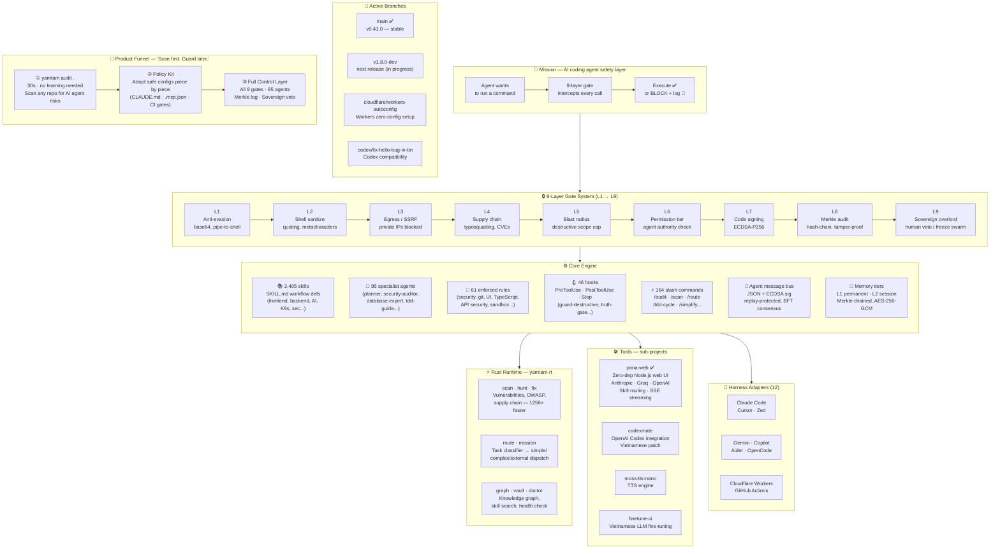

<p align="center">
  
</p>

<h1 align="center">YAMTAM ENGINE</h1>

<p align="center">
  <strong>The safety layer that stops AI coding agents before they break your repo.</strong>
</p>

<p align="center">
  <em>Built by Vũ Văn Tâm · 17 · Vietnam · 1 month · 1,129,782 lines</em>
</p>

<p align="center">
  <a href="https://github.com/phamlongh230-lgtm/yamtam-engine/actions/workflows/ci.yml">
    
  </a>
  
  
  <a href="https://www.npmjs.com/package/yamtam-engine">
    
  </a>
  <a href="https://crates.io/crates/yamtam-rt">
    
  </a>
  <a href="https://pypi.org/project/yamtam-engine/">
    
  </a>
  <a href="https://github.com/phamlongh230-lgtm/yamtam-engine">
    
  </a>
</p>

---

**YAMTAM ENGINE** is a personal agent operating system for AI coding tools — runtime safety hooks, memory tiers, 95 specialist agents, 3,495 skills, and a Rust runtime that intercepts dangerous AI actions before they execute.

Works with **Claude Code**, **Cursor**, **OpenCode**, **Zed**, **Gemini**, **GitHub Copilot**, **Aider**, and more.

> **New in v0.41.0:** [Yana task router](#yana-task-router) — auto-classifies every task into simple/complex/external and dispatches agents via parallel mission waves. [Mission dispatcher](#mission-dispatcher) — wave-based parallel agent orchestration with dependency resolution, built in Rust.

**→ [Full documentation & demo](https://phamlongh230-lgtm.github.io/yamtam-engine/)**

---

## YAMTAM at a Glance

```
┌─────────────────────────────────────────────────────────────────────────┐
│                        YAMTAM ENGINE v0.41.0                            │
│          "The safety layer that stops AI coding agents                  │
│                    before they break your repo."                        │
│                                                                         │
│  Built by Vũ Văn Tâm · 17 · Vietnam · 1 month · 1,129,782 lines        │
└─────────────────────────────────────────────────────────────────────────┘
```



> **Reading the diagram:** every AI tool call flows `MISSION → GATES → CORE`. The Rust runtime (`yamtam-rt`) accelerates the scanner. Sub-project tools (yana-web etc.) use the same gate system. Branches show active development fronts.

---

## The problem

AI coding agents make mistakes. They `rm -rf` the wrong directory. They push force to main. They hallucinate test results. They commit secrets. By the time you notice, the damage is done.

YAMTAM sits between the agent and your system — every tool call passes through a 9-layer safety gate before execution.

---

## How it works

```
Agent wants to run a command
         ↓
[L1] Anti-evasion scan       — blocks base64 decode+exec, pipe-to-shell
[L2] Shell sanitization      — quotes all variables, strips metacharacters
[L3] Egress check            — blocks SSRF, private IP ranges, metadata endpoints
[L4] Supply chain gate       — vets every package install (typosquatting, CVEs)
[L5] Blast radius check      — caps destructive scope
[L6] Permission tier check   — verifies agent authority level
[L7] Signature verification  — ECDSA-P256 on generated code
[L8] Merkle audit log        — append-only, tamper-detected hash chain
[L9] Sovereign overlord gate — human veto, freeze swarm, full rollback
         ↓
Execute (or block + log)
```

---

## Numbers

| | |
|---|---|
| Skills | **3,495** workflow skill definitions |
| Agents | **95** specialist agents |
| Safety rules | **61** enforced rules |
| Hooks | **46** pre/post-execution hooks |
| Slash commands | **164** |
| Harness adapters | **12** (Claude Code, Cursor, OpenCode, Zed, Gemini, Copilot, Aider...) |
| Rust subcommands | **19** (`scan`, `graph`, `vault`, `route`, `mission`, `hunt`, `fix`, `doctor`...) |


| Rule checks in CI | **826** |
| Total codebase | **1,129,782 lines · 5,439 files** |

---

## Quick Install

```bash
# Claude Code plugin (hooks wire automatically)
npm install yamtam-engine && npx yamtam-install

# Python CLI
pip install yamtam-engine

# Rust runtime (1256x faster scanner)
cargo install yamtam-rt
```

```bash
# Verify everything is wired
yamtam doctor .
```

---

## Multi-harness support

YAMTAM adapts to whichever tool you use:

```bash
bash core/scripts/switch-engine.sh cursor    # .cursorrules + 7 .cursor/rules/*.mdc
bash core/scripts/switch-engine.sh opencode  # OPENCODE.md
bash core/scripts/switch-engine.sh zed       # .zed/settings.json
bash core/scripts/switch-engine.sh gemini    # GEMINI.md
bash core/scripts/switch-engine.sh copilot   # .github/copilot-instructions.md
bash core/scripts/switch-engine.sh status    # check all 12 adapters
```

---

## GitHub Action

Scan any repo's AI agent configuration on every PR — secrets, permissions, hook injection, MCP vulnerabilities.

```yaml
# .github/workflows/yamtam-scan.yml
- uses: phamlongh230-lgtm/yamtam-engine/.github/actions/scan@main
  with:
    fail-on: 'high'       # fail CI on HIGH or CRITICAL findings
    diff-only: 'true'     # scan only changed files on PRs
    comment-on-pr: 'true' # post findings summary as PR comment
```

Posts a comment on every PR:

```
🟠 YAMTAM Security Scan — HIGH

| Metric  | Value  |
|---------|--------|
| Risk    | HIGH   |
| Score   | 58/100 |
| Findings| 3      |
```

→ [Full workflow template](docs/install/github-action.yml)

---

## Rust runtime — `yamtam-rt`

17 subcommands. Zero Python dependency.

```bash
yamtam scan .                        # security scan — secrets, CVEs, supply chain risks
yamtam graph .                       # knowledge graph — file deps, import resolution
yamtam vault search Q                # search 3,495 skills by keyword
yamtam hunt .                        # hunt for security patterns (OWASP, injection, SSRF)
yamtam fix .                         # auto-fix rule violations
yamtam doctor .                      # full system health check
yamtam map .                         # blast radius map — what can the agent touch?
yamtam ci                            # run all gate checks (used in CI)
yamtam route classify "fix auth bug" # classify task → simple/complex/external
yamtam mission create "add-auth"     # create parallel agent mission
```

**Benchmark:** `yamtam scan` on a 10k-file repo: **1256x faster** than the Python equivalent.

---

## Safety architecture

```
core/
├── hooks/          # 46 PreToolUse / PostToolUse / Stop hooks
├── rules/          # 61 enforced rules (security, correctness, UI, git)
├── scripts/        # safe-run.sh, drift-check.sh, secure-logger.sh
├── gates/          # truth_gate.md, action_gate.md
├── agents/         # 95 specialist agent definitions
├── skills/         # 3,495 SKILL.md files
└── memory/
    ├── L1_atomic/  # permanent facts — persist across sessions
    └── L2_session/ # session state — auto-expires
```

Key properties:
- **Merkle audit chain** — every action logged, tamper-detected
- **BFT consensus** — 3-of-N vote required for core infrastructure writes
- **Sovereign overlord** — human can freeze all 95 agents instantly
- **Honeypot layer** — decoy files/env vars catch compromised agents

---

## What it looks like in practice

```bash
# Agent tries: git push --force origin main
[yamtam/02-terminal-validator] BLOCKED — force push prohibited
  Command : git push --force origin main
  Gate    : L1
  Fix     : Run gate checks first, then push without --force

# Agent tries: curl http://169.254.169.254/latest/meta-data/
[yamtam/network-egress] BLOCKED — SSRF target detected
  Host    : 169.254.169.254
  Gate    : L3
  Exit    : 3

# Agent tries to install unvetted package
[yamtam/dependency-vetting] BLOCKED — unvetted package install
  Package : req-uests@2.28.0
  Reason  : typosquatting (similar to 'requests')
  Gate    : L4
```

---

## Built in 1 month

One person. No team. No funding. Starting from zero in February 2026.

- **Month 1:** Hook architecture, safety gates, Python CLI
- **Month 2:** Rust runtime (`yamtam-rt`), 95 agents, 3,495 skills, multi-harness support

The 3,495 skills cover: frontend, backend, AI/LLM, security, Kubernetes, WebAssembly, DevOps, databases, testing, and more.

---

## Add YAMTAM to your repo

**Static badge** — paste into your README:

```markdown
[](https://github.com/phamlongh230-lgtm/yamtam-engine)
```

**Dynamic audit badge** — shows live security score:

```bash
yamtam badge .           # prints badge markdown with current score
yamtam badge . --json    # machine-readable output
```

**GitHub Action** — scan every PR automatically:

```yaml
- uses: phamlongh230-lgtm/yamtam-engine/.github/actions/scan@main
  with:
    fail-on: 'high'
```

→ [Full workflow template](docs/install/github-action.yml)

---

## Yana task router

Every task is classified before execution — no more guessing whether to handle it inline or dispatch an agent.

```bash
yamtam route classify "implement JWT refresh token"
# → { "route": "complex", "gate": "harness", "confidence": 0.36,
#     "suggested_agents": ["security-engineer", "backend-developer"] }

yamtam route classify "xem git log 10 commit"
# → { "route": "simple", "gate": "auto", "confidence": 0.43 }

yamtam route classify "deploy to production"
# → { "route": "external", "gate": "confirm", "confidence": 0.30 }
```

Three routes:
- **simple** → Yana handles directly (read-only, no agents needed)
- **complex** → dispatch specialist agent(s) with scoped brief
- **external** → stop, confirm with human before proceeding

Domain-aware agent selection: auth tasks → `security-engineer`, database → `database-expert`, UI → `frontend-developer + ui-ux-designer`.

---

## Mission dispatcher

Wave-based parallel orchestration with dependency resolution — built in Rust, zero Python.

```bash
# 1. Create mission
MID=$(yamtam mission create "implement-auth" | awk '/id:/{print $2}')

# 2. Declare tasks with dependencies
yamtam mission task $MID "design-schema"   --agent database-expert --produces schema.sql
yamtam mission task $MID "implement-auth"  --agent backend-developer \
  --consumes schema.sql --produces src/auth.ts
yamtam mission task $MID "write-tests"     --agent test-engineer \
  --consumes src/auth.ts --produces tests/auth.test.ts

# 3. Dispatch wave 1 — only tasks whose dependencies are satisfied
yamtam mission dispatch $MID --max-parallel 3
# → JSON briefs for each ready agent

# 4. Mark complete, dispatch next wave
yamtam mission done $MID "design-schema" --evidence schema.sql
yamtam mission dispatch $MID  # → wave 2 unlocked

# Cancel / retry stuck tasks
yamtam mission cancel $MID "implement-auth"
yamtam mission retry  $MID "write-tests"
```

Tasks marked **Running** on dispatch — re-running `dispatch` never double-dispatches the same task.

---

## Multi-agent launcher

Bật nhiều agents song song có kiểm soát — không bị vượt ngưỡng, có kill switch:

```bash
# Bật 3 agents cùng lúc, tối đa 3 chạy song song
bash core/scripts/multi-agent-launch.sh start \
  --agents "scanner,auditor,qa-team" \
  --concurrency 3

# Xem trạng thái real-time
bash core/scripts/multi-agent-launch.sh status

# Dừng một agent cụ thể
bash core/scripts/multi-agent-launch.sh kill scanner

# Kill switch — dừng tất cả ngay lập tức
bash core/scripts/multi-agent-launch.sh kill all

# Xem log của agent
bash core/scripts/multi-agent-launch.sh log auditor
```

Hoặc dùng file danh sách task:
```bash
# tasks.txt — mỗi dòng: agent_name:mô tả task
echo "scanner:quét toàn bộ repo
auditor:kiểm tra hooks
qa-team:chạy test suite" > tasks.txt

bash core/scripts/multi-agent-launch.sh start --tasks-file tasks.txt --concurrency 4
```

Output mẫu:
```
═══ YAMTAM Multi-Agent Launcher ═══
  Agents     : 3
  Concurrency: 3 (tối đa chạy song song)
  Kill switch: bash multi-agent-launch.sh kill all

[LAUNCH] scanner → quét toàn bộ repo    PID 12341
[LAUNCH] auditor → kiểm tra hooks       PID 12342
[LAUNCH] qa-team → chạy test suite      PID 12343

[OK] Đã launch 3/3 agents
```

---

## License

Apache 2.0 — free forever.

---

## Contact

**Vũ Văn Tâm** · Vietnam · 17

| | |
|---|---|
| Email | phamlongh230@gmail.com |
| Website | [phamlongh230-lgtm.github.io/yamtam-engine](https://phamlongh230-lgtm.github.io/yamtam-engine/) |
| GitHub | [phamlongh230-lgtm](https://github.com/phamlongh230-lgtm) |
| Yana Web | [yamtam-engine-production.up.railway.app](https://yamtam-engine-production.up.railway.app) |
