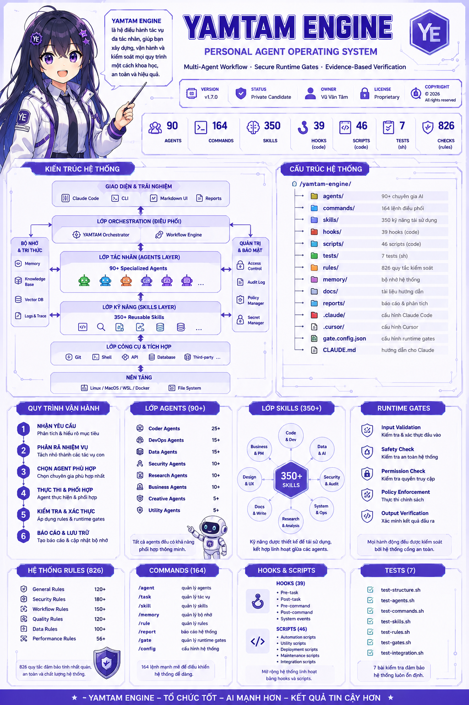

<p align="center">
  
</p>

<h1 align="center">YAMTAM ENGINE</h1>

<p align="center">
  <strong>Audits your AI coding agent setup before it can damage your repo.</strong><br/>
  Scan first. Guard later.
</p>

<p align="center">
  <em>Built by a 17-year-old student — Vũ Văn Tâm</em>
</p>

<p align="center">
  <a href="https://phamlongh230-lgtm.github.io/yamtam-engine/yamtam-system-map.html">
    
  </a>
</p>

<p align="center">
  
</p>

<p align="center">
  <a href="https://github.com/phamlongh230-lgtm/yamtam-engine/actions/workflows/ci.yml">
    
  </a>
  
  
  
  
</p>

---

## Quick Start

```bash
# 1. Check your environment before starting an agent session
yamtam doctor .

# 2. Scan your repo for AI agent risk patterns
yamtam audit .
```

### Doctor — pre-session health check

```
YAMTAM Doctor — Runtime Health Check

  [OK  ] python3                  Python 3.12.3, PyYAML available
  [OK  ] git                      available
  [OK  ] working tree             clean — no uncommitted changes
  [WARN] git branch               on 'main' — agent changes will land on default branch
  [WARN] .gitignore               missing entries: *.pem, credentials.json
  [OK  ] claude settings          found, 8 allowed tools
  [WARN] MCP config               db-server has no read_only: true

  Health:  4 ok  ·  3 warn  ·  2 info

  !  Review WARN items. Run with --fix for suggestions.
```

```bash
yamtam doctor .          # health check
yamtam doctor . --fix    # show fix for every WARN/FAIL
yamtam doctor . --quiet  # single summary line (CI use)
```

### Audit — risk scan

```
YAMTAM Agent Audit Report

  Score:    0 / 100
  Risk:     CRITICAL

  [CRITICAL] AC002  .claude/settings.json    allowedTools contains Bash(*) — wildcard shell
  [CRITICAL] SE001  .env:5                   Anthropic API key exposed
  [CRITICAL] MCP001 .mcp.json                filesystem MCP server has full-root access
  [CRITICAL] SH002  scripts/deploy.sh:12     curl | bash install step
  [HIGH    ] CI004  .github/workflows/...    secrets echoed in workflow step
  [HIGH    ] SH005  scripts/deploy.sh:19     eval with variable content

  Summary:  14 critical · 9 high · 6 medium · 4 low
```

```bash
yamtam audit .                          # scan current repo
yamtam audit . --markdown report.md     # export full Markdown report
yamtam audit . --sarif audit.sarif      # GitHub Code Scanning format
yamtam audit . --diff origin/main       # PR mode — scan only changed files
yamtam audit . --fail-on high           # CI gate: exit 1 on HIGH+
yamtam audit . --json                   # machine-readable output
```

**.yamtamignore** — suppress known-safe findings per file:

```
# .yamtamignore
SH008:scripts/legacy.sh              # known false positive — no set -e intentional
CI003:.github/workflows/deploy.yml   # accepted risk, tracked in backlog
```

### Try it on the demo repo

`examples/unsafe-agent-repo/` is an intentionally misconfigured AI agent repo — 5 files, 34 findings, score 0/100. Run it to see what bad agent config looks like:

```bash
yamtam audit examples/unsafe-agent-repo
```

### CI Integration (GitHub Actions)

Copy `.github/workflows/yamtam-audit.yml` into your repo. It auto-detects PR vs push and runs diff-mode or full scan accordingly, uploading SARIF results to GitHub's Security tab:

```yaml
- name: Run yamtam audit
  run: |
    python3 core/scripts/audit_scanner.py . \
      --diff origin/${{ github.base_ref }} \
      --sarif yamtam-audit.sarif \
      --fail-on high
```

---

## What is YAMTAM?

YAMTAM ENGINE is a **standalone agent operating system** that wraps Claude Code (and other AI coding tools) with runtime safety enforcement, memory, agents, and verification — without touching your product repositories.

It sits **outside** your codebase and intercepts AI actions before they cause harm:

```
You → Claude Code → [YAMTAM HOOKS] → Tool executes (or gets blocked)
```

**Real incidents YAMTAM would have blocked:**
- Replit (July 2025) — AI agent deleted production data via unguarded `rm -rf`
- PocketOS (April 2026) — prompt injection caused unauthorized file exfiltration

---

## Why use it?

| Without YAMTAM | With YAMTAM |
|---|---|
| `rm -rf /` silently executes | Hard blocked at L5 |
| `curl \| bash` runs untrusted code | Supply chain guard blocks it |
| AI claims "tests passed" with no proof | Truth Gate requires evidence |
| Prompt injection overrides instructions | L3.5 injection guard intercepts |
| `DROP TABLE users` runs in prod | DB protect hook blocks it |
| AI deploys to prod without approval | Deploy gate hard blocks |

---

## Quick Install

```bash
# Recommended: download and verify before running
curl -L -o install.sh https://raw.githubusercontent.com/phamlongh230-lgtm/yamtam-engine/main/install.sh
sha256sum install.sh   # verify checksum in releases/checksums.txt
bash install.sh
```

```bash
# Or manually (unzip release)
unzip releases/yamtam-engine-v1.8.0-fixed.zip -d /path/to/project/.claude/
bash .claude/tests/hooks/run-hook-tests.sh
```

> **Note:** `curl | bash` is intentionally not the primary install method.  
> YAMTAM flags `curl | bash` as a risk pattern — we practice what we scan for.

---

## 6-Layer Gate System (L0–L5)

```
L0 — Audit       audit-log.sh, telemetry-sender.sh
                 Every tool call logged with hash-chain

L1 — Scope       token-scope-guard.sh, scope-guard.sh
                 Warn on secret/env access, cross-scope writes

L1.5 — Validate  tool-validator.sh
                 Block SSRF, path traversal, sensitive file reads

L2 — Commit      commit-gate.sh
                 Advisory warning on cross-scope commits

L3 — Truth       truth-gate-guard.sh
                 Block unsupported claims without evidence

L3.5 — Inject    prompt-injection-guard.sh
                 Block identity override, system prompt extraction, jailbreaks

L4 — Deploy      deploy-gate.sh
                 Block gh/kubectl/docker/gcloud/fly/heroku

L4.5 — Supply    supply-chain-guard.sh
                 Block pipe-to-shell, typosquatting, URL package installs

L5 — Destructive guard-destructive.sh, db-protect.sh, api-destruct-guard.sh
                 Block rm -rf, DROP TABLE, DELETE without WHERE
```

**Emergency bypass:** `YAMTAM_DEPLOY_APPROVED=1`, `YAMTAM_SCOPE_OK=1`, `YAMTAM_TRUTH_GATE_BYPASS=1`

---

## Key Features

### Truth Gate (L3)

AI must show evidence before claiming success:

```
❌  "Tests passed"                          ← blocked, no proof
✅  "Tests passed — 47 passed, 0 failed"   ← allowed, evidence shown
```

Claim verbs that require proof: `done`, `passed`, `clean`, `fixed`, `deployed`, `merged`, `verified`

### Action Gate (L0–L5)

Risk-tiered enforcement:

| Level | Action | Enforcement |
|---|---|---|
| L0 | Read | Always allowed |
| L1 | Local write | Logged |
| L2 | Commit | Warn if cross-scope |
| L3 | Push | Request approval |
| L4 | Deploy | Blocked by default |
| L5 | Production data | Hard block |

### Scope Guard

Prevents drift between YAMTAM tasks and product code:
- YAMTAM-scoped tasks cannot edit `app/`, `components/`, `lib/`
- Product-scoped tasks cannot edit YAMTAM files
- Crossing boundaries requires explicit approval

### Cross-Engine Support

| Engine | Enforcement |
|---|---|
| **Claude Code** | Runtime blocking via hooks (L0–L5) |
| **Cursor** | Hard enforcement via safe-run.sh proxy |
| **Aider** | Hard enforcement via shell proxy |
| **GitHub Copilot** | Advisory via prompt layer |
| **Continue.dev** | Advisory via system prompt (`adapters/continue.md`) |
| **Gemini Code Assist** | Advisory via system prompt (`adapters/gemini-code.md`) |
| **OpenRouter** | Advisory via system prompt (`adapters/openrouter.md`) |

Switch engines: `bash core/scripts/switch-engine.sh <engine>`

---

## Memory System

- **L1 Atomic Memory** — persistent facts, git-tracked, tagged, confidence-scored, expiry sweep
- **L2 Session Memory** — ephemeral facts, gitignored, cleared each session

---

## What's Included

| Asset | Count |
|---|---|
| Agents | 90 |
| Slash commands | 164 |
| Runtime hooks | 45 |
| Workflow skills | 387 |
| Operating rules | 61 |
| Utility scripts | 47 |
| Verification checks | 826 |

### Agents (90)

Specialized agents across domains:

- **Core Development** (8): fullstack-engineer, api-designer, microservices-architect
- **Quality Assurance** (6): test-automation-engineer, qa-lead, performance-tester
- **Infrastructure** (8): devops-engineer, sre, cloud-architect
- **Security** (4): security-engineer, penetration-tester, compliance-auditor
- **Data / AI** (6): data-engineer, ml-engineer, llm-architect
- **Business** (4): business-analyst, technical-writer, ux-researcher

### Skills (387)

| Category | Count |
|---|---|
| Security & Guardrails | 11 |
| AI / Agent Orchestration | 19 |
| Frontend / UI | 21 |
| IaC / DevOps | 5 |
| Data / Backend | 11 |
| Observability | 4 |
| Workflow / Core | 10 |
| + more | 269 |

### Key Commands

| Command | Purpose |
|---|---|
| `/verify` | Full health check (git + hooks + tests + drift) |
| `/memory [keyword]` | Search L1 + L2 memory |
| `/risk-scan` | Pre-execution risk analysis |
| `/scope-declare` | Declare file scope before edits |
| `/security-audit` | Security review |
| `/rollback` | List checkpoints and rollback |
| `/handoff` | Generate session handoff |
| `/status` | Project status card |

Full list: `core/commands/` (164 commands)

---

## Repository Structure

```
yamtam-engine/
├── core/                ← SOURCE OF TRUTH — all canonical definitions live here
│   ├── agents/          agent definitions
│   ├── commands/        slash commands
│   ├── hooks/           runtime hooks
│   ├── skills/          workflow skills
│   ├── scripts/         utility scripts (audit_scanner.py, doctor.py, …)
│   ├── rules/           operating rules
│   └── tests/           verification checks
├── .claude/             ← APPLIED PACK — symlinked/copied from core/ for Claude Code
│   ├── agents/          → mirrors core/agents/
│   ├── commands/        → mirrors core/commands/
│   └── skills/          → mirrors core/skills/
├── scanner/             Rule YAML files for yamtam audit
├── adapters/            System prompt adapters per engine (continue, gemini, openrouter, …)
├── examples/            Demo repos — unsafe-agent-repo (0/100 score demo)
├── router/              Model routing policy
├── ledger/              Token/cost ledger schema
├── gates/               Gate specifications
├── memory/              L1 persistent · L2 session
├── releases/            Release packs
└── docs/                Documentation
```

> **`core/` is the source of truth. `.claude/` is the applied pack** — it mirrors `core/`
> so Claude Code can load agents/skills/commands without needing to know the full repo layout.
> If content diverges, `core/scripts/drift-check.sh` detects it.
> Never edit `.claude/` directly — edit `core/` and let the sync propagate.

---

## Verification

826 total checks — run before every release:

```bash
bash core/tests/hooks/run-hook-tests.sh        # 88 hook tests
bash core/tests/skills/test-skill-triggering.sh  # 678 skill trigger tests
```

Breakdown: 65 hook tests · 12 audit tests · 678 skill trigger tests · 65 red-team scenarios · 6 smoke tests

---

## What YAMTAM is NOT

- Not a product app or user-facing software
- Not bundled inside your product repo
- Not a replacement for IAM, backups, RBAC, or production monitoring
- Not allowed to claim success without evidence

---

## YAMTAM Blackbox OS

YAMTAM is not an IDE, not a terminal, and not just an agent pack. It is a blackbox and constitution runtime for AI coding agents: recording what agents do, verifying what agents claim, blocking unsafe actions, and turning past failures into future protection.

Read the full direction: [docs/yamtam-blackbox-os.md](docs/yamtam-blackbox-os.md)

---

## 🌱 Origin Story

Before YAMTAM ENGINE became a full Personal Agent Operating System, it started from early personal experiments in web design, interface building, and AI-assisted development.

The earliest version was a simple static web project:

```
myfirstapp522-main/
├── index.html
└── bg.mp3
```

| Item | Details |
|---|---|
| Owner | Vũ Văn Tâm |
| Stack | HTML, CSS, JavaScript |
| Interface | One-page static web page |
| Media | Background music (`bg.mp3`) |
| Theme | Korean poetry, soft visual mood |
| Purpose | Early personal practice before building larger AI-assisted systems |

This was not the teacher's original project — it was a personal milestone. It is kept as a historical marker showing the path from a small static web page to a standalone AI agent workflow system.

```
Static HTML prototype
        ↓
Personal web experiments
        ↓
AI-assisted development workflow
        ↓
Multi-agent project control
        ↓
YAMTAM ENGINE
```

---

## Contributing & Feedback

YAMTAM improves through real-world use. If a hook fires when it shouldn't, or misses something it should catch — that's the most valuable signal.

**Most useful feedback:**
- **False positives** — hook blocked something legitimate
- **False negatives** — hook missed a real threat
- **Real incidents** — AI behavior YAMTAM would have prevented
- **Missing patterns** — attack vectors not covered by current rules

Open an issue or PR. See `CONTRIBUTING.md` for how to add hooks, skills, or rules.

**Direct contact:** phamlongh230@gmail.com · duybui4680@gmail.com · +82 010 6315 8995 · +84 037 495 5390

---

## Documentation

| File | Purpose |
|---|---|
| `AGENTS.md` | Entry point for AI assistants — read first |
| `gates/truth_gate.md` | L3 Truth Gate specification |
| `gates/action_gate.md` | L0–L5 Action Gate specification |
| `docs/SEPARATION.md` | Boundary between YAMTAM and product repos |
| `docs/AGENT_BEHAVIOR.md` | Good vs bad agent behavior examples |
| `docs/HOOK_WIRING.md` | Hook configuration guide |
| `examples/unsafe-agent-repo/` | Demo: intentionally misconfigured repo (score 0/100) |
| `.yamtamignore.example` | Template for suppressing known-safe findings |
| `.github/workflows/yamtam-audit.yml` | Copy-paste CI integration example |
| `ROADMAP.md` | Feature roadmap |
| `CHANGELOG.md` | Release history |
| `docs/yamtam-system-map.html` | Interactive system map (open in browser) |

---

## License

Apache 2.0 License — Copyright © 2026 Vũ Văn Tâm.

Free to use, fork, modify, and distribute. See `LICENSE` for full terms.

---

<p align="center">
  <sub>v1.8.0 · Built for Claude Code · Apache 2.0 License · Maintained by Vũ Văn Tâm</sub>
</p>

---

<h2 align="center">🇻🇳 Giới thiệu tiếng Việt</h2>

## YAMTAM ENGINE là gì?

> Dự án được tạo ra bởi **học sinh 17 tuổi** — Vũ Văn Tâm.

<p align="center">
  
</p>

YAMTAM ENGINE là **hệ điều hành cho AI agents** — chạy song song với Claude Code để kiểm soát, bảo vệ và điều phối các tác vụ AI trước khi chúng gây ra hậu quả thực tế.

Nó hoạt động **bên ngoài** các repository sản phẩm, chặn các hành động nguy hiểm ngay tại runtime:

```
Bạn → Claude Code → [YAMTAM HOOKS] → Lệnh thực thi (hoặc bị chặn)
```

**Những sự cố thực tế mà YAMTAM đã phòng ngừa:**
- Replit (tháng 7/2025) — AI agent xóa dữ liệu production bằng `rm -rf` không được bảo vệ
- PocketOS (tháng 4/2026) — prompt injection khiến AI exfiltrate file trái phép

---

## Tại sao cần YAMTAM?

| Không có YAMTAM | Có YAMTAM |
|---|---|
| `rm -rf /` chạy âm thầm | Bị chặn cứng tại L5 |
| `curl \| bash` chạy code không tin cậy | Supply chain guard chặn lại |
| AI tự nhận "tests passed" không có bằng chứng | Truth Gate yêu cầu phải có proof |
| Prompt injection override instructions | L3.5 injection guard can thiệp |
| `DROP TABLE users` chạy trên prod | DB protect hook chặn lại |
| AI deploy lên prod không cần duyệt | Deploy gate chặn mặc định |

---

## Cài đặt nhanh

```bash
# Cài qua Claude Code plugin
/plugin install phamlongh230-lgtm/yamtam-engine

# Hoặc giải nén vào project
unzip releases/yamtam-engine-v1.8.0-fixed.zip -d /path/to/project/.claude/

# Kiểm tra 826 checks
bash .claude/tests/hooks/run-hook-tests.sh
```

---

## Audit — quét rủi ro

```bash
yamtam audit .                          # quét toàn bộ repo
yamtam audit . --sarif audit.sarif      # GitHub Code Scanning format
yamtam audit . --diff origin/main       # chỉ quét file thay đổi trong PR
yamtam audit . --fail-on high           # CI gate: exit 1 nếu có HIGH+
yamtam audit . --markdown report.md     # xuất báo cáo Markdown
```

**.yamtamignore** — bỏ qua finding đã biết và chấp nhận:

```
SH008:scripts/legacy.sh              # false positive đã xác nhận
CI003:.github/workflows/deploy.yml   # rủi ro được chấp nhận
```

**Demo thực tế:** `examples/unsafe-agent-repo/` — 5 file, 34 finding, điểm 0/100 CRITICAL.

---

## Hệ thống 6 lớp bảo vệ (L0–L5)

| Lớp | Tên | Chức năng |
|---|---|---|
| L0 | Audit | Ghi log mọi tool call với hash-chain |
| L1 | Scope | Cảnh báo khi truy cập secret/env, viết chéo scope |
| L1.5 | Validate | Chặn SSRF, path traversal, đọc file nhạy cảm |
| L2 | Commit | Cảnh báo khi commit chéo scope |
| L3 | Truth | Chặn claim không có bằng chứng |
| L3.5 | Inject | Chặn identity override, jailbreak, prompt injection |
| L4 | Deploy | Chặn gh/kubectl/docker/gcloud/fly/heroku |
| L4.5 | Supply | Chặn pipe-to-shell, typosquatting, cài package từ URL lạ |
| L5 | Destructive | Chặn `rm -rf`, `DROP TABLE`, `DELETE` không có WHERE |

---

## Tính năng nổi bật

### Truth Gate (L3)
AI bắt buộc phải đưa ra bằng chứng trước khi khai báo hoàn thành:
```
❌  "Tests passed"                          ← bị chặn, không có proof
✅  "Tests passed — 47 passed, 0 failed"   ← được phép, có bằng chứng
```

### Hỗ trợ đa engine

| Engine | Mức độ bảo vệ |
|---|---|
| Claude Code | Runtime blocking qua hooks (L0–L5) |
| Cursor | Hard enforcement qua safe-run.sh proxy |
| Aider | Hard enforcement qua shell proxy |
| GitHub Copilot | Advisory qua prompt layer |
| Continue.dev | Advisory qua system prompt adapter |
| Gemini Code Assist | Advisory qua system prompt adapter |

Chuyển engine: `bash core/scripts/switch-engine.sh <engine>`

### Bộ nhớ 2 tầng
- **L1 Atomic Memory** — facts bền vững, git-tracked, có confidence score
- **L2 Session Memory** — facts tạm thời, gitignored, xóa sau mỗi session

---

## Nội dung

| Thành phần | Số lượng |
|---|---|
| Agents chuyên biệt | 90 |
| Slash commands | 164 |
| Runtime hooks | 45 |
| Workflow skills | 387 |
| Operating rules | 61 |
| Utility scripts | 47 |
| Verification checks | 826 |

---

## 🌱 Câu chuyện khởi đầu

Trước khi YAMTAM ENGINE trở thành một Personal Agent Operating System hoàn chỉnh, nó bắt đầu từ những thử nghiệm cá nhân về thiết kế web, xây dựng giao diện và phát triển với sự hỗ trợ của AI.

Phiên bản sớm nhất là một dự án web tĩnh đơn giản:

```
myfirstapp522-main/
├── index.html
└── bg.mp3
```

| Thông tin | Chi tiết |
|---|---|
| Chủ sở hữu | Vũ Văn Tâm |
| Công nghệ | HTML, CSS, JavaScript |
| Giao diện | Trang web tĩnh một trang |
| Media | Nhạc nền (`bg.mp3`) |
| Chủ đề | Thơ Hàn Quốc, giao diện nhẹ nhàng, thẩm mỹ |
| Mục đích | Thực hành cá nhân trước khi xây dựng hệ thống AI lớn hơn |

Đây không phải project gốc của giáo viên — đây là cột mốc phát triển của cá nhân tôi. Nó được giữ lại như một dấu ấn lịch sử, thể hiện hành trình từ một trang HTML nhỏ đến hệ thống agent workflow độc lập.

```
Static HTML prototype
        ↓
Thử nghiệm web cá nhân
        ↓
Phát triển với sự hỗ trợ AI
        ↓
Multi-agent project control
        ↓
YAMTAM ENGINE
```

---

## Đóng góp & Phản hồi

YAMTAM cải thiện qua thực tế sử dụng. Phản hồi có giá trị nhất:

- **False positive** — hook chặn nhầm thứ hợp lệ
- **False negative** — hook bỏ sót mối nguy hiểm thực sự
- **Sự cố thực tế** — AI làm hại mà YAMTAM đáng lẽ phải ngăn được
- **Pattern còn thiếu** — vector tấn công chưa được cover

Mở issue hoặc PR. Xem `CONTRIBUTING.md` để biết cách thêm hooks, skills, rules.

**Liên hệ trực tiếp:** phamlongh230@gmail.com · duybui4680@gmail.com · +82 010 6315 8995 · +84 037 495 5390

---

## Giấy phép

Apache License 2.0 — Copyright © 2026 Vũ Văn Tâm.

Tự do sử dụng, fork, chỉnh sửa và phân phối. Xem `LICENSE` để biết đầy đủ điều khoản.

---

<p align="center">
  <sub>v1.8.0 · Xây dựng cho Claude Code · Apache 2.0 · Tác giả: Vũ Văn Tâm</sub>
</p>
