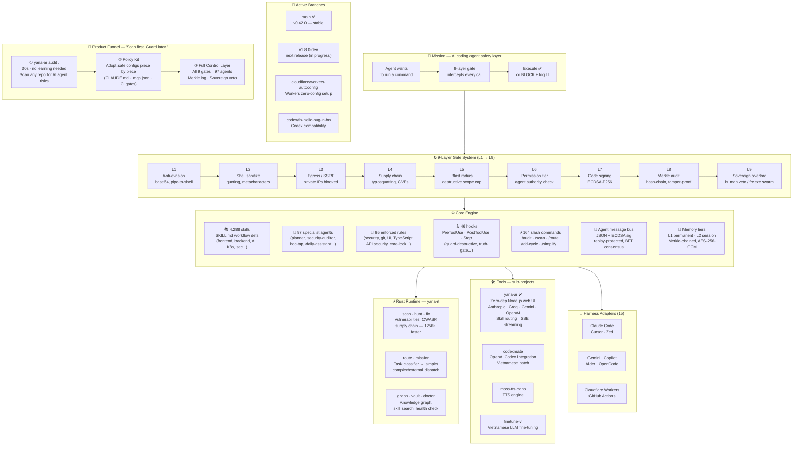

<p align="center">
  
</p>

<h1 align="center">Yana AI</h1>

<p align="center">
  <strong>The orchestration layer between humans and AI — routing, safety, and context for every domain.</strong>
</p>

<p align="center">
  <em>Built by Vũ Văn Tâm · 17 · Vietnam · 1,848,363 lines</em>
</p>

<p align="center">
  <strong>English</strong> · <a href="README.vi.md">🇻🇳 Tiếng Việt</a>
</p>

<p align="center">
  <a href="https://github.com/yanacuti1121/yana-ai/actions/workflows/ci.yml">
    
  </a>
  
  
  <a href="https://www.npmjs.com/package/yana-ai">
    
  </a>
  <a href="https://crates.io/crates/yana-rt">
    
  </a>
  <a href="https://pypi.org/project/yana-ai/">
    
  </a>
  <a href="https://github.com/yanacuti1121/yana-ai">
    
  </a>
  <a href="https://github.com/marketplace/yana-ai">
    
  </a>
  <a href="https://github.com/apps/yamtam">
    
  </a>
</p>

<p align="center">
  
  
  
  
  
  
  
</p>

---

**Yana AI** is a personal agent operating system for AI coding tools — runtime safety hooks, memory tiers, 97 specialist agents, 4,288 skills, and a Rust runtime that intercepts dangerous AI actions before they execute.

Works with **Claude Code**, **Cursor**, **Windsurf**, **Antigravity**, **Kiro**, **OpenCode**, **Zed**, **Gemini**, **GitHub Copilot**, **Aider**, and more.


> **New in v0.42.0:** Mobile feature parity — Sessions, Analytics, Cron, and HTML Maker ported from desktop to the mobile app. **yana-pixel-bridge** — relays Claude Code Agent/Task dispatch events to a sibling `agent-office` instance for live walk-to-desk/work/idle animation. 6 new themes + bilingual tweaks panel. Patched a curl\|bash supply-chain risk across 41 skills, closed 3 rule gaps. **Core-lock** — SHA-256 integrity manifest pinning 218 core files against tampering (rule 67).

**→ [Full documentation & demo](https://yanacuti1121.github.io/yana-ai/)** · **[GitHub Marketplace](https://github.com/marketplace/yana-ai)**

→ [VISION.md](VISION.md) · [ARCHITECTURE.md](ARCHITECTURE.md) · [ROADMAP.md](ROADMAP.md)

> **What are the 97 agents?** They are not 97 AI models running at the same time — they're predefined specialist roles (security, frontend, backend, testing, learning, daily assistant…) used for routing and task organization. In normal usage, only the agent required for the current task is activated; most requests use a single model and a single agent route.
>Generated from repository metrics
Last updated: 2026-06-21
---

## 🤝 An invitation — try it yourself

Don't take this README's word for any of it. Install the engine, then ask your AI assistant to do something it shouldn't — and watch the gates catch it first:

```bash
npm install yana-ai && npx yana-ai-install   # wire the hooks (60 seconds)
yana-ai doctor .                                   # verify everything is wired
```

Then try: ask your agent to `git push --force`, pipe a script from the internet into bash, or read a `.env` file — every attempt is intercepted, explained, and logged. That moment is the whole pitch.

Built by one 17-year-old in Vietnam — which means real-world feedback is the most valuable thing you can give this project. If something blocks too much, too little, or confuses you: [open an issue](https://github.com/yanacuti1121/yana-ai/issues). Every report makes the gates sharper.

---

## Yana AI at a Glance

```
┌──────────────────────────────────────────────────────────────────┐
│                     Yana AI v0.42.0                        │
│      "The orchestration layer between humans and AI —            │
│        routing, safety, and context for every domain."           │
│                                                                  │
│        Built by Vũ Văn Tâm · 17 · Vietnam · 1.8M+ lines          │
└──────────────────────────────────────────────────────────────────┘
```



> **Reading the diagram:** every AI tool call flows `MISSION → GATES → CORE`. The Rust runtime (`yana-rt`) accelerates the scanner. Sub-project tools (yana-web etc.) use the same gate system. Branches show active development fronts.

---

## The problem

AI coding agents make mistakes. They `rm -rf` the wrong directory. They push force to main. They hallucinate test results. They commit secrets. By the time you notice, the damage is done.

Yana AI sits between the agent and your system — every tool call passes through a 9-layer safety gate before execution.

---

## How it works

```
Agent wants to run a command
         ↓
[L1] Anti-evasion scan       — blocks base64 decode+exec, pipe-to-shell
[L2] Shell sanitization      — quotes all variables, strips metacharacters
[L3] Egress check            — blocks SSRF, private IP ranges, metadata endpoints
[L4] Supply chain gate       — vets every package install (typosquatting, CVEs)
[L5] Blast radius check      — caps destructive scope
[L6] Permission tier check   — verifies agent authority level
[L7] Signature verification  — ECDSA-P256 on generated code
[L8] Merkle audit log        — append-only, tamper-detected hash chain
[L9] Sovereign overlord gate — human veto, freeze swarm, full rollback
         ↓
Execute (or block + log)
```

---

## Numbers

| | |
|---|---|
| 🧩 Skills | **4,288** workflow skill definitions |
| 🤖 Agents | **97** specialist agents |
| 📜 Safety rules | **65** enforced rules |
| 🪝 Hooks | **46** pre/post-execution hooks |
| ⚡ Slash commands | **164** |
| 🔌 Harness adapters | **15** (Claude Code, Cursor, Windsurf, Antigravity, Kiro, OpenCode, Zed, Gemini, Copilot, Aider...) |
| 🦀 Rust subcommands | **23** (`scan`, `graph`, `vault`, `route`, `mission`, `hunt`, `fix`, `doctor`...) |
| ✅ Rule checks in CI | **826** |
| 📦 Total codebase | **1,848,363 lines · 10,331 files** |

---

## Quick Install

**→ [Install from GitHub Marketplace](https://github.com/marketplace/yana-ai)** — one click, official listing.

```bash
# Claude Code plugin — npx yana-ai-install wires the hooks
# (required: npm v12+ no longer runs postinstall scripts by default)
npm install yana-ai && npx yana-ai-install

# Python CLI
pip install yana-ai

# Rust runtime (1256x faster scanner)
cargo install yana-rt
```

```bash
# Verify everything is wired
yana-ai doctor .
```

---

## Multi-harness support

Yana AI adapts to whichever tool you use:

```bash
bash core/scripts/switch-engine.sh cursor    # .cursorrules + 7 .cursor/rules/*.mdc
bash core/scripts/switch-engine.sh opencode  # OPENCODE.md
bash core/scripts/switch-engine.sh zed       # .zed/settings.json
bash core/scripts/switch-engine.sh gemini    # GEMINI.md
bash core/scripts/switch-engine.sh copilot   # .github/copilot-instructions.md
bash core/scripts/switch-engine.sh status    # check all 12 adapters
```

---

## GitHub Action

Scan any repo's AI agent configuration on every PR — secrets, permissions, hook injection, MCP vulnerabilities.

```yaml
# .github/workflows/yana-ai-scan.yml
- uses: yanacuti1121/yana-ai/.github/actions/scan@main
  with:
    fail-on: 'high'       # fail CI on HIGH or CRITICAL findings
    diff-only: 'true'     # scan only changed files on PRs
    comment-on-pr: 'true' # post findings summary as PR comment
```

Posts a comment on every PR:

```
🟠 Yana AI Security Scan — HIGH

| Metric  | Value  |
|---------|--------|
| Risk    | HIGH   |
| Score   | 58/100 |
| Findings| 3      |
```

→ [Full workflow template](docs/install/github-action.yml)

---

## Rust runtime — `yana-rt`

23 subcommands. Zero Python dependency.

```bash
yana-ai scan .                        # security scan — secrets, CVEs, supply chain risks
yana-ai graph .                       # knowledge graph — file deps, import resolution
yana-ai vault search Q                # search 4,288 skills by keyword
yana-ai hunt .                        # hunt for security patterns (OWASP, injection, SSRF)
yana-ai fix .                         # auto-fix rule violations
yana-ai doctor .                      # full system health check
yana-ai map .                         # blast radius map — what can the agent touch?
yana-ai ci                            # run all gate checks (used in CI)
yana-ai route classify "fix auth bug" # classify task → simple/complex/external
yana-ai mission create "add-auth"     # create parallel agent mission
```

**Benchmark:** `yana-ai scan` on a 10k-file repo: **1256x faster** than the Python equivalent.

---

## Safety architecture

```
core/
├── hooks/          # 46 PreToolUse / PostToolUse / Stop hooks
├── rules/          # 65 enforced rules (security, correctness, UI, git)
├── scripts/        # safe-run.sh, verify-core-lock.sh, secure-logger.sh
├── gates/          # truth_gate.md, action_gate.md
├── agents/         # 97 specialist agent definitions
├── skills/         # 4,288 SKILL.md files
├── config/
│   ├── core-lock.json    # SHA-256 manifest — 218 core files pinned
│   └── skills-lock.json  # skill content hashes
└── memory/
    ├── L1_atomic/  # permanent facts — persist across sessions
    └── L2_session/ # session state — auto-expires
```

Key properties:
- **Merkle audit chain** — every action logged, tamper-detected
- **Core-lock integrity** — SHA-256 manifest detects drift, deletion, and rule injection in core/
- **BFT consensus** — 3-of-N vote required for core infrastructure writes
- **Sovereign overlord** — human can freeze all 97 agents instantly
- **Honeypot layer** — decoy files/env vars catch compromised agents

---

## What it looks like in practice

```bash
# Agent tries: git push --force origin main
[yana-ai/02-terminal-validator] BLOCKED — force push prohibited
  Command : git push --force origin main
  Gate    : L1
  Fix     : Run gate checks first, then push without --force

# Agent tries: curl http://169.254.169.254/latest/meta-data/
[yana-ai/network-egress] BLOCKED — SSRF target detected
  Host    : 169.254.169.254
  Gate    : L3
  Exit    : 3

# Agent tries to install unvetted package
[yana-ai/dependency-vetting] BLOCKED — unvetted package install
  Package : req-uests@2.28.0
  Reason  : typosquatting (similar to 'requests')
  Gate    : L4
```

---

## Yana AI

**[Live →](https://yanai-production.up.railway.app)**

Yana is the first interface built on Yana AI core — a web UI that lets anyone chat with AI, switch providers, and use skill routing without knowing anything about the infrastructure underneath.

```
User → Yana AI → Yana AI Core (Router · Safety · Context) → Model
```

- Zero signup — bring your own API key
- 🔐 **Encrypted key vault** — keys stored AES-256-GCM, master key non-extractable (WebCrypto + IndexedDB), never plaintext
- Multi-provider: Anthropic · Groq · Gemini · OpenAI · DeepSeek · OpenRouter · 9Router · Ollama

**Provider setup** — bring your own key, keys encrypted locally (never sent to Yana AI):

| Provider | Type | Setup |
|----------|------|-------|
| **Claude** | Cloud | API key → [console.anthropic.com/settings/keys](https://console.anthropic.com/settings/keys) |
| **OpenAI** | Cloud | API key → [platform.openai.com/api-keys](https://platform.openai.com/api-keys) |
| **Gemini** | Cloud | API key → [aistudio.google.com/app/apikey](https://aistudio.google.com/app/apikey) |
| **Groq** | Cloud | API key → [console.groq.com/keys](https://console.groq.com/keys) |
| **DeepSeek** | Cloud | API key → [platform.deepseek.com/api_keys](https://platform.deepseek.com/api_keys) |
| **OpenRouter** | Cloud | API key → [openrouter.ai/settings/keys](https://openrouter.ai/settings/keys) |
| **9Router** | Local | `npm install -g 9router` → `9router` (runs on `localhost:20128`) |
| **Ollama** | Local | [ollama.com/download](https://ollama.com/download) → `ollama serve` → `ollama pull llama3.2` |
- 📊 **100% real data** — live provider stats, L1 memory garden, audit-log health panel; zero demo numbers
- Skill routing built in — type naturally, Yana AI dispatches the right agent
- **Non-coding use cases:** learning (Socratic learning assistant), daily work (summarize / plan / draft)
- SSE streaming, mobile-friendly · Electron desktop shell (`tools/yana-desktop`)

If Yana AI is the power grid, Yana is the first building plugged into it.

---

## Built by one person

One person. No team. No funding.

- Hook architecture, safety gates, Python CLI
- Rust runtime (`yana-rt`), 97 agents, 4,288 skills, multi-harness support
- 15 harness adapters (Claude Code, Cursor, Windsurf, Antigravity, Kiro, Zed, Gemini, Copilot, Aider…)

The 4,288 skills cover: frontend, backend, AI/LLM, security, Kubernetes, WebAssembly, DevOps, databases, testing, and more. Two new agent personas cover non-coding use cases: learning (`hoc-tap`) and daily productivity (`daily-assistant`).

---

## Add Yana AI to your repo

**Static badge** — paste into your README:

```markdown
[](https://github.com/yanacuti1121/yana-ai)
```

**Dynamic audit badge** — shows live security score:

```bash
yana-ai badge .           # prints badge markdown with current score
yana-ai badge . --json    # machine-readable output
```

**GitHub Action** — scan every PR automatically:

```yaml
- uses: yanacuti1121/yana-ai/.github/actions/scan@main
  with:
    fail-on: 'high'
```

→ [Full workflow template](docs/install/github-action.yml)

---

## Yana task router

Every task is classified before execution — no more guessing whether to handle it inline or dispatch an agent.

```bash
yana-ai route classify "implement JWT refresh token"
# → { "route": "complex", "gate": "harness", "confidence": 0.36,
#     "suggested_agents": ["security-engineer", "backend-developer"] }

yana-ai route classify "xem git log 10 commit"
# → { "route": "simple", "gate": "auto", "confidence": 0.43 }

yana-ai route classify "deploy to production"
# → { "route": "external", "gate": "confirm", "confidence": 0.30 }
```

Five routes:
- **simple** → Yana handles directly (read-only, no agents needed)
- **skill** → matched against 4,288-entry index, dispatches exact skill agent
- **learn** → routes to `hoc-tap` — Socratic learning assistant (triggers on "learn", "explain", "why" — English and Vietnamese)
- **daily** → routes to `daily-assistant` — summarize / plan / draft (triggers on "summarize", "write an email", "make a plan" — English and Vietnamese)
- **complex** → dispatch specialist agent(s) with scoped brief
- **external** → stop, confirm with human before proceeding

Domain-aware agent selection: auth tasks → `security-engineer`, database → `database-expert`, UI → `frontend-developer + ui-ux-designer`.

---

## Mission dispatcher

Wave-based parallel orchestration with dependency resolution — built in Rust, zero Python.

```bash
# 1. Create mission
MID=$(yana-ai mission create "implement-auth" | awk '/id:/{print $2}')

# 2. Declare tasks with dependencies
yana-ai mission task $MID "design-schema"   --agent database-expert --produces schema.sql
yana-ai mission task $MID "implement-auth"  --agent backend-developer \
  --consumes schema.sql --produces src/auth.ts
yana-ai mission task $MID "write-tests"     --agent test-engineer \
  --consumes src/auth.ts --produces tests/auth.test.ts

# 3. Dispatch wave 1 — only tasks whose dependencies are satisfied
yana-ai mission dispatch $MID --max-parallel 3
# → JSON briefs for each ready agent

# 4. Mark complete, dispatch next wave
yana-ai mission done $MID "design-schema" --evidence schema.sql
yana-ai mission dispatch $MID  # → wave 2 unlocked

# Cancel / retry stuck tasks
yana-ai mission cancel $MID "implement-auth"
yana-ai mission retry  $MID "write-tests"
```

Tasks marked **Running** on dispatch — re-running `dispatch` never double-dispatches the same task.

---

## Multi-agent launcher

Launch multiple agents in parallel with hard limits and a kill switch:

```bash
# Launch 3 agents, at most 3 running in parallel
bash core/scripts/multi-agent-launch.sh start \
  --agents "scanner,auditor,qa-team" \
  --concurrency 3

# Real-time status
bash core/scripts/multi-agent-launch.sh status

# Stop one specific agent
bash core/scripts/multi-agent-launch.sh kill scanner

# Kill switch — stop everything immediately
bash core/scripts/multi-agent-launch.sh kill all

# Tail an agent's log
bash core/scripts/multi-agent-launch.sh log auditor
```

Or drive it from a task-list file:
```bash
# tasks.txt — one line per task: agent_name:task description
echo "scanner:scan the whole repo
auditor:check the hooks
qa-team:run the test suite" > tasks.txt

bash core/scripts/multi-agent-launch.sh start --tasks-file tasks.txt --concurrency 4
```

Sample output:
```
═══ Yana AI Multi-Agent Launcher ═══
  Agents     : 3
  Concurrency: 3 (max running in parallel)
  Kill switch: bash multi-agent-launch.sh kill all

[LAUNCH] scanner → scan the whole repo    PID 12341
[LAUNCH] auditor → check the hooks        PID 12342
[LAUNCH] qa-team → run the test suite     PID 12343

[OK] Launched 3/3 agents
```

---

97 specialist roles defined in repo config
4,288 skill definitions discovered by repository scan
1,848,363 lines across 10,331 files, measured on 2026-06-21

---

## Contact

**Vũ Văn Tâm** · Vietnam · 17

| | |
|---|---|
| Email | phamlongh230@gmail.com |
| Website | [yanacuti1121.github.io/yana-ai](https://yanacuti1121.github.io/yana-ai/) |
| GitHub | [yanacuti1121/Yana-AI](https://github.com/yanacuti1121/Yana-AI) |
| Yana AI | [yanai-production.up.railway.app](https://yanai-production.up.railway.app) |

---

## 🇻🇳 Tiếng Việt

Bản dịch tiếng Việt đầy đủ của tài liệu này: **[README.vi.md](README.vi.md)**
