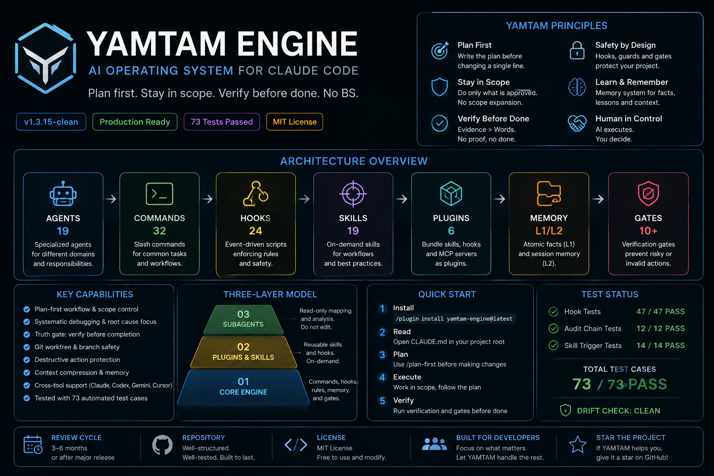

# YAMTAM ENGINE

**Personal agent operating system.**
Hook layer, safety guards, and workflow rules for AI assistants
(Claude Code or other AI coding assistants) operating on arbitrary codebases.



| Asset | Count |
|---|---|
| Agents | 87 |
| Commands | 156 |
| Hooks | 24 |
| Scripts | 35 |
| Skills | 231 |
| Rules | 42 |
| Templates | 12 |
| Tests | 415 checks (55 hook + 12 audit + 334 skill + 6 smoke + 65 red-team) |

**Version:** 1.3.48
**Status:** Runtime active. 415 checks passing. Release pack live. v1.3.48.
**Maintainer:** Vũ Văn Tâm
**Repo type:** Standalone — NOT part of any product repo.

---

## What YAMTAM is

A pack of bash hooks, scripts, and tests that you drop into a project's
`.claude/` directory to constrain what an AI agent can do:

- Block destructive shell, DB, API, and deploy commands.
- Warn when agent reads secrets/tokens or writes to product directories.
- Enforce evidence before agent claims `done` / `passed` / `clean` (Truth Gate).
- Gate commits touching cross-scope paths; block unauthorized deploys.
- Store verified facts in L1 Atomic Memory; session facts in L2 (gitignored).
- Detect documentation drift and stale claims automatically.
- Log all hook decisions locally with SHA-256 hash-chain audit trail (tamper-evident).
- Track session trust score — Truth Gate violations decrement score; score < 50 requires double evidence.
- Proactively verify claims with `/fact-check`; self-improve skills with `/improve-skill` (human-gated).
- **Multi-engine governance** — adapters for Cursor, GitHub Copilot, and Aider.
- **Token ROI** — loop detection, fast-tier auto-routing, per-session cost reporting.

## What YAMTAM is not

- Not a product. Not user-facing.
- Not a replacement for production safety (IAM, backups, RBAC).
- Not a full protection layer — see `docs/LIMITATIONS.md` (when imported).
- Not coupled to any single project. Apply to any repo via release pack.
- See `.out-of-scope/` for features deliberately not built.

---

## Repo structure

```txt
yamtam-engine/
├── README.md              ← you are here
├── AGENTS.md              ← entry point for AI assistants (read first if AI)
├── CONTRIBUTING.md        ← skill format guide, PR checklist
├── SECURITY.md            ← vulnerability disclosure + L0-L5 scope
├── CHANGELOG.md
├── ROADMAP.md
├── MANIFEST.json
├── LICENSE
├── .cursorrules           ← Cursor legacy rules (security + code constraints)
├── .gitignore
│
├── core/                  ← runtime assets
│   ├── agents/            ← 87 agent definitions (quality-testing, infrastructure, security-team, core-development, forge, etc.)
│   ├── commands/          ← 156 slash commands (incl. /security-audit, /security-scan, /write-tests, /tdd-cycle, /smart-fix, /cost-report)
│   ├── hooks/             ← 24 hooks (.sh + .js) — L0 audit → L5 destructive guard + token-budget-guard.sh
│   ├── scripts/           ← 34 utility scripts (safe-run.sh, secure-logger.sh, verify-rules.sh, memory-gc.sh, log-rotate.sh, validate-manifest.sh, …)
│   ├── rules/             ← 41 rules (00-meta-rule-enforcer, 03-privilege-isolation, api-security-gate, audit-hardening-policy, container-hardening-law, dependency-vetting-law, shell-sanitize-law, anti-evasion-law, prompt-jailbreak-guard, env-integrity-policy, fuzz-testing-constraints, agent-middleware-law, …)
│   ├── templates/         ← 12 project templates (incl. SKILL_TEMPLATE.md)
│   ├── skills/            ← 178 skill definitions
│   │     Workflow/Core    : plan-first, verify-before-done, debug-protocol, branch-finish, worktree-safety, tdd, memory-gc
│   │     Security         : red-team-check, blue-team-fix, purple-team-report, adversarial-prompt-testing, supply-chain-security, zero-trust-patterns, agent-safety-patterns, leak-check
│   │     AI/Agent         : rag-architect, prompt-engineering, auto-feedback-loop, prompt-caching-strategy, research-team, tree-of-thoughts, ingest-repo, autonomous-patching-loop, llm-output-validation
│   │     Frontend/UI      : baseline-ui, shadcn-patterns, react-doctor, design-tokens-system, color-math-system, typography-scale, motion-physics, component-layout-patterns, enterprise-design-systems, advanced-color-math, advanced-typography, advanced-motion-easing, smart-layout-aesthetics + 8 more
│   │     IaC/DevOps       : kubernetes-patterns, terraform-patterns, docker-patterns, serverless-patterns, cicd-patterns
│   │     Data/Backend     : database-patterns, database-query-safety, caching-memory-efficiency, high-perf-data-algorithms, profiling-benchmarking, graphql-patterns, resilience-patterns + 4 more
│   │     Monorepo/Build   : monorepo-governance, monorepo-patterns, build-system
│   │     Stack depth      : typescript-patterns, nextjs-patterns, state-management-patterns, unit-testing-patterns, database-migrations
│   │     Token/Cost       : token-roi (loop detection, fast-tier routing, ROI scoring)
│   │     + 62 more        : error-handling, secret-management, load-testing, feature-flags, mlops, websocket-patterns, i18n-patterns, …
│   ├── config/            ← 6 config JSON files (skills-lock.json, …)
│   └── tests/
│       ├── hooks/         ← run-hook-tests.sh + test-audit-chain.sh (55+12 test cases)
│       ├── skills/        ← test-skill-triggering.sh (310 skill trigger checks)
│       └── commands/      ← test-hook-review-smoke.sh (6 smoke tests)
│
├── adapters/              ← cross-engine governance adapters
│   ├── README.md          ← engine matrix + switch-engine.sh docs
│   └── aider.md           ← Aider --system-prompt adapter
│
├── .cursor/rules/         ← Cursor MDC rules (Cursor ≥ 0.40)
│   ├── yamtam-security.mdc
│   └── yamtam-code-quality.mdc
│
├── memory/
│   ├── L1_atomic/         ← persistent fact store (tagged, confidence-gated)
│   └── L2_session/        ← session-scoped facts (gitignored, cleared each session)
│
├── gates/
│   ├── truth_gate.md           ← L3 spec + runtime hook (truth-gate-guard.sh)
│   ├── action_gate.md          ← L4 spec (L0–L5 coverage table)
│   ├── anti-fake-pass-gate.md  ← evidence hierarchy (PASS/REVIEWED/UNKNOWN)
│   ├── security-scope-gate.md  ← ownership confirmation before security scans
│   └── ui-quality-gate.md      ← L1–L7 UI gate (baseline → accessible → generative UI)
│
├── prompts/
│   └── system_prompt.md   ← copy-paste prompt block for AI operators
│
├── docs/
│   ├── HOOK_WIRING.md, MAINTENANCE_POLICY.md, CLAUDE_MD_GUIDE.md
│   ├── SEPARATION.md, RUNBOOK.md, AGENT_BEHAVIOR.md
│   ├── AUDIT_HARDENING.md, OUTPUT_BUDGET_POLICY.md
│   ├── third-party-inspiration.md   ← attribution log for all external sources
│   ├── skill-spec.md, skill-writing-guide.md, skill-evaluation-rules.md
│   └── model-routing-strategy.md    ← Power/Balanced/Fast tier routing map
│
├── .out-of-scope/         ← features deliberately not built
├── .claude-plugin/        ← plugin manifest for /plugin install
│   ├── plugin.json
│   └── marketplace.json
├── .github/
│   ├── workflows/release.yml
│   ├── copilot-instructions.md   ← GitHub Copilot governance adapter
│   └── security-advisories/
│
└── releases/
    ├── yamtam-engine-v1.3.48.zip
    └── yamtam-engine-latest.zip
```

---

## Asset counts

| Path | Count |
|---|---|
| `core/agents/` | 87 agents |
| `core/commands/` | 156 commands |
| `core/hooks/` | 24 hooks |
| `core/scripts/` | 35 scripts |
| `core/rules/` | 42 rules |
| `core/templates/` | 12 templates |
| `core/skills/` | 231 skills |
| `core/config/` | 6 config files |
| `adapters/` | aider.md + .cursorrules + .cursor/rules/ + copilot-instructions.md |
| `core/tests/hooks/` | 55 test cases |
| `core/tests/skills/` | 310 skill trigger tests |
| `core/tests/commands/` | 6 smoke tests |
| `memory/L1_atomic/` | 4 seed facts (tagged) |
| `memory/L2_session/` | ephemeral — gitignored |

---

## Skill categories (v1.3.48)

| Category | Count | Skills |
|---|---|---|
| Security & guardrails | 11 | red-team-check, blue-team-fix, purple-team-report, adversarial-prompt-testing, supply-chain-security, zero-trust-patterns, agent-safety-patterns, leak-check, owasp-llm-top10, agent-attack-surface, agent-memory-security |
| AI / Agent orchestration | 19 | rag-architect, prompt-engineering, llm-ui-patterns, auto-feedback-loop, prompt-caching-strategy, ai-team-workflow, agent-messaging-patterns, git-native-agent-protocol, research-team, tree-of-thoughts, ingest-repo, autonomous-patching-loop, state-machine-workflows, resilience-circuit-breakers, agent-telemetry, vector-store-patterns, type-safe-api-contracts, durable-task-queues, agent-middleware-gate |
| LLM output quality | 2 | llm-output-validation, llm-cost-optimizer |
| Frontend / UI — Core | 11 | baseline-ui, fixing-accessibility, fixing-motion-performance, shadcn-patterns, react-doctor, animation-principles, impeccable, interface-feel, design-engineering, apply-premium-background, generative-ui-patterns |
| Frontend / UI — Design systems | 10 | design-tokens-system, color-math-system, typography-scale, motion-physics, component-layout-patterns, enterprise-design-systems, advanced-color-math, advanced-typography, advanced-motion-easing, smart-layout-aesthetics |
| IaC / DevOps | 5 | kubernetes-patterns, terraform-patterns, docker-patterns, serverless-patterns, cicd-patterns |
| Stack depth | 6 | typescript-patterns, nextjs-patterns, state-management-patterns, unit-testing-patterns, monorepo-patterns, database-migrations |
| Monorepo / Build | 2 | monorepo-governance, build-system |
| Observability | 4 | slo-design, incident-response-runbook, observability-instrumentation, telemetry-analysis |
| Data / Backend | 11 | caching-patterns, api-rate-limiting, auth-patterns, resilience-patterns, event-driven-architecture, database-patterns, graphql-patterns, caching-memory-efficiency, high-perf-data-algorithms, profiling-benchmarking, database-query-safety |
| Compilers / Parsing | 3 | graph-dependency-resolution, ast-code-manipulation, grammar-lexer-dsl |
| Workflow / Core | 10 | plan-first, verify-before-done, tdd, debug-protocol, branch-finish, worktree-safety, session-context, pre-compact-backup, strategic-compact, memory-gc |
| Token / Cost | 1 | token-roi (loop detection, fast-tier auto-routing, ROI scoring) |
| Other (i18n, perf, patterns, …) | 81 | error-handling, secret-management, distributed-tracing, contract-testing, load-testing, feature-flags, websocket-patterns, mlops, cloud-cost-optimization, i18n-patterns, data-privacy, adr-writing, refactor-patterns, caching-patterns (redis), api-design, backend-patterns, coding-standards, deep-research, documentation-lookup, e2e-testing, security-review, tdd-workflow, verification-loop, agent-introspection-debugging, frontend-patterns, mcp-server-patterns, + 56 more |

---

## Cross-Engine Support

YAMTAM natively targets Claude Code. Adapters make governance available on other engines:

| Engine | File | Enforcement |
|---|---|---|
| Claude Code | `.claude/settings.json` (hooks) | **Runtime blocking** (L0–L5 hooks) |
| Cursor | `.cursorrules` + `.cursor/rules/*.mdc` | Advisory (prompt layer) |
| GitHub Copilot | `.github/copilot-instructions.md` | Advisory (prompt layer) |
| Aider | `adapters/aider.md` via `--system-prompt` | Advisory (prompt layer) |

```bash
# Check adapter status
bash core/scripts/switch-engine.sh status

# Switch active engine
bash core/scripts/switch-engine.sh cursor|copilot|aider|claude
```

> Advisory-mode engines receive rule injection via prompt. For hard runtime blocking on any engine, route commands through `core/scripts/safe-run.sh`.

---

## Action Gate coverage (L0–L5)

| Level | Hook | Behavior |
|---|---|---|
| L0 | `audit-log.sh`, `telemetry-sender.sh` | Log every tool call (hash-chain tamper-evident) |
| L1 | `token-scope-guard.sh`, `scope-guard.sh` | Warn on secret/scope access |
| L2 | `commit-gate.sh` | Advisory warn on cross-scope commits |
| L3 | `truth-gate-guard.sh` | Warn on unsupported claims |
| L4 | `deploy-gate.sh` | Block gh/kubectl/docker/gcloud/fly/heroku deploys |
| L5 | `db-protect.sh`, `api-destruct-guard.sh`, `guard-destructive.sh` | Block destructive ops |
| \+ | `token-budget-guard.sh` | Loop detection + fast-tier routing after 5 attempts |

Bypass: `YAMTAM_DEPLOY_APPROVED=1`, `YAMTAM_SCOPE_OK=1`, `YAMTAM_TRUTH_GATE_BYPASS=1`.

---

## How to apply to a project

See `docs/HOOK_WIRING.md` for full wiring guide and `settings.json` presets.

```bash
# Apply latest release pack
unzip releases/yamtam-engine-latest.zip -d /path/to/project/.claude/

# Verify
cd /path/to/project
bash .claude/tests/hooks/run-hook-tests.sh
```

Or install via Claude Code plugin system:
```
/plugin install phamlongh230-lgtm/yamtam-engine
```

---

## How to cut a new release

```bash
# In this repo — after making changes:
bash core/scripts/build-release.sh
# Runs: syntax check → 415 checks → drift check → zip → symlink latest
```

GitHub Actions auto-releases on semver tag push:
```bash
git tag v1.3.48 && git push origin v1.3.46
```

---

## License / credits

Licensed under Apache 2.0. See `LICENSE`.
Initial author: Vũ Văn Tâm.
Not affiliated with any specific product repo this pack may be applied to.
See `CONTRIBUTING.md` to add skills, rules, or adapters.
