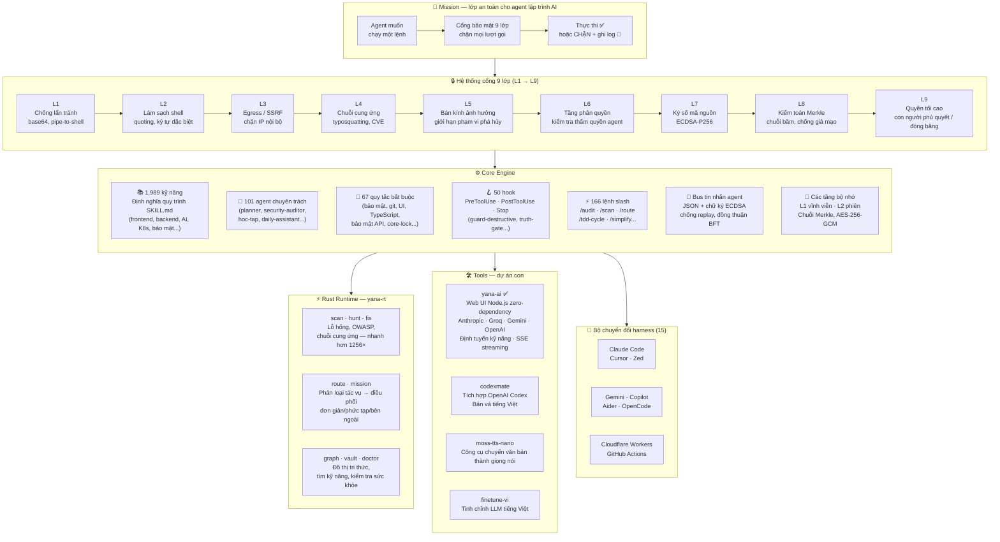

```
$ yana-ai
╭─────────────────────────────────────────────────────────────────────────────────────────────────────────────────────────────────────────────╮
│                                                                                                                                            │
│   ██╗   ██╗ █████╗ ███╗   ██╗ █████╗     █████╗ ██╗                                                                                       │
│   ╚██╗ ██╔╝██╔══██╗████╗  ██║██╔══██╗   ██╔══██╗██║                                                                                       │
│    ╚████╔╝ ███████║██╔██╗ ██║███████║   ███████║██║                                                                                       │
│     ╚██╔╝  ██╔══██║██║╚██╗██║██╔══██║   ██╔══██║██║                                                                                       │
│      ██║   ██║  ██║██║ ╚████║██║  ██║   ██║  ██║██║                                                                                       │
│      ╚═╝   ╚═╝  ╚═╝╚═╝  ╚═══╝╚═╝  ╚═╝   ╚═╝  ╚═╝╚═╝                                                                                       │
│                                                                                                                                            │
│ v0.42.3 · Personal Agent OS                │ Tips for getting started                                                                      │
│ 101 agents · 1,989 skills                   │ yana-ai doctor                                                                               │
│ 66 rules · 49 hooks · 101 scripts          │ yana-ai init                                                                                  │
│ 826 checks · 9 gate layers                 │                                                                                               │
│                                            │ What's new                                                                                    │
│                                            │ v0.42.3 — WASM guard + automated publish pipeline                                           │
╰─────────────────────────────────────────────────────────────────────────────────────────────────────────────────────────────────────────────╯
```

<h1 align="center">Yana AI</h1>

<p align="center">
  <strong>Lớp điều phối giữa con người và AI — định tuyến, bảo mật và ngữ cảnh cho mọi lĩnh vực.</strong>
</p>

<p align="center">
  <em>Phát triển bởi Vũ Văn Tâm · 17 tuổi · Việt Nam</em>
</p>

<p align="center">
  <a href="README.md">English</a> · <strong>Tiếng Việt</strong> · <a href="README.ko.md">🇰🇷 한국어</a> · <a href="README.zh.md">🇨🇳 中文</a>
</p>

         (Chúng tôi hiện đang chuyển đổi từ Linux sang macOS, và vẫn còn rất nhiều lỗi.)

<p align="center">
  <a href="https://github.com/yanacuti1121/yana-ai/actions/workflows/ci.yml">
    
  </a>
  
  
  <a href="https://www.npmjs.com/package/yana-ai">
    
  </a>
  <a href="https://crates.io/crates/yana-rt">
    
  </a>
  <a href="https://pypi.org/project/yana-ai/">
    
  </a>
  <a href="https://github.com/marketplace/yana-ai">
    
  </a>
</p>

<p align="center">
  
  
  
  
  
  
  
</p>

---

**Yana AI** là một hệ điều hành agent cá nhân dành cho các công cụ lập trình AI — bao gồm các hook bảo mật runtime, các tầng bộ nhớ, 101 agent chuyên trách, 1,989 kỹ năng và một runtime viết bằng Rust giúp chặn các hành động nguy hiểm của AI trước khi chúng được thực thi.

Hoạt động với **Claude Code**, **Cursor**, **Windsurf**, **Antigravity**, **Kiro**, **OpenCode**, **Zed**, **Gemini**, **GitHub Copilot**, **Aider**, và nhiều công cụ khác.


> **Mới trong v0.42.3:** **yana-rt nay chạy được trên trình duyệt** — build WebAssembly qua wasm-bindgen đưa guard chặn lệnh nguy hiểm tới extension trình duyệt, VS Code và Node.js (`npm install yana-rt`). Pipeline publish hoàn toàn tự động — npm, PyPI và crates.io đều publish khi push tag. Số lượng agent đã được đối soát về đúng 101. Rule 70 được bổ sung: luật context-faithfulness — dữ liệu người dùng cung cấp ưu tiên hơn dữ liệu training.
>
> **Cập nhật 2026-07-01:** ghi chú "đối soát về 101" ở trên tự nó cũng từng sai (số cũ 162 không khớp với bất kỳ file nào khác trong repo — ARCHITECTURE.md ghi 95, dữ liệu trang docs ghi 93). Toàn bộ số liệu trên trang này giờ được sinh bằng `core/scripts/generate-stats.py` trực tiếp từ filesystem thay vì gõ tay.

**→ [Tài liệu đầy đủ & demo](https://yanacuti1121.github.io/Yana-AI/)** · **[GitHub Marketplace](https://github.com/marketplace/yana-ai)**

→ [VISION.md](VISION.md) · [ARCHITECTURE.md](ARCHITECTURE.md) · [ROADMAP.md](ROADMAP.md)

> **101 agent này là gì?** Không phải 101 mô hình AI chạy cùng lúc — đó là các vai trò chuyên gia được định nghĩa trước (bảo mật, frontend, backend, kiểm thử, học tập, trợ lý hàng ngày…) dùng để định tuyến và tổ chức công việc. Khi sử dụng bình thường, chỉ agent cần thiết cho tác vụ hiện tại mới được kích hoạt — hầu hết yêu cầu chỉ dùng một mô hình và một tuyến agent duy nhất.

---

## 🤝 Lời mời — hãy tự mình trải nghiệm

Đừng tin lời README này — hãy cài engine, rồi yêu cầu trợ lý AI của bạn làm một việc đáng lẽ không nên làm, và xem các gate chặn lại trước:

```bash
npm install yana-ai && npx yana-ai-install   # nối hooks (60 giây)
yana-ai doctor .                                   # kiểm tra mọi thứ đã sẵn sàng
```

Thử ngay: bảo agent `git push --force`, pipe một script từ internet vào bash, hay đọc file `.env` — mọi nỗ lực đều bị chặn, được giải thích rõ lý do, và ghi vào audit log. Khoảnh khắc đó chính là toàn bộ giá trị của dự án.

Dự án được xây dựng bởi một bạn 17 tuổi ở Việt Nam — nghĩa là phản hồi từ thực tế của bạn là món quà giá trị nhất. Nếu có gì chặn quá tay, lọt lưới, hay gây khó hiểu: [mở issue](https://github.com/yanacuti1121/yana-ai/issues). Mỗi báo cáo đều giúp các gate sắc bén hơn.

---

## Tổng quan về Yana AI

```
┌──────────────────────────────────────────────────────────────────┐
│                     Yana AI v0.42.0                        │
│        "Lớp điều phối giữa con người và AI — định tuyến,         │
│          bảo mật và ngữ cảnh cho mọi lĩnh vực."                  │
│                                                                  │
│   Phát triển bởi Vũ Văn Tâm · 17 tuổi · Việt Nam                 │
└──────────────────────────────────────────────────────────────────┘
```



> **Cách đọc sơ đồ:** mọi lượt gọi công cụ của AI đều chảy theo hướng `MISSION → GATES → CORE`. Runtime Rust (`yana-rt`) tăng tốc bộ quét. Các công cụ dự án con (yana-ai, v.v.) dùng chung hệ thống cổng bảo mật.

---

## Vấn đề

Các agent lập trình AI thường mắc sai lầm. Chúng `rm -rf` nhầm thư mục. Chúng force push lên main. Chúng bịa kết quả kiểm thử. Chúng vô tình commit secrets. Đến khi bạn nhận ra thì thiệt hại đã xảy ra rồi.

Yana AI nằm giữa agent và hệ thống của bạn — mọi lượt gọi công cụ đều phải đi qua cổng an toàn 9 lớp trước khi thực thi.

---

## Cơ chế hoạt động

```
Agent muốn chạy một lệnh
         ↓
[L1] Quét chống lẩn tránh      — chặn base64 decode+exec, pipe-to-shell
[L2] Làm sạch shell            — quote mọi biến, loại bỏ ký tự đặc biệt
[L3] Kiểm tra egress           — chặn SSRF, dải IP nội bộ, metadata endpoint
[L4] Cổng chuỗi cung ứng       — kiểm duyệt mọi gói cài đặt (typosquatting, CVE)
[L5] Kiểm tra bán kính phá hủy — giới hạn phạm vi tác động nguy hiểm
[L6] Kiểm tra tầng phân quyền  — xác minh cấp thẩm quyền của agent
[L7] Xác thực chữ ký số        — ECDSA-P256 trên mã nguồn được sinh ra
[L8] Nhật ký kiểm toán Merkle  — chuỗi băm chỉ ghi thêm, phát hiện giả mạo
[L9] Cổng tối cao              — con người phủ quyết, đóng băng swarm, rollback toàn diện
         ↓
Thực thi (hoặc chặn + ghi log)
```

---

## Số liệu

| | |
|---|---|
| 🧩 Kỹ năng | **1,989** định nghĩa kỹ năng quy trình |
| 🤖 Agent | **101** agent chuyên trách |
| 📜 Quy tắc an toàn | **67** quy tắc được thực thi |
| 🪝 Hook | **50** hook trước/sau thực thi |
| ⚡ Lệnh slash | **166** |
| 🔌 Adapter harness | **15** (Claude Code, Cursor, Windsurf, Antigravity, Kiro, OpenCode, Zed, Gemini, Copilot, Aider...) |
| 🦀 Lệnh con Rust | **23** (`scan`, `graph`, `vault`, `route`, `mission`, `hunt`, `fix`, `doctor`...) |
| ✅ Kiểm tra quy tắc trong CI | **826** |
| 📦 Tổng mã nguồn | **8,438 tệp** |

---

## Cài đặt nhanh

**→ [Cài từ GitHub Marketplace](https://github.com/marketplace/yana-ai)** — một cú click, listing chính thức.

```bash
# Plugin Claude Code — npx yana-ai-install kết nối hook
# (bắt buộc: npm v12+ mặc định không chạy postinstall script nữa)
npm install yana-ai && npx yana-ai-install

# Python CLI
pip install yana-ai

# Runtime Rust (bộ quét nhanh hơn 1256 lần)
cargo install yana-rt
```

```bash
# Xác minh mọi thứ đã kết nối đúng
yana-ai doctor .
```

---

## Hỗ trợ đa harness

Yana AI tự thích ứng với công cụ bạn đang dùng:

```bash
bash core/scripts/switch-engine.sh cursor    # .cursorrules + 7 .cursor/rules/*.mdc
bash core/scripts/switch-engine.sh opencode  # OPENCODE.md
bash core/scripts/switch-engine.sh zed       # .zed/settings.json
bash core/scripts/switch-engine.sh gemini    # GEMINI.md
bash core/scripts/switch-engine.sh copilot   # .github/copilot-instructions.md
bash core/scripts/switch-engine.sh status    # kiểm tra cả 15 adapter
```

---

## GitHub Action

Quét cấu hình agent AI của bất kỳ repo nào trên mỗi PR — secrets, quyền hạn, hook injection, lỗ hổng MCP.

```yaml
# .github/workflows/yana-ai-scan.yml
- uses: yanacuti1121/yana-ai/.github/actions/scan@main
  with:
    fail-on: 'high'       # fail CI khi phát hiện mức HIGH hoặc CRITICAL
    diff-only: 'true'     # chỉ quét các tệp thay đổi trên PR
    comment-on-pr: 'true' # đăng tóm tắt kết quả dưới dạng comment trên PR
```

Tự động đăng comment trên mỗi PR:

```
🟠 Yana AI Security Scan — HIGH

| Tiêu chí  | Giá trị |
|-----------|---------|
| Rủi ro    | HIGH    |
| Điểm số   | 58/100  |
| Phát hiện | 3       |
```

→ [Mẫu workflow đầy đủ](docs/install/github-action.yml)

---

## Runtime Rust — `yana-rt`

23 lệnh con. Hoàn toàn không phụ thuộc Python.

```bash
yana-ai scan .                        # quét bảo mật — secrets, CVE, rủi ro chuỗi cung ứng
yana-ai graph .                       # đồ thị tri thức — phụ thuộc tệp, phân giải import
yana-ai vault search Q                # tìm trong 1,989 kỹ năng theo từ khóa
yana-ai hunt .                        # săn các mẫu bảo mật (OWASP, injection, SSRF)
yana-ai fix .                         # tự động sửa vi phạm quy tắc
yana-ai doctor .                      # kiểm tra sức khỏe toàn hệ thống
yana-ai map .                         # bản đồ bán kính ảnh hưởng — agent chạm được vào đâu?
yana-ai ci                            # chạy tất cả kiểm tra cổng (dùng trong CI)
yana-ai route classify "fix auth bug" # phân loại tác vụ → đơn giản/phức tạp/bên ngoài
yana-ai mission create "add-auth"     # tạo mission agent song song
```

**Benchmark:** `yana-ai scan` trên repo 10k tệp: **nhanh hơn 1256 lần** so với bản Python tương đương.

---

## Kiến trúc bảo mật

```
core/
├── hooks/          # 50 hook PreToolUse / PostToolUse / Stop
├── rules/          # 67 quy tắc bắt buộc (bảo mật, tính đúng đắn, UI, git)
├── scripts/        # safe-run.sh, verify-core-lock.sh, secure-logger.sh
├── gates/          # truth_gate.md, action_gate.md
├── agents/         # 101 định nghĩa agent chuyên trách
├── skills/         # 1,989 tệp SKILL.md
├── config/
│   ├── core-lock.json    # manifest SHA-256 — ghim 220 tệp cốt lõi
│   └── skills-lock.json  # mã băm nội dung kỹ năng
└── memory/
    ├── L1_atomic/  # dữ kiện vĩnh viễn — tồn tại qua các phiên
    └── L2_session/ # trạng thái phiên — tự hết hạn
```

Các thuộc tính chính:
- **Chuỗi kiểm toán Merkle** — mọi hành động đều được ghi log, phát hiện can thiệp
- **Toàn vẹn core-lock** — manifest SHA-256 phát hiện drift, xóa tệp, chèn quy tắc trái phép trong `core/`
- **Đồng thuận BFT** — cần 3-trên-N phiếu thuận mới được ghi vào hạ tầng cốt lõi
- **Quyền tối cao con người** — đóng băng cả 101 agent ngay lập tức
- **Tầng honeypot** — tệp mồi / biến môi trường giả phát hiện agent bị chiếm quyền

---

## Thực tế khi chạy

```bash
# Agent thử: git push --force origin main
[yana-ai/02-terminal-validator] BLOCKED — nghiêm cấm force push
  Lệnh      : git push --force origin main
  Cổng chặn : L1
  Cách sửa  : Chạy kiểm tra cổng trước, sau đó push không có --force

# Agent thử: curl http://169.254.169.254/latest/meta-data/
[yana-ai/network-egress] BLOCKED — phát hiện mục tiêu SSRF
  Host      : 169.254.169.254
  Cổng chặn : L3
  Mã thoát  : 3

# Agent thử cài gói chưa kiểm duyệt
[yana-ai/dependency-vetting] BLOCKED — cài đặt gói chưa qua kiểm duyệt
  Gói       : req-uests@2.28.0
  Lý do     : typosquatting (gần giống gói 'requests')
  Cổng chặn : L4
```

---

## Yana AI

**[Dùng thử trực tuyến →](https://yanai-production.up.railway.app)**

Yana là giao diện đầu tiên xây trên lõi Yana AI — một web UI cho phép bất kỳ ai trò chuyện với AI, chuyển đổi provider và dùng định tuyến kỹ năng mà không cần biết gì về hạ tầng bên dưới.

```
Người dùng → Yana AI → Yana AI Core (Định tuyến · Bảo mật · Ngữ cảnh) → Mô hình AI
```

- Không cần đăng ký — dùng API key của chính bạn
- 🔐 **Kho khóa mã hóa** — khóa lưu bằng AES-256-GCM, master key không thể trích xuất (WebCrypto + IndexedDB), không bao giờ ở dạng plaintext
- Đa provider: Anthropic · Groq (Llama4 · Qwen3 · Gemma2) · Gemini 2.5 · OpenAI · DeepSeek · OpenRouter
- 📊 **100% dữ liệu thực** — thống kê provider trực tiếp, vườn bộ nhớ L1, bảng sức khỏe audit-log; không có số liệu demo
- Định tuyến kỹ năng tích hợp sẵn — gõ tự nhiên, Yana AI tự điều phối đúng agent
- **Ngoài lập trình:** học tập (trợ lý học theo phương pháp Socratic), công việc hàng ngày (tóm tắt / lên kế hoạch / soạn thảo)
- SSE streaming, thân thiện mobile · Phiên bản desktop Electron (`tools/yana-desktop`)

Nếu Yana AI là lưới điện, Yana là tòa nhà đầu tiên cắm vào dòng điện đó.

---

## Một người xây dựng

Một người. Không đội ngũ. Không gọi vốn.

- Kiến trúc hook, các cổng an toàn, Python CLI
- Runtime Rust (`yana-rt`), 101 agent, 1,989 kỹ năng, hỗ trợ đa harness
- 15 adapter harness (Claude Code, Cursor, Windsurf, Antigravity, Kiro, Zed, Gemini, Copilot, Aider…)

1,989 kỹ năng bao phủ: frontend, backend, AI/LLM, bảo mật, Kubernetes, WebAssembly, DevOps, cơ sở dữ liệu, kiểm thử, và nhiều hơn nữa. Hai agent persona mới phục vụ nhu cầu ngoài lập trình: học tập (`hoc-tap`) và năng suất hàng ngày (`daily-assistant`).

---

## Thêm Yana AI vào repo của bạn

**Huy hiệu tĩnh** — dán vào README của bạn:

```markdown
[](https://github.com/yanacuti1121/yana-ai)
```

**Huy hiệu audit động** — hiển thị điểm bảo mật trực tiếp:

```bash
yana-ai badge .           # in markdown huy hiệu kèm điểm số hiện tại
yana-ai badge . --json    # xuất định dạng máy đọc được
```

**GitHub Action** — tự động quét mỗi PR:

```yaml
- uses: yanacuti1121/yana-ai/.github/actions/scan@main
  with:
    fail-on: 'high'
```

→ [Mẫu workflow đầy đủ](docs/install/github-action.yml)

---

## Bộ định tuyến tác vụ Yana

Mỗi tác vụ đều được phân loại trước khi thực thi — không còn phải đoán nên xử lý tại chỗ hay điều động agent.

```bash
yana-ai route classify "implement JWT refresh token"
# → { "route": "complex", "gate": "harness", "confidence": 0.36,
#     "suggested_agents": ["security-engineer", "backend-developer"] }

yana-ai route classify "xem git log 10 commit"
# → { "route": "simple", "gate": "auto", "confidence": 0.43 }

yana-ai route classify "deploy to production"
# → { "route": "external", "gate": "confirm", "confidence": 0.30 }
```

Năm tuyến định hướng:
- **simple** → Yana xử lý trực tiếp (chỉ đọc, không cần agent)
- **skill** → đối chiếu danh mục 1,989 kỹ năng, điều phối đúng agent kỹ năng
- **learn** → chuyển sang `hoc-tap` — trợ lý học tập kiểu Socratic (học, giải thích, tại sao...)
- **daily** → chuyển sang `daily-assistant` — tóm tắt / lên kế hoạch / soạn thảo (tóm tắt, viết email, lên kế hoạch...)
- **complex** → điều phối (các) agent chuyên gia với brief giới hạn phạm vi
- **external** → dừng lại, xác nhận với con người trước khi tiếp tục

Chọn agent theo chuyên môn: tác vụ auth → `security-engineer`, cơ sở dữ liệu → `database-expert`, UI → `frontend-developer + ui-ux-designer`.

---

## Hệ thống điều phối nhiệm vụ (Mission dispatcher)

Điều phối song song theo làn sóng với cơ chế giải quyết phụ thuộc — viết bằng Rust, không phụ thuộc Python.

```bash
# 1. Tạo mission
MID=$(yana-ai mission create "implement-auth" | awk '/id:/{print $2}')

# 2. Khai báo task kèm phụ thuộc
yana-ai mission task $MID "design-schema"   --agent database-expert --produces schema.sql
yana-ai mission task $MID "implement-auth"  --agent backend-developer \
  --consumes schema.sql --produces src/auth.ts
yana-ai mission task $MID "write-tests"     --agent test-engineer \
  --consumes src/auth.ts --produces tests/auth.test.ts

# 3. Dispatch làn sóng 1 — chỉ chạy task đã đủ điều kiện phụ thuộc
yana-ai mission dispatch $MID --max-parallel 3
# → brief JSON cho từng agent sẵn sàng

# 4. Đánh dấu hoàn thành, dispatch làn sóng tiếp theo
yana-ai mission done $MID "design-schema" --evidence schema.sql
yana-ai mission dispatch $MID  # → làn sóng 2 được mở khóa

# Hủy / thử lại task bị kẹt
yana-ai mission cancel $MID "implement-auth"
yana-ai mission retry  $MID "write-tests"
```

Task được đánh dấu **Running** ngay khi dispatch — chạy lại `dispatch` không bao giờ điều phối trùng cùng một task.

---

## Trình khởi chạy đa agent (Multi-agent launcher)

Bật nhiều agent song song có kiểm soát — không vượt ngưỡng, có kill switch:

```bash
# Bật 3 agent cùng lúc, tối đa 3 chạy song song
bash core/scripts/multi-agent-launch.sh start \
  --agents "scanner,auditor,qa-team" \
  --concurrency 3

# Xem trạng thái real-time
bash core/scripts/multi-agent-launch.sh status

# Dừng một agent cụ thể
bash core/scripts/multi-agent-launch.sh kill scanner

# Kill switch — dừng tất cả ngay lập tức
bash core/scripts/multi-agent-launch.sh kill all

# Xem log của agent
bash core/scripts/multi-agent-launch.sh log auditor
```

Hoặc dùng file danh sách task:

```bash
# tasks.txt — mỗi dòng: tên_agent:mô tả task
echo "scanner:quét toàn bộ repo
auditor:kiểm tra hooks
qa-team:chạy test suite" > tasks.txt

bash core/scripts/multi-agent-launch.sh start --tasks-file tasks.txt --concurrency 4
```

Output mẫu:

```
═══ Yana AI Multi-Agent Launcher ═══
  Agents     : 3
  Concurrency: 3 (tối đa chạy song song)
  Kill switch: bash multi-agent-launch.sh kill all

[LAUNCH] scanner → quét toàn bộ repo    PID 12341
[LAUNCH] auditor → kiểm tra hooks       PID 12342
[LAUNCH] qa-team → chạy test suite      PID 12343

[OK] Đã launch 3/3 agents
```

---

101 specialist roles defined in repo config
1,989 skill definitions discovered by repository scan
8,438 files, measured on 2026-06-30
First commit: 2026-05-17

---

## Liên hệ

**Vũ Văn Tâm** · Việt Nam · 17 tuổi

| | |
|---|---|
| Email | phamlongh230@gmail.com |
| Website | [yanacuti1121.github.io/Yana-AI](https://yanacuti1121.github.io/Yana-AI/) |
| GitHub | [yanacuti1121](https://github.com/yanacuti1121) |
| Yana AI | [yanai-production.up.railway.app](https://yanai-production.up.railway.app) |

---

## Ghi nhận

Yana AI được xây dựng dựa trên ý tưởng, mô hình và công cụ từ cộng đồng mã nguồn mở — bao gồm các dự án được cấp phép theo Apache 2.0, MIT và các giấy phép mở khác. Tất cả nguồn bên thứ ba được sử dụng đúng theo giấy phép tương ứng. Dự án này không có bất kỳ ý định nào sao chép, mạo danh hay vi phạm quyền sở hữu trí tuệ của cá nhân hoặc tổ chức nào. Những dự án có ảnh hưởng trực tiếp đến các quyết định thiết kế đều được ghi nhận trong tệp mã nguồn và tài liệu rule liên quan.
