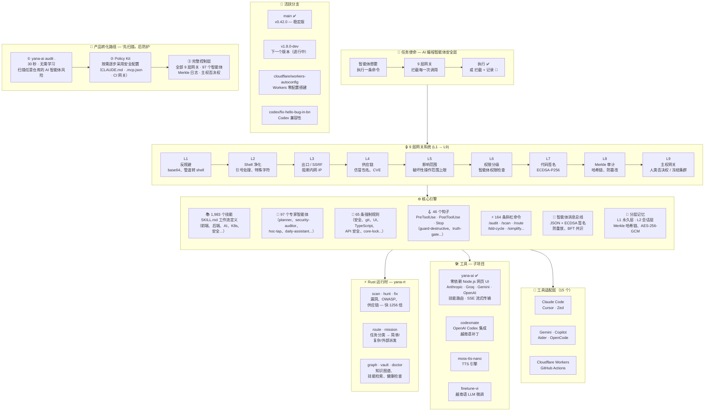

```
$ yana-ai
╭─────────────────────────────────────────────────────────────────────────────────────────────────────────────────────────────────────────────╮
│                                                                                                                                            │
│   ██╗   ██╗ █████╗ ███╗   ██╗ █████╗     █████╗ ██╗                                                                                       │
│   ╚██╗ ██╔╝██╔══██╗████╗  ██║██╔══██╗   ██╔══██╗██║                                                                                       │
│    ╚████╔╝ ███████║██╔██╗ ██║███████║   ███████║██║                                                                                       │
│     ╚██╔╝  ██╔══██║██║╚██╗██║██╔══██║   ██╔══██║██║                                                                                       │
│      ██║   ██║  ██║██║ ╚████║██║  ██║   ██║  ██║██║                                                                                       │
│      ╚═╝   ╚═╝  ╚═╝╚═╝  ╚═══╝╚═╝  ╚═╝   ╚═╝  ╚═╝╚═╝                                                                                       │
│                                                                                                                                            │
│ v0.42.1 · Personal Agent OS                │ Tips for getting started                                                                      │
│ 101 agents · 1,983 skills                   │ yana-ai doctor                                                                               │
│ 66 rules · 49 hooks · 101 scripts          │ yana-ai init                                                                                  │
│ 826 checks · 9 gate layers                 │                                                                                               │
│                                            │ What's new                                                                                    │
│                                            │ v0.42.1 — Mobile parity + Pixel Office + theming                                             │
╰─────────────────────────────────────────────────────────────────────────────────────────────────────────────────────────────────────────────╯
```

<h1 align="center">Yana AI</h1>

<p align="center">
  <strong>人类与 AI 之间的编排层 — 为每个领域提供路由、安全与上下文。</strong>
</p>

<p align="center">
  <em>作者：Vũ Văn Tâm · 17 岁 · 越南</em>
</p>

<p align="center">
  <a href="README.md">English</a> · <a href="README.vi.md">🇻🇳 Tiếng Việt</a> · <a href="README.ko.md">🇰🇷 한국어</a> · <strong>🇨🇳 中文</strong>
</p>

<p align="center">
  <a href="https://github.com/yanacuti1121/yana-ai/actions/workflows/ci.yml">
    
  </a>
  
  
  <a href="https://www.npmjs.com/package/yana-ai">
    
  </a>
  <a href="https://crates.io/crates/yana-rt">
    
  </a>
  <a href="https://pypi.org/project/yana-ai/">
    
  </a>
  <a href="https://github.com/yanacuti1121/yana-ai">
    
  </a>
  <a href="https://github.com/marketplace/yana-ai">
    
  </a>
  <a href="https://github.com/apps/yamtam">
    
  </a>
</p>

<p align="center">
  
  
  
  
  
  
  
</p>

---

**Yana AI** 是面向 AI 编程工具的个人智能体操作系统 — 包含运行时安全钩子、分层记忆系统、97 个专家智能体、1,983 个技能,以及一个在危险 AI 操作执行前进行拦截的 Rust 运行时。

可与 **Claude Code**、**Cursor**、**Windsurf**、**Antigravity**、**Kiro**、**OpenCode**、**Zed**、**Gemini**、**GitHub Copilot**、**Aider** 等工具配合使用。


> **v0.42.0 新功能：** 移动端功能对齐 — Sessions、Analytics、Cron 和 HTML Maker 已从桌面端移植到移动应用。**yana-pixel-bridge** — 将 Claude Code 的 Agent/Task 调度事件转发给同伴 `agent-office` 实例,实时呈现走向工位/工作/空闲的像素动画。新增 6 套主题 + 双语调优面板。修补了 41 个技能中存在的 curl\|bash 供应链风险,关闭了 3 个规则缺口。**Core-lock** — SHA-256 完整性清单,锁定 220 个核心文件以防篡改(规则 67)。

**→ [完整文档与演示](https://yanacuti1121.github.io/Yana-AI/)** · **[GitHub Marketplace](https://github.com/marketplace/yana-ai)**

→ [VISION.md](VISION.md) · [ARCHITECTURE.md](ARCHITECTURE.md) · [ROADMAP.md](ROADMAP.md)

> **97 个智能体是什么意思？** 它们并不是同时运行的 97 个 AI 模型 — 而是预先定义好的专家角色(安全、前端、后端、测试、学习、日常助理……),用于路由和任务组织。在正常使用中,只会激活当前任务所需的那一个智能体;大多数请求只用到单一模型与单一智能体路径。
>由仓库指标自动生成
最后更新：2026-06-21
---

## 🤝 邀请 — 亲自试一试

不要只听这份 README 的一面之词。安装这个引擎,然后让你的 AI 助手做一件它不该做的事 —— 看着网关先把它拦下来：

```bash
npm install yana-ai && npx yana-ai-install   # 接入钩子（60 秒）
yana-ai doctor .                                   # 验证一切已正确接入
```

然后试试看：让智能体执行 `git push --force`、把网上下载的脚本通过管道传给 bash,或者读取 `.env` 文件 —— 每一次尝试都会被拦截、解释并记录下来。这一刻就是整个项目的核心卖点。

由越南一名 17 岁的少年独立开发 —— 这意味着真实世界的反馈对这个项目而言极其珍贵。如果有什么拦得太多、太少,或者让你感到困惑：[提交一个 issue](https://github.com/yanacuti1121/yana-ai/issues)。每一份反馈都会让网关变得更锋利。

---

## Yana AI 概览

```
┌──────────────────────────────────────────────────────────────────┐
│                     Yana AI v0.42.0                        │
│         "人类与 AI 之间的编排层 —                                │
│           为每个领域提供路由、安全与上下文。"                     │
│                                                                  │
│        作者：Vũ Văn Tâm · 17 岁 · 越南                          │
└──────────────────────────────────────────────────────────────────┘
```



> **如何读这张图：** 每一次 AI 工具调用都沿 `MISSION → GATES → CORE` 的路径流动。Rust 运行时（`yana-rt`）为扫描器提速。子项目工具（yana-web 等）共用同一套网关系统。分支部分展示当前活跃的开发方向。

---

## 问题所在

AI 编程智能体会犯错。它们会在错误的目录执行 `rm -rf`。它们会强制推送到 main 分支。它们会编造测试结果。它们会提交密钥。等你发现的时候,损害已经造成。

Yana AI 介于智能体与你的系统之间 —— 每一次工具调用在执行前都必须通过 9 层安全网关。

---

## 工作原理

```
智能体想要执行一条命令
         ↓
[L1] 反规避扫描          — 拦截 base64 解码后执行、管道转 shell
[L2] Shell 净化           — 为所有变量加引号,剔除特殊字符
[L3] 出口检查             — 拦截 SSRF、内网 IP 段、元数据端点
[L4] 供应链网关           — 审查每一次包安装（仿冒包名、CVE）
[L5] 影响范围检查         — 限制破坏性操作的影响范围
[L6] 权限分级检查         — 验证智能体的权限等级
[L7] 签名验证             — 对生成代码进行 ECDSA-P256 验证
[L8] Merkle 审计日志      — 只追加、防篡改的哈希链
[L9] 主权网关             — 人类否决权、冻结集群、完整回滚
         ↓
执行（或拦截 + 记录）
```

---

## 数据一览

| | |
|---|---|
| 🧩 技能 | **1,983** 个工作流技能定义 |
| 🤖 智能体 | **97** 个专家智能体 |
| 📜 安全规则 | **65** 条强制规则 |
| 🪝 钩子 | **46** 个前置/后置执行钩子 |
| ⚡ 斜杠命令 | **164** 条 |
| 🔌 工具适配层 | **15** 个（Claude Code、Cursor、Windsurf、Antigravity、Kiro、OpenCode、Zed、Gemini、Copilot、Aider...） |
| 🦀 Rust 子命令 | **23** 个（`scan`、`graph`、`vault`、`route`、`mission`、`hunt`、`fix`、`doctor`...） |
| ✅ CI 中的规则检查 | **826** 项 |
| 📦 代码库总量 | **10,331 个文件** |

---

## 快速安装

**→ [从 GitHub Marketplace 安装](https://github.com/marketplace/yana-ai)** — 一键安装,官方上架项目。

```bash
# Claude Code 插件 — npx yana-ai-install 接入钩子
# （前提：npm v12+ 默认不再运行 postinstall 脚本）
npm install yana-ai && npx yana-ai-install

# Python CLI
pip install yana-ai

# Rust 运行时（扫描速度快 1256 倍）
cargo install yana-rt
```

```bash
# 验证一切已正确接入
yana-ai doctor .
```

---

## 多工具适配支持

Yana AI 会根据你使用的工具自动适配：

```bash
bash core/scripts/switch-engine.sh cursor    # .cursorrules + 7 个 .cursor/rules/*.mdc
bash core/scripts/switch-engine.sh opencode  # OPENCODE.md
bash core/scripts/switch-engine.sh zed       # .zed/settings.json
bash core/scripts/switch-engine.sh gemini    # GEMINI.md
bash core/scripts/switch-engine.sh copilot   # .github/copilot-instructions.md
bash core/scripts/switch-engine.sh status    # 检查全部 12 个适配器
```

---

## GitHub Action

在每次 PR 时扫描仓库的 AI 智能体配置 —— 密钥、权限、钩子注入、MCP 漏洞。

```yaml
# .github/workflows/yana-ai-scan.yml
- uses: yanacuti1121/yana-ai/.github/actions/scan@main
  with:
    fail-on: 'high'       # 发现 HIGH 或 CRITICAL 级别问题时使 CI 失败
    diff-only: 'true'     # 在 PR 中仅扫描有变更的文件
    comment-on-pr: 'true' # 将扫描结果摘要发布为 PR 评论
```

在每个 PR 上自动发布评论：

```
🟠 Yana AI Security Scan — HIGH

| Metric  | Value  |
|---------|--------|
| Risk    | HIGH   |
| Score   | 58/100 |
| Findings| 3      |
```

→ [完整工作流模板](docs/install/github-action.yml)

---

## Rust 运行时 — `yana-rt`

23 个子命令。零 Python 依赖。

```bash
yana-ai scan .                        # 安全扫描 — 密钥、CVE、供应链风险
yana-ai graph .                       # 知识图谱 — 文件依赖、import 解析
yana-ai vault search Q                # 按关键词检索 1,983 个技能
yana-ai hunt .                        # 检测安全模式（OWASP、注入、SSRF）
yana-ai fix .                         # 自动修复规则违规
yana-ai doctor .                      # 完整系统健康检查
yana-ai map .                         # 影响范围地图 — 智能体能触及哪些地方？
yana-ai ci                            # 运行全部网关检查（CI 中使用）
yana-ai route classify "fix auth bug" # 任务分类 → 简单/复杂/外部
yana-ai mission create "add-auth"     # 创建并行智能体任务集
```

**基准测试：** 在一万文件规模的仓库上运行 `yana-ai scan`——比 Python 版本**快 1256 倍**。

---

## 安全架构

```
core/
├── hooks/          # 46 个 PreToolUse / PostToolUse / Stop 钩子
├── rules/          # 65 条强制规则（安全、正确性、UI、git）
├── scripts/        # safe-run.sh、verify-core-lock.sh、secure-logger.sh
├── gates/          # truth_gate.md、action_gate.md
├── agents/         # 97 个专家智能体定义
├── skills/         # 1,983 个 SKILL.md 文件
├── config/
│   ├── core-lock.json    # SHA-256 清单 — 锁定 220 个核心文件
│   └── skills-lock.json  # 技能内容哈希
└── memory/
    ├── L1_atomic/  # 永久事实 — 跨会话保留
    └── L2_session/ # 会话状态 — 自动过期
```

关键特性：
- **Merkle 审计链** — 每一次操作都被记录,且可检测篡改
- **Core-lock 完整性** — SHA-256 清单可检测 `core/` 目录中的偏移、删除与规则注入
- **BFT 共识** — 写入核心基础设施需要 3-of-N 投票
- **主权网关** — 人类可以瞬间冻结全部 97 个智能体
- **蜜罐层** — 诱饵文件/环境变量用于捕获被攻陷的智能体

---

## 实际运行效果

```bash
# 智能体尝试：git push --force origin main
[yana-ai/02-terminal-validator] BLOCKED — 禁止强制推送
  命令      : git push --force origin main
  网关      : L1
  解决方法  : 先运行网关检查,再不带 --force 推送

# 智能体尝试：curl http://169.254.169.254/latest/meta-data/
[yana-ai/network-egress] BLOCKED — 检测到 SSRF 目标
  主机      : 169.254.169.254
  网关      : L3
  退出码    : 3

# 智能体尝试安装未经审查的包
[yana-ai/dependency-vetting] BLOCKED — 未经审查的包安装
  包名      : req-uests@2.28.0
  原因      : 仿冒包名（与 'requests' 相似）
  网关      : L4
```

---

## Yana AI

**[立即体验 →](https://yanai-production.up.railway.app)**

Yana 是基于 Yana AI 核心构建的第一个界面 —— 一个让任何人都能与 AI 对话、切换提供商并使用技能路由的网页 UI,完全无需了解底层基础设施。

```
用户 → Yana AI → Yana AI Core（路由 · 安全 · 上下文） → 模型
```

- 无需注册 — 使用你自己的 API 密钥
- 🔐 **加密密钥保险箱** — 密钥以 AES-256-GCM 加密存储,主密钥不可导出（WebCrypto + IndexedDB）,从不以明文形式存在
- 多提供商支持：Anthropic · Groq · Gemini · OpenAI · DeepSeek · OpenRouter · 9Router · Ollama

**提供商设置** — 使用你自己的密钥,密钥在本地加密（不会发送给 Yana AI）：

| 提供商 | 类型 | 设置方式 |
|----------|------|-------|
| **Claude** | 云端 | API 密钥 → [console.anthropic.com/settings/keys](https://console.anthropic.com/settings/keys) |
| **OpenAI** | 云端 | API 密钥 → [platform.openai.com/api-keys](https://platform.openai.com/api-keys) |
| **Gemini** | 云端 | API 密钥 → [aistudio.google.com/app/apikey](https://aistudio.google.com/app/apikey) |
| **Groq** | 云端 | API 密钥 → [console.groq.com/keys](https://console.groq.com/keys) |
| **DeepSeek** | 云端 | API 密钥 → [platform.deepseek.com/api_keys](https://platform.deepseek.com/api_keys) |
| **OpenRouter** | 云端 | API 密钥 → [openrouter.ai/settings/keys](https://openrouter.ai/settings/keys) |
| **9Router** | 本地 | `npm install -g 9router` → `9router`（运行于 `localhost:20128`） |
| **Ollama** | 本地 | [ollama.com/download](https://ollama.com/download) → `ollama serve` → `ollama pull llama3.2` |
- 📊 **100% 真实数据** — 实时提供商统计、L1 记忆花园、审计日志健康面板;没有任何演示用假数据
- 内置技能路由 — 自然输入即可,Yana AI 会派发到正确的智能体
- **非编程场景：** 学习（苏格拉底式学习助理）、日常工作（摘要 / 规划 / 草拟）
- SSE 流式传输,移动端友好 · Electron 桌面端外壳（`tools/yana-desktop`）

如果说 Yana AI 是电网,那 Yana 就是第一座接上电的建筑。

---

## 一个人完成的项目

一个人。没有团队。没有融资。

- 钩子架构、安全网关、Python CLI
- Rust 运行时（`yana-rt`）、97 个智能体、1,983 个技能、多工具适配支持
- 15 个工具适配层（Claude Code、Cursor、Windsurf、Antigravity、Kiro、Zed、Gemini、Copilot、Aider……）

这 1,983 个技能覆盖：前端、后端、AI/LLM、安全、Kubernetes、WebAssembly、DevOps、数据库、测试等等。另有两个面向非编程场景的全新智能体角色：学习（`hoc-tap`）与日常生产力（`daily-assistant`）。

---

## 在你的仓库中加入 Yana AI

**静态徽章** — 粘贴到你的 README：

```markdown
[](https://github.com/yanacuti1121/yana-ai)
```

**动态审计徽章** — 显示实时安全分数：

```bash
yana-ai badge .           # 输出带当前分数的徽章 markdown
yana-ai badge . --json    # 输出机器可读格式
```

**GitHub Action** — 自动扫描每一次 PR：

```yaml
- uses: yanacuti1121/yana-ai/.github/actions/scan@main
  with:
    fail-on: 'high'
```

→ [完整工作流模板](docs/install/github-action.yml)

---

## Yana 任务路由器

每个任务在执行前都会被分类 —— 再也不用猜测该自己处理还是派发给智能体。

```bash
yana-ai route classify "implement JWT refresh token"
# → { "route": "complex", "gate": "harness", "confidence": 0.36,
#     "suggested_agents": ["security-engineer", "backend-developer"] }

yana-ai route classify "查看最近 10 条 git log"
# → { "route": "simple", "gate": "auto", "confidence": 0.43 }

yana-ai route classify "deploy to production"
# → { "route": "external", "gate": "confirm", "confidence": 0.30 }
```

五种路由：
- **simple** → Yana 直接处理（只读,无需智能体）
- **skill** → 与 1,983 条技能索引匹配,派发到准确的技能智能体
- **learn** → 路由到 `hoc-tap` —— 苏格拉底式学习助理（触发词："learn"、"explain"、"why" —— 支持英语与越南语）
- **daily** → 路由到 `daily-assistant` —— 摘要 / 规划 / 草拟（触发词："summarize"、"write an email"、"make a plan" —— 支持英语与越南语）
- **complex** → 携带限定范围的简报,派发给专家智能体
- **external** → 暂停,在继续之前征得人类确认

领域感知的智能体选择：认证任务 → `security-engineer`,数据库 → `database-expert`,UI → `frontend-developer + ui-ux-designer`。

---

## 任务集调度器

基于波次的并行编排,内置依赖解析 —— 用 Rust 编写,零 Python 依赖。

```bash
# 1. 创建任务集
MID=$(yana-ai mission create "implement-auth" | awk '/id:/{print $2}')

# 2. 声明带依赖关系的任务
yana-ai mission task $MID "design-schema"   --agent database-expert --produces schema.sql
yana-ai mission task $MID "implement-auth"  --agent backend-developer \
  --consumes schema.sql --produces src/auth.ts
yana-ai mission task $MID "write-tests"     --agent test-engineer \
  --consumes src/auth.ts --produces tests/auth.test.ts

# 3. 派发第 1 波 — 只派发依赖已满足的任务
yana-ai mission dispatch $MID --max-parallel 3
# → 为每个就绪的智能体输出 JSON 简报

# 4. 标记完成,派发下一波
yana-ai mission done $MID "design-schema" --evidence schema.sql
yana-ai mission dispatch $MID  # → 解锁第 2 波

# 取消 / 重试卡住的任务
yana-ai mission cancel $MID "implement-auth"
yana-ai mission retry  $MID "write-tests"
```

任务一经派发即标记为 **Running** —— 重复运行 `dispatch` 永远不会让同一个任务被重复派发。

---

## 多智能体启动器

并行启动多个智能体,带硬性上限与一键终止开关：

```bash
# 启动 3 个智能体,最多 3 个并行运行
bash core/scripts/multi-agent-launch.sh start \
  --agents "scanner,auditor,qa-team" \
  --concurrency 3

# 实时状态
bash core/scripts/multi-agent-launch.sh status

# 停止某一个特定智能体
bash core/scripts/multi-agent-launch.sh kill scanner

# 一键终止 — 立即停止全部
bash core/scripts/multi-agent-launch.sh kill all

# 跟踪某个智能体的日志
bash core/scripts/multi-agent-launch.sh log auditor
```

也可以用任务列表文件驱动：
```bash
# tasks.txt — 每行一个任务：智能体名称:任务描述
echo "scanner:scan the whole repo
auditor:check the hooks
qa-team:run the test suite" > tasks.txt

bash core/scripts/multi-agent-launch.sh start --tasks-file tasks.txt --concurrency 4
```

示例输出：
```
═══ Yana AI Multi-Agent Launcher ═══
  Agents     : 3
  Concurrency: 3（最多并行运行数）
  Kill switch: bash multi-agent-launch.sh kill all

[LAUNCH] scanner → scan the whole repo    PID 12341
[LAUNCH] auditor → check the hooks        PID 12342
[LAUNCH] qa-team → run the test suite     PID 12343

[OK] 已启动 3/3 个智能体
```

---

仓库配置中定义了 97 个专家角色
仓库扫描发现了 1,983 个技能定义
共 10,331 个文件,测量于 2026-06-21

---

## 联系方式

**Vũ Văn Tâm** · 越南 · 17 岁

| | |
|---|---|
| 邮箱 | phamlongh230@gmail.com |
| 网站 | [yanacuti1121.github.io/Yana-AI](https://yanacuti1121.github.io/Yana-AI/) |
| GitHub | [yanacuti1121/Yana-AI](https://github.com/yanacuti1121/Yana-AI) |
| Yana AI | [yanai-production.up.railway.app](https://yanai-production.up.railway.app) |

---

## 🇬🇧 / 🇻🇳 / 🇰🇷 其他语言

本文档的其他语言版本：**[README.md](README.md)**（English） · **[README.vi.md](README.vi.md)**（Tiếng Việt） · **[README.ko.md](README.ko.md)**（한국어）
