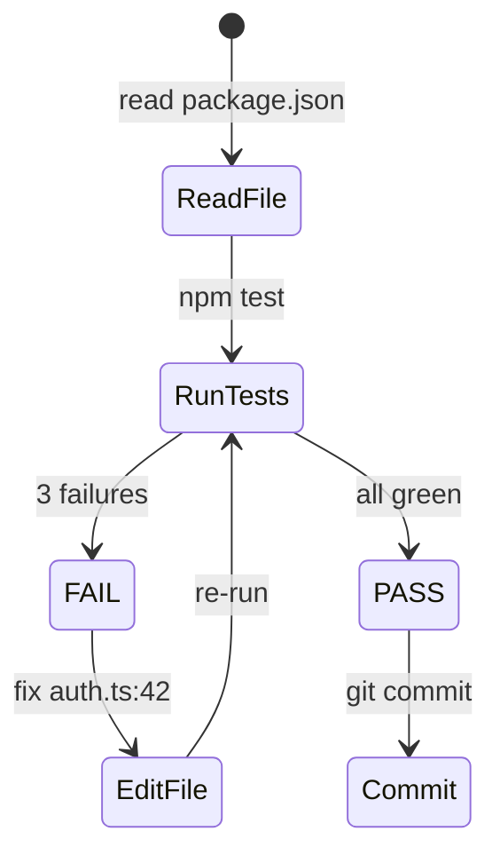

# TencentDB Agent Memory
# Source: Tencent/TencentDB-Agent-Memory (Apache-2.0)
# Tier: TIER 2 — CORRECTNESS

Bộ nhớ dài hạn 4 tầng cho AI agent — không cần API ngoài, token giảm 61%, success rate tăng 51%.

**Do NOT use for:** `hermes-memory-manager` (multi-provider orchestration), `mem0` (managed cloud memory), `terminal--agent-memory` (general patterns).

---

## Kiến trúc 4 tầng (L0 → L3)

```
L0 — Raw conversations       Raw tool call logs + full conversation history
       ↓ compress
L1 — Atomic facts            Extracted facts, decisions, preferences (SQLite)
       ↓ cluster
L2 — Scenarios/scenes        Grouped contexts — "debugging session", "PR review"
       ↓ abstract
L3 — Personas                High-level user/project profile updated over time

Retrieval: L3 (fast, broad) → L2 (context) → L1 (precise) → L0 (evidence)
```

Mỗi tầng human-readable → dễ debug. Đường dẫn từ L3 abstraction xuống L0 raw là **deterministic** — không bao giờ mất trace.

---

## Short-term memory: Mermaid tool-log compression

Tool logs dài và tốn token. TencentDB nén chúng thành Mermaid state diagram:

```markdown
<!-- Thay vì lưu 200 dòng tool output: -->



Token savings: ~60% vs raw logs, vẫn giữ đủ context để tiếp tục task.

```typescript
function compressToolLog(calls: ToolCall[]): string {
  const lines = calls.map((c, i) => {
    const from = i === 0 ? '[*]' : calls[i-1].tool
    const status = c.error ? 'FAIL' : (c.result?.slice(0, 20) ?? 'ok')
    return `    ${from} --> ${c.tool}: ${status}`
  })
  return `\`\`\`mermaid\nstateDiagram-v2\n${lines.join('\n')}\n\`\`\``
}
```

---

## Long-term memory: SQLite + sqlite-vec

```typescript
// Setup — local only, no API key
import Database from 'better-sqlite3'
import { load as loadVec } from 'sqlite-vec'

const db = new Database('.yana/agent-memory.db')
loadVec(db)

db.exec(`
  CREATE VIRTUAL TABLE IF NOT EXISTS facts USING vec0(
    embedding float[768]
  );
  CREATE TABLE IF NOT EXISTS facts_meta (
    id INTEGER PRIMARY KEY,
    tier INTEGER,       -- 1=atomic 2=scenario 3=persona
    content TEXT,
    tags TEXT,
    ts INTEGER
  );
`)

// Upsert atomic fact (L1)
function storeFact(content: string, embedding: number[], tags: string[]) {
  const meta = db.prepare(
    'INSERT INTO facts_meta(tier,content,tags,ts) VALUES(1,?,?,?)'
  ).run(content, tags.join(','), Date.now())
  db.prepare('INSERT INTO facts(rowid,embedding) VALUES(?,?)').run(
    meta.lastInsertRowid, new Float32Array(embedding)
  )
}

// Hybrid search: BM25 + vector với RRF fusion
function recall(query: string, embedding: number[], k = 5) {
  const vec = db.prepare(`
    SELECT rowid, distance FROM facts
    WHERE embedding MATCH ? ORDER BY distance LIMIT ?
  `).all(new Float32Array(embedding), k * 2)

  const bm25 = db.prepare(`
    SELECT id FROM facts_meta WHERE content LIKE ? LIMIT ?
  `).all(`%${query}%`, k * 2)

  // RRF fusion: score = Σ 1/(rank + 60)
  const scores = new Map<number, number>()
  vec.forEach(({ rowid }, i)  => scores.set(rowid, (scores.get(rowid) ?? 0) + 1/(i+61)))
  bm25.forEach(({ id }, i)    => scores.set(id,    (scores.get(id)    ?? 0) + 1/(i+61)))

  return [...scores.entries()]
    .sort((a, b) => b[1] - a[1])
    .slice(0, k)
    .map(([id]) => db.prepare('SELECT * FROM facts_meta WHERE id=?').get(id))
}
```

---

## Persona builder (L3)

```typescript
// L3 persona — built từ accumulated L1/L2 facts
interface AgentPersona {
  projectContext: string    // "yana-ai: Rust runtime + 3518 skills, multi-agent"
  workStyle:      string    // "prefers surgical edits, no comments, vi + en"
  recentFocus:    string[]  // ["mobile sync", "security rules", "README cleanup"]
  avoidPatterns:  string[]  // ["don't say oke ngon lành while bugs remain"]
}

// Inject persona vào system prompt — thay thế manual context trong mỗi session
function buildSystemContext(persona: AgentPersona): string {
  return [
    `Project: ${persona.projectContext}`,
    `Style: ${persona.workStyle}`,
    `Recent: ${persona.recentFocus.join(', ')}`,
    `Avoid: ${persona.avoidPatterns.join('; ')}`,
  ].join('\n')
}
```

---

## Tích hợp với Yana AI L1/L2

TencentDB L0–L3 mở rộng hệ thống Yana AI hiện có:

| Yana AI | TencentDB | Mapping |
|---------|-----------|---------|
| Chat history | L0 raw | Tương đương |
| `add-fact.sh` entries | L1 atomic | Tương đương |
| Session context | L2 scenarios | Bổ sung thêm clustering |
| *(chưa có)* | L3 personas | **Mới** — cross-session profile |
| *(chưa có)* | Mermaid compression | **Mới** — tool log shortening |

Triển khai: L0/L1 dùng Yana AI cũ, thêm L2 clustering + L3 persona update cuối session.

---

## Cài đặt

```bash
npm install better-sqlite3 sqlite-vec
```

---

## Anti-Fake-Pass Checks

```
❌ FAIL nếu dùng external API cho embedding trong local-only deployment
❌ FAIL nếu Mermaid output không thể parse lại thành tool call sequence
❌ FAIL nếu L3 persona overwrite L1 facts (phải keep cả hai)
❌ FAIL nếu RRF fusion bỏ qua một trong hai signals (BM25 hoặc vector)
✅ PASS khi: recall() trả về kết quả trong < 50ms trên 10K facts
✅ PASS khi: Mermaid diagram < 30% kích thước raw tool log gốc
```

## See also

- `hermes-memory-manager` — multi-provider orchestration (không cover L0–L3 pipeline)
- `mem0` — managed cloud memory (cần API, khác local SQLite approach)
- `mermaid-diagram-generation` — Mermaid cho docs (không phải tool log compression)
- `memory-persistence-law.md` — Yana AI rule về L1/L2 persistence
