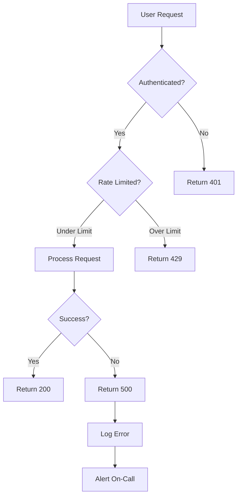
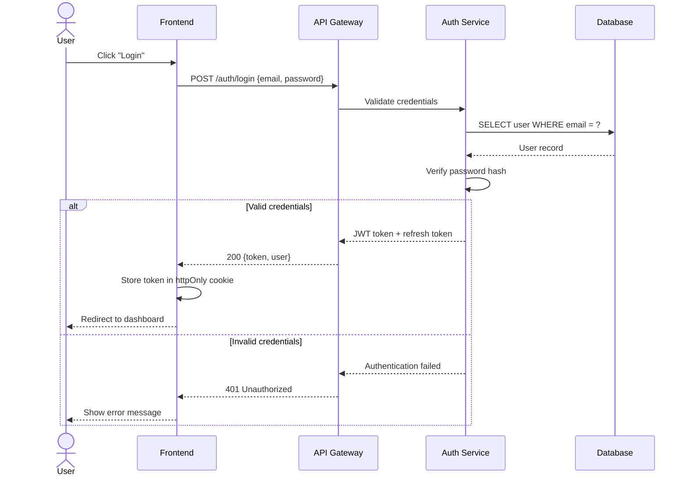
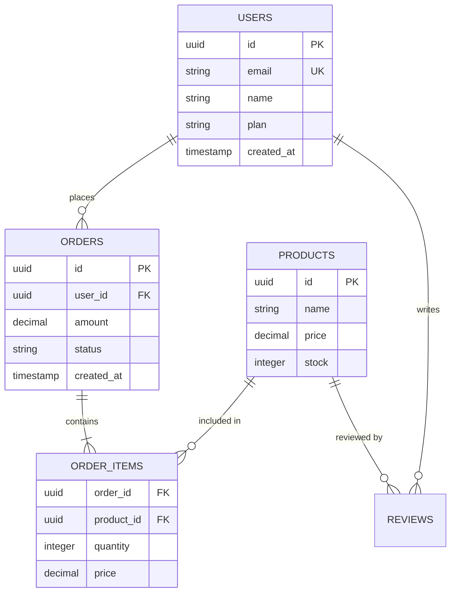
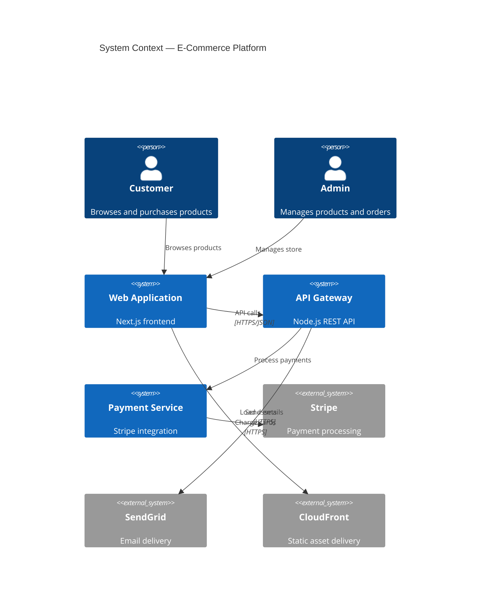
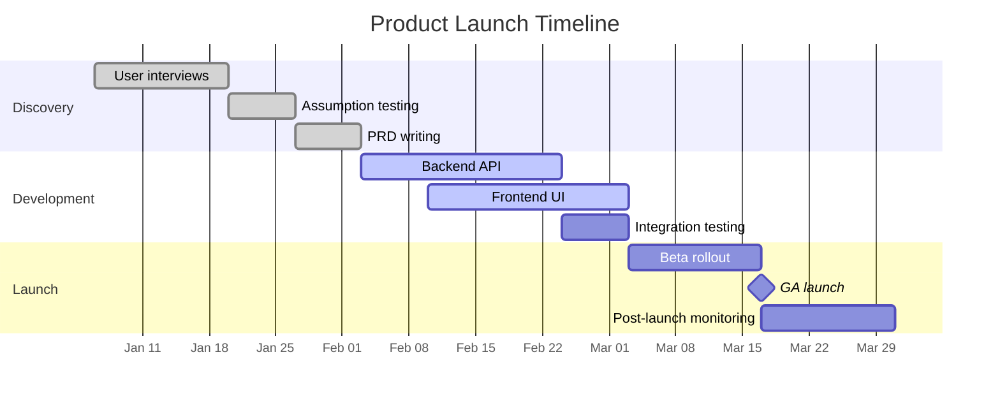
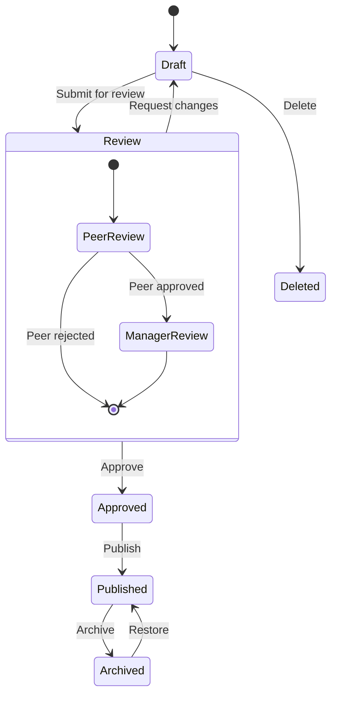

# Mermaid — Diagrams as Code in Markdown

## Overview

You are an expert in Mermaid, the JavaScript-based diagramming library that renders diagrams from text definitions embedded in Markdown. You help developers create flowcharts, sequence diagrams, class diagrams, ERDs, Gantt charts, and architecture diagrams that live alongside code and documentation — versioned in Git, rendered in GitHub, GitLab, Notion, and VitePress.

## Instructions

### Flowcharts



### Sequence Diagrams



### Entity Relationship Diagrams



### Architecture Diagrams (C4)



### Gantt Charts



### State Diagrams



## Installation

```bash
npm install mermaid                    # JavaScript library
# Or use CDN: <script src="https://cdn.jsdelivr.net/npm/mermaid/dist/mermaid.min.js"></script>

# GitHub, GitLab, Notion render Mermaid natively in Markdown
# Just use ```mermaid code blocks
```

## Examples

**Example 1: User asks to set up mermaid**

User: "Help me set up mermaid for my project"

The agent should:
1. Check system requirements and prerequisites
2. Install or configure mermaid
3. Set up initial project structure
4. Verify the setup works correctly

**Example 2: User asks to build a feature with mermaid**

User: "Create a dashboard using mermaid"

The agent should:
1. Scaffold the component or configuration
2. Connect to the appropriate data source
3. Implement the requested feature
4. Test and validate the output

## Guidelines

1. **Diagrams as code** — Keep Mermaid diagrams in Markdown files alongside code; they version, diff, and review in PRs
2. **GitHub native rendering** — GitHub renders Mermaid in README and docs automatically; no extra tooling needed
3. **Sequence diagrams for APIs** — Use sequence diagrams to document API flows; clearer than prose for multi-service interactions
4. **ERDs from actual schema** — Generate Mermaid ERDs from your database schema; keep them in sync with migrations
5. **Keep it simple** — Mermaid diagrams should fit on one screen; split complex systems into multiple diagrams
6. **Theme for presentations** — Use `%%{init: {'theme': 'dark'}}%%` for dark-mode diagrams in presentations
7. **C4 for architecture** — Use C4 context/container/component diagrams for system architecture documentation
8. **Gantt for planning** — Use Gantt charts in project READMEs to communicate timelines; auto-renders in GitHub
