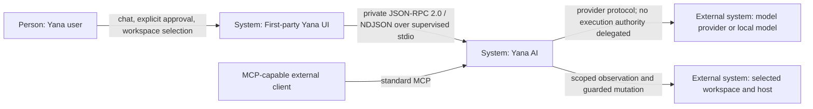
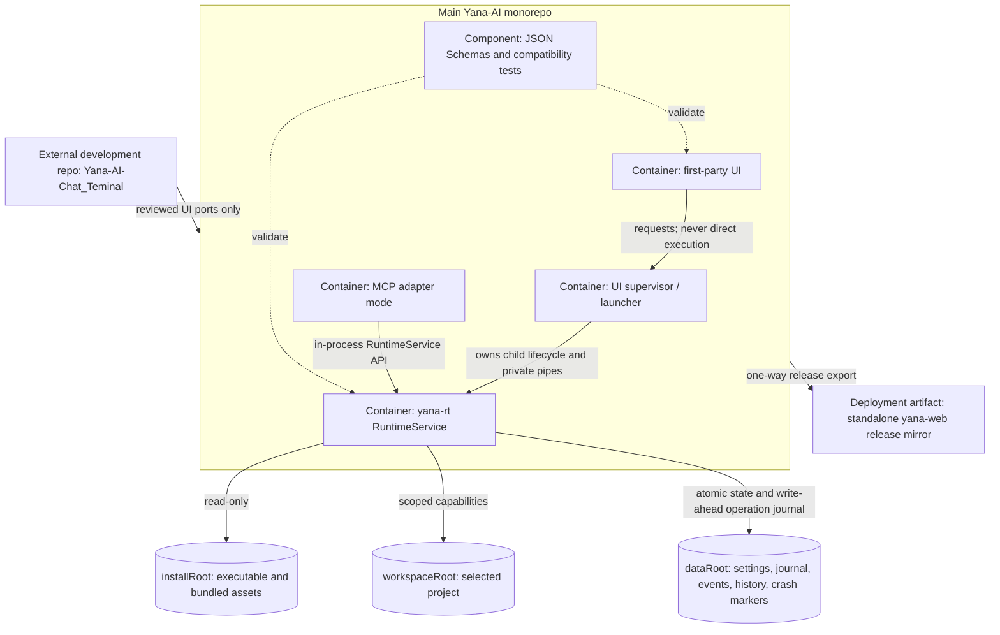

## ADR-011: Canonical Runtime for the Unified Yana Experience

**Date**: 2026-08-09
**Status**: Accepted
**Deciders**: Vũ Văn Tâm / @systems-architect

### Context

Yana currently has several surfaces that can drift into separate products: the
main Yana-AI repository, the standalone `yana-web` repository, the
`Yana-AI-Chat_Teminal` experiment, the Rust `yana-rt` runtime, and the MCP
spike described by ADR-010. The visual work is ahead of the runtime boundary.
If each surface owns routing, settings, approvals, filesystem access, or tool
execution, the project will gain several authorities that happen to look like
one application. That is a distributed monolith with a security split-brain,
not a unified experience.

This ADR is the approved Wave 0 boundary. It adds contracts and inventory only;
it does not add an execution capability or authorize the UI to bypass existing
guards. It resolves these constraints:

- The main Yana-AI repository is the canonical product/runtime monorepo.
- The standalone `yana-web` repository is a one-way release mirror, not a
  second source of truth.
- `Yana-AI-Chat_Teminal` is a UI incubator. Ideas may be promoted into the main
  repository after review; runtime or release authority may not originate
  there.
- `yana-rt` exposes one `RuntimeService` and is the sole authority for
  capabilities, policy, approval state, execution, operation state, evidence,
  and effective runtime configuration.
- A first-party UI needs lifecycle, cancellation, backpressure, approval, and
  crash semantics that MCP does not provide as Yana's private application
  protocol. MCP remains an interoperability adapter and is not renamed or
  extended into this private channel.
- Existing `src/bus.rs::BusEvent` consumers must not receive a second event
  envelope.
- Installed code, the selected workspace, and mutable user/runtime data have
  different trust and lifecycle rules, even when development puts them under
  nearby paths.

ADR-010 is still useful evidence from the Program J spike, but its proposed
"MCP fully replaces the translator pattern" direction is superseded for
first-party application communication. MCP may expose RuntimeService
capabilities to external clients; it does not become the desktop/UI control
plane and may not implement a second guard or approval path.

### Options Considered

1. **Let each UI embed the runtime logic it needs**: Share libraries where
   convenient, but let desktop/web/incubator code own settings, provider calls,
   approvals, and execution. — Pros: fastest initial UI integration; each UI
   can iterate independently. Cons: multiple mutation paths, inconsistent
   policy, secrets and approval state cross the UI trust boundary, and fixes
   must be ported to every surface.
2. **Use MCP as the only protocol for first-party and third-party clients**:
   Put all tools behind `yana-rt mcp` and use MCP stdio everywhere. — Pros: one
   published protocol and existing SDK/tool discovery support. Cons: MCP is an
   interoperability/tool protocol, not a supervised application lifecycle;
   cancellation, ordered application events, bounded notification flow,
   operation reconciliation, and opaque human approvals would become
   Yana-specific MCP extensions. It also preserves the dangerous ambiguity
   between an optional model-chosen tool and mandatory runtime enforcement.
3. **Canonical RuntimeService with a private supervised stdio protocol; MCP as
   an adapter**: First-party UI code speaks the versioned private protocol.
   MCP and future adapters call the same RuntimeService internally. — Pros: one
   authority and mutation path, explicit lifecycle and failure behavior,
   bounded local transport, and clean separation between product protocol and
   ecosystem interoperability. Cons: Yana owns another protocol and must
   maintain compatibility tests, supervision, generated bindings, and a
   migration period with a feature flag.

### Decision

Choose option 3. Build a modular monolith around `yana-rt RuntimeService`, not
microservices and not a set of UI-owned backends. The private protocol is a
stable adapter boundary around the Rust service; it is not a license to move
domain logic into transport handlers.

#### Source and release topology

| Surface | Role | May own | Must not own |
| --- | --- | --- | --- |
| Main Yana-AI repository | Canonical product/runtime monorepo | Runtime, first-party UI, contracts, tests, packaging, release metadata | Bidirectional sync rules that allow mirrors to overwrite canonical source |
| Standalone `yana-web` | Generated release mirror | Distribution artifact and provenance pointing to a canonical commit | Original product changes, runtime logic, independent version decisions |
| `Yana-AI-Chat_Teminal` | UI incubator | Prototypes, visual experiments, interaction evidence | Runtime authority, releases, policy, approvals, capability implementations |

Promotion is intentionally asymmetric:

```text
Yana-AI-Chat_Teminal --reviewed port--> main Yana-AI --release export--> yana-web mirror
                                                  ^
                                                  |
                                      only canonical source changes here
```

The release mirror records the canonical commit and contract version used to
produce it. A hotfix made in the mirror must first be replayed and reviewed in
the main repository; the next export may then contain it. There is no automatic
reverse merge.

#### C4 context



#### C4 containers



`RuntimeService` is the only container allowed to decide or perform a
capability. The supervisor owns process lifecycle and pipes, not policy. The UI
renders state and collects explicit user intent, but it cannot turn a denial
into an approval. The MCP adapter translates standard MCP messages into the
same in-process service API; it contains no guard patterns, executor, settings
store, or approval manager of its own.

#### Root separation

RuntimeService resolves and returns three canonical native paths during the
handshake:

- `installRoot` contains the executable, bundled UI, schemas, and release
  metadata. Normal runtime treats it as read-only. Updating the installation
  is a release operation, not a user task.
- `workspaceRoot` is the currently authorized project. Every path-bearing
  capability resolves against this root and repeats containment checks after
  symlink/canonical-path resolution.
- `dataRoot` contains mutable application state: runtime settings, UI
  preferences, operation journal, event history, conversation history, logs,
  and crash markers. It is never scanned as product source merely because it
  is nearby on disk.

The client may send a `workspaceHint` during initialization. It is untrusted
input, not authority. Rust canonicalizes and authorizes it before returning
`workspaceRoot`. The UI must use the returned value. No relative path or
current-working-directory inference crosses this boundary.

#### Private transport and framing

The first-party protocol is named `yana.runtime`, version `1.0`. It uses
JSON-RPC 2.0 messages, encoded as UTF-8 NDJSON over pipes owned by the UI
supervisor:

- stdin and stdout are protocol-only; diagnostics go to stderr;
- exactly one JSON object per LF-terminated line;
- batch arrays, a UTF-8 BOM, blank frames, and raw multi-line JSON are invalid;
- the pre-negotiation maximum is 1 MiB. The initialize response advertises the
  effective `maxFrameBytes`, which may not exceed the schema's 16 MiB ceiling;
- the parser counts bytes incrementally before allocating a full frame;
- a protocol violation is fail-closed: return a typed JSON-RPC error only when
  the request ID can be recovered safely, then close the session. The runtime
  does not guess where a corrupted stream resumes.

This transport is private because the supervisor starts a known `yana-rt`
binary and owns both anonymous pipes. It is not a localhost TCP API, a public
socket, an MCP dialect, or an authentication boundary. If a remote or
multi-user transport is added later, it requires a new ADR and an authenticated
threat model.

The normative decoded-frame schema is
`core/contracts/runtime-protocol.schema.json`.

#### Handshake, versions, and capabilities

The handshake has three messages:

1. Client sends `runtime.initialize` as client sequence 1 with a null
   `sessionId`, supported protocol versions, client identity, desired
   capabilities, and an optional workspace hint.
2. Runtime chooses one common version and returns server identity, a
   Rust-generated session ID, the effective capability intersection, canonical
   roots, settings schema versions, and flow-control limits as runtime sequence
   1. No common version returns `incompatible_version` and closes the session.
3. Client sends `runtime.initialized` as client sequence 2. Runtime accepts no
   normal call and emits no normal event before this acknowledgement.

Unknown optional capabilities are ignored. A client marks capabilities it
cannot operate without; the UI remains on the disabled/legacy presentation if
the effective set lacks one. Missing safety capability never degrades to a
client-side implementation.

Protocol and settings schema versions are independent of application release
versions. Breaking wire changes require a new major protocol version and a
dual-version migration window; additive optional fields require a minor
contract revision but cannot be inserted into a `1.0` frame while its schemas
remain closed.

#### IDs, order, and operations

- Request, session, operation, event, installation, and approval identifiers
  are opaque ASCII strings of at most 128 bytes. They are compared byte-for-
  byte and never parsed for authority.
- A client-generated request ID is unique for a session and is never reused,
  even after cancellation. The response copies it exactly.
- Runtime-generated session, operation, event, and approval IDs use a
  cryptographically strong random source. Sequence numbers are not IDs.
- Client and runtime maintain independent, strictly increasing, gap-free
  sequence counters starting at 1. A duplicate, regression, or gap means lost,
  replayed, or reordered pipe state and terminates the session.
- `runtime.call` creates a runtime-owned `operationId`. Mutation capabilities
  additionally require an `idempotencyKey`; RuntimeService journals the key
  before the side effect and returns the recorded outcome on an exact retry.
  A key with different inputs is rejected.
- Responses may complete out of request order. Correlation uses `id`; temporal
  replay and notification acknowledgement use `yana.sequence`.

#### Cancellation

`runtime.cancel` is a normal request with its own ID and exactly one target:
the still-pending request ID or the durable operation ID. Cancellation is
best-effort and returns `accepted`, `already_terminal`, `not_cancellable`, or
`not_found`.

Before mutation starts, accepted cancellation prevents it. While a cancellable
child process runs, Rust owns signalling, the deadline, and reaping. Once an
irreversible step may have occurred, the result is never reported as cancelled
merely because the UI closed; it remains running or becomes `unknown` until
evidence reconciliation. Cancelling an operation waiting for approval consumes
and invalidates its approval handle.

#### Backpressure

The initialize result negotiates `maxInFlightRequests`, `eventWindow`,
`ackTimeoutMs`, and `maxFrameBytes`.

- The UI never has more than `maxInFlightRequests` unanswered requests. The
  runtime rejects excess work with typed `busy` (`-32003`) and a bounded retry
  hint; it does not create an operation first.
- Every runtime response and notification advances the runtime sequence. The
  UI sends `runtime.ack` with the highest contiguous runtime sequence it has
  fully processed.
- Runtime holds at most `eventWindow` unacknowledged notifications in memory.
  Read-only progress/telemetry may be coalesced. Approval challenges,
  mutation-started, mutation-terminal, denial, cancellation, crash, and event-
  gap records are durable and never silently dropped.
- At the hard window, RuntimeService stops accepting new mutation calls,
  persists terminal state to `dataRoot`, and waits for acknowledgement. If no
  progress occurs before `ackTimeoutMs`, it closes the protocol so the
  supervisor can restart it. It never accumulates an unbounded writer queue.

OS pipe backpressure is therefore the last mechanical limit, not the first
policy. A client that stops reading cannot wedge memory growth or cause the
runtime to accept invisible mutations indefinitely.

#### Notifications and BusEvent compatibility

The only server notification method in version 1.0 is `runtime.event`. Its
`params` object has the exact serialized `BusEvent` fields already used by
`src/bus.rs`:

```json
{
  "id": "event-01",
  "ts": "2026-08-09T12:00:00Z",
  "from": "runtime-service",
  "to": "yana-desktop",
  "type": "runtime.operation.completed",
  "payload": { "operationId": "operation-01" },
  "reply_to": null
}
```

The JSON-RPC `yana.sequence` is transport order. `BusEvent.id` is durable event
identity. `reply_to` remains snake_case to preserve compatibility. Consumers
must tolerate an unknown event `type` but must not treat it as an approval or
terminal state unless their negotiated capability defines that type.

#### Rust-owned opaque approvals

Approval policy and state live in RuntimeService:

1. A guarded mutation that is eligible for human approval returns
   `approval_required`, a presentation-only summary, and a Rust-generated
   opaque `handle` bound to session, operation, exact input digest, scope,
   expiry, and one decision.
2. The UI renders the supplied scope/risk/summary. It cannot alter the hidden
   binding and receives no signing key or reusable permission.
3. The UI sends `runtime.approval.resolve` with the handle and only
   `approve_once` or `deny` in Wave 0.
4. Rust atomically consumes the handle. Expired, replayed, cross-session,
   input-mismatched, or post-crash handles are invalid.

A hard guard denial never creates an approval challenge. Handles are held in
memory, are not written to UI preferences or logs, and die with the runtime
session. "Approve for session/scope" is deliberately absent until its grant
model receives a separate security review.

#### Runtime settings versus UI preferences

Two closed schemas prevent a convenient UI toggle from becoming execution
authority:

| Rust-owned runtime settings | UI-owned preferences |
| --- | --- |
| canonical roots | theme, blue/pink/green balance, glow, opacity, motif, layout and font scale |
| transport and flow-control limits | panel sizes and collapsed state |
| approval authority and handle lifetime | send-on-enter and auto-scroll |
| operation/event retention and crash markers | locale, reduced motion, contrast |
| feature stages, cohorts, and kill switch | presentation notifications |

Runtime settings validate against
`core/contracts/runtime-settings.schema.json` and are atomically written by
Rust under `dataRoot`. UI preferences validate against
`core/contracts/ui-preferences.schema.json`. Their schema excludes roots,
transport, capabilities, approvals, feature flags, provider credentials, and
execution policy. The UI may ask RuntimeService to locate its preference file,
but runtime code never interprets presentation fields as policy.

#### Feature-flag rollout and rollback

`unifiedExperience` is evaluated by Rust from a stable installation ID and has
four stages: `off`, `shadow`, `canary`, and `on`. A kill switch dominates every
stage and allowlist.

- `off`: the new adapter is not started.
- `shadow`: handshake and read-only comparison are allowed; no mutation is
  dispatched through a second path.
- `canary`: selected installations use the private adapter. Selection is a
  stable hash plus explicit allowlist, not UI randomness.
- `on`: all eligible first-party installations use it.

The UI receives only effective negotiated capabilities, never the raw cohort
algorithm or write access to flags. Rollback sets the Rust-owned kill switch,
restarts the child, and returns the UI to the previous presentation adapter.
There is never a period with two mutation authorities. Wave 0 performs no data
migration, so rollback is file/config based and approval handles simply expire.

#### Crash and restart semantics

- EOF, broken pipe, supervisor death, runtime death, invalid framing, or an
  acknowledgement timeout ends the session. All pending request IDs and
  approval handles are invalidated.
- The supervisor may restart with bounded exponential backoff, but every
  restart creates a new session ID and performs the full handshake. It never
  replays an in-flight mutation automatically.
- Runtime writes an operation intent and input/idempotency digest before a
  mutation. After restart, `runtime.operation.get` returns the recorded terminal
  result or `unknown`. Unknown is fail-closed and requires evidence/state
  reconciliation or an explicit new user action.
- Read-only requests without a recorded response may be retried with a new
  request ID. Mutation retries reuse the original idempotency key only after
  reconciliation.
- Corrupt settings or journal state prevents mutation mode from starting. The
  UI may still render diagnostics, but cannot fall back to its own executor.

### Consequences

- **Positive**: One Rust authority owns capabilities, guard decisions,
  approvals, execution, settings, evidence, and operation truth across every
  UI and adapter. The main repository has one release lineage, and the private
  protocol makes cancellation, flow control, and recovery testable.
- **Negative**: Yana now owns a versioned application protocol, supervisor,
  compatibility matrix, and migration flag. A RuntimeService crash temporarily
  removes all first-party capabilities, and strict sequence/framing rules favor
  safety over attempting to recover a damaged stream.
- **Neutral**: MCP remains supported, but as an interoperability adapter rather
  than the first-party control plane. The UI incubator and release mirror remain
  useful, but their changes flow through the canonical monorepo.

### Non-Functional Requirements

- **Availability**: Runtime session target is 99.9% excluding host shutdown and
  external provider failure. The supervisor is the recovery mechanism for the
  single local RuntimeService process; restart budget is three attempts with
  backoff before presenting a stable diagnostic state.
- **Latency**: Local handshake P95 < 100 ms and P99 < 250 ms. Runtime dispatch
  overhead excluding the capability/provider is P95 < 50 ms and P99 < 150 ms.
  Approval challenge-to-render is P95 < 100 ms and P99 < 250 ms. These are
  budgets to measure before rollout, not current performance claims.
- **Security**: Anonymous pipes, known child binary, least-privilege roots,
  canonical path checks, Rust-owned opaque one-shot approvals, no UI-held
  execution credentials, fail-closed settings/journal validation, and no remote
  listener in version 1.0. Security architecture review is required before
  canary mutation traffic.
- **Observability**: Golden signals are request/event traffic, protocol and
  capability latency, typed error rate, queue/window saturation, child restart
  count, cancellation latency, pending/expired approvals, and operation journal
  reconciliation outcomes. Logs include session/request/operation/event IDs but
  never approval handles, secrets, raw credentials, or unredacted sensitive
  output.
- **Data retention**: Default operation journal retention is 14 days and event
  retention is 7 days, configurable only within the runtime schema bounds.
  Approval handles are memory-only. UI preferences persist until user reset.
  Conversation/evidence retention remains governed by their existing policies;
  this ADR does not silently extend it.
- **Disaster recovery**: Runtime process RTO is 5 seconds on a healthy host.
  RPO is zero for a mutation whose write-ahead journal record was acknowledged
  before execution; low-priority observational telemetry may lose up to the
  last acknowledgement window. Workspace recovery remains Git/host backup
  responsibility. Corrupt `dataRoot` enters diagnostic read-only mode rather
  than reconstructing authority from UI state.

### Scale & Edge Cases

#### At 10× current load

The first wall is the bounded stdio writer/event window, specifically OS pipe
capacity and RuntimeService memory used by unacknowledged frames. Users see
`busy` responses, coalesced progress, or a reconnect diagnostic rather than an
ever-growing queue. The cheapest mitigation is to measure queue saturation,
coalesce read-only progress, batch UI rendering after receipt (not wire frames),
and tune the bounded `eventWindow`/ack cadence without raising the hard memory
ceiling blindly.

#### At 100× current load

One RuntimeService process per UI installation becomes a CPU, file-descriptor,
and child-process scheduling ceiling when many capabilities run concurrently.
The ceiling is incrementally removable: retain one authoritative coordinator
and operation journal, move pure read-only capability workers behind bounded
internal queues, and keep mutations serialized per workspace. The wire protocol
and UI do not need a rewrite; the in-process service implementation and worker
pool evolve behind the same contract.

#### At 1000× current load

The locked-in assumption that fails is local, single-user, single-host
supervision over anonymous stdio. A multi-tenant or remote Yana would need an
authenticated transport, durable broker, tenant isolation, distributed
operation ownership, and a new availability model. That is a substantial
architecture change and is acceptable because 1000× remote concurrency is not
the target of this local-first product. The decision worth preserving now is
opaque IDs plus journaled operations; the stdio transport itself is explicitly
an adapter, not domain state.

#### Failure modes per container

| Container/resource | When down | When slow | When it returns wrong data |
| --- | --- | --- | --- |
| First-party UI | Runtime may finish/journal already-started work; no new user intent or approval is accepted. Fail closed, not silent. | Rendering lag causes ack-window pressure; runtime stops new mutations at the hard window. | UI cannot create authority. Runtime validates every request, ignores client display claims, and binds approval to hidden input/scope. |
| UI supervisor/launcher | Child dies with the supervisor; session and handles expire. Already-started mutation is reconciled from journal on next launch. | Missed health/reap deadlines surface a degraded state; bounded restart timers prevent a spin loop. | Runtime handshake verifies protocol/binary identity; roots and policy come from Rust, not supervisor assertions. |
| `yana-rt RuntimeService` | All capability traffic stops. UI shows unavailable; no UI/MCP fallback executor. Supervisor restarts with a new session. | Deadlines, queue limits, and typed busy errors prevent slowness propagating into unbounded UI state. | Consumers validate schema and IDs, evidence/journal checks detect inconsistent terminal state, and mutation results become `unknown` rather than invented success. |
| MCP adapter | External MCP capabilities disappear; first-party UI is unaffected. | MCP timeouts/errors do not consume private event-window credit; adapter applies its own bounded calls into RuntimeService. | RuntimeService revalidates translated inputs and remains the source of policy; bad adapter output cannot manufacture approval. |
| Model/provider connector | Chat/tool selection degrades or fails; RuntimeService capabilities and policy remain available. | Provider deadlines/circuit breaker stop the model from occupying request slots forever. | Model output is untrusted intent; typed capability validation, guard, approval, and evidence prevent it becoming execution truth. |
| `workspaceRoot`/host capability layer | Scoped reads/mutations fail explicitly; runtime does not switch to installRoot or dataRoot. | Capability deadline/cancellation isolates the request; process/file slowness is reported with operation state. | Canonical path, metadata, digest, and postcondition validation catch stale/wrong observations before downstream claims. |
| `dataRoot` journal/settings store | Mutation mode fails closed; diagnostics may remain read-only. | Write/fsync latency delays mutation start and creates saturation signals rather than bypassing the journal. | Schema, atomic replace, version markers, checksums/evidence, and backup/recovery policy reject corrupt authority state. |

#### Data edge cases

Empty IDs, roots, methods, capability names, approval handles, and human-facing
approval text are rejected; an empty capability list and empty capability input
object are valid because a minimal client or parameterless read may use them.
Strings and arrays are capped in the schemas, and encoded frames are capped in
bytes before JSON allocation; the maximum is accepted and maximum plus one is
rejected/connection-closing. Two writers cannot resolve the same operation or
approval: Rust atomically owns request IDs, idempotency keys, operation state,
and single-use handles, while journal/setting writes use lock plus atomic
replace. Client clock skew does not decide expiry—the runtime uses a monotonic
deadline and sends UTC `expiresAt` only for display. All wire timestamps are
RFC 3339 UTC, so DST/timezone boundaries do not change ordering. Human content
is UTF-8 and may include emoji, RTL, zero-width joiners, and combining marks;
the UI must render bidi isolation and length limits are byte-aware at the frame
boundary. Authority-bearing IDs remain ASCII and opaque, and paths are compared
using canonical native path semantics rather than Unicode display equality.
Durations, byte counts, sequences, and rollout percentages are integers. No
money is represented; a future money/measurement field must use integer minor
units or a decimal string, never a binary float. The UI-only `fontScale` number
has no security or accounting meaning.

#### Team and operational edge cases

Three engineers can work in parallel after this contract lands: a Rust owner on
RuntimeService/supervision, a frontend owner on the adapter/rendering, and a QA
owner on conformance/crash tests. They meet at versioned schemas rather than a
shared transport implementation, so the main merge bottleneck is deliberate
schema review, not incidental file overlap. The new on-call burden is local
runtime diagnosis (protocol errors, saturation, crash loops, corrupt dataRoot),
owned jointly by the runtime and desktop maintainers; there is no centralized
3 AM pager until a hosted service exists. Rollback is possible at every rollout
stage: set the Rust kill switch, restart, and return to the prior UI adapter.
Wave 0 has no irreversible migration. Later data migrations must be
forward/backward readable for one release window, and a rollback must invalidate
all outstanding approval handles rather than translate them.

### Implementation Handoffs

- `@backend-developer`: implement the Rust RuntimeService, private protocol
  handler, supervisor contract, write-ahead operation journal, and migrate MCP
  handlers to the same in-process service API.
- `@frontend-developer`: implement the first-party protocol adapter and render
  only RuntimeService-provided state/approval presentation; promote incubator
  components through the canonical repository.
- `@qa-engineer`: add cross-language conformance fixtures, malformed/oversize
  frames, sequence gaps, stuck-reader backpressure, cancellation races, crash
  reconciliation, and feature-flag rollback tests.
- `@security reviewer` plus human: review opaque approval binding, process
  provenance, root canonicalization, logs/redaction, and fail-closed recovery
  before mutation canary.

### Contract Artifacts

- `core/contracts/runtime-protocol.schema.json`
- `core/contracts/runtime-settings.schema.json`
- `core/contracts/ui-preferences.schema.json`
- `tests/test_unified_runtime_contracts.py`
- `src/bus.rs` (`BusEvent` compatibility source)
- `docs/LOCAL_EMBODIMENT_RUNTIME.md` (Wave 0 context)
- `docs/adr/ADR-010-mcp-server-replaces-translator-per-engine.md`
