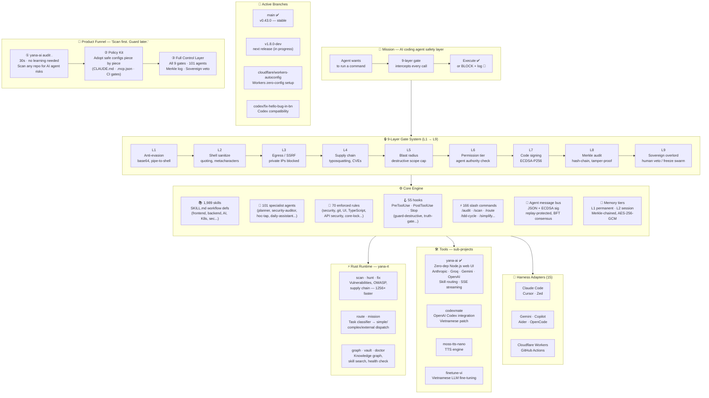

# Architecture reference

Moved from the main README (2026-07-05) so the top-level pitch stays short.
Content unchanged from the version that lived in `README.md`.

## Yana AI at a Glance

```
┌──────────────────────────────────────────────────────────────────┐
│                     Yana AI v0.43.0                        │
│      "The orchestration layer between humans and AI —            │
│        routing, safety, and context for every domain."           │
│                                                                  │
│        Built by Vũ Văn Tâm · 17 · Vietnam                       │
└──────────────────────────────────────────────────────────────────┘
```



> **Reading the diagram:** every AI tool call flows `MISSION → GATES → CORE`. The Rust runtime (`yana-rt`) accelerates the scanner. Sub-project tools (yana-web etc.) use the same gate system. Branches show active development fronts.

## How it works

```
Agent wants to run a command
         ↓
[L1] Anti-evasion scan       — blocks base64 decode+exec, pipe-to-shell
[L2] Shell sanitization      — quotes all variables, strips metacharacters
[L3] Egress check            — blocks SSRF, private IP ranges, metadata endpoints
[L4] Supply chain gate       — vets every package install (typosquatting, CVEs)
[L5] Blast radius check      — caps destructive scope
[L6] Permission tier check   — verifies agent authority level
[L7] Signature verification  — ECDSA-P256 on generated code
[L8] Merkle audit log        — append-only, tamper-detected hash chain
[L9] Sovereign overlord gate — human veto, freeze swarm, full rollback
         ↓
Execute (or block + log)
```

## Numbers

| | |
|---|---|
| 🧩 Skills | **1,989** workflow skill definitions |
| 🤖 Agents | **101** specialist agents |
| 📜 Safety rules | **70** enforced rules |
| 🪝 Hooks | **55** pre/post-execution hooks |
| ⚡ Slash commands | **166** |
| 🔌 Harness adapters | **15** (Claude Code, Cursor, Windsurf, Antigravity, Kiro, OpenCode, Zed, Gemini, Copilot, Aider...) |
| 🦀 Rust subcommands | **23** (`scan`, `graph`, `vault`, `route`, `mission`, `hunt`, `fix`, `doctor`...) |
| ✅ Rule checks in CI | **826** |
| 📦 Total codebase | **8,438 files** |

## Safety architecture

```
core/
├── hooks/          # 55 PreToolUse / PostToolUse / Stop hooks
├── rules/          # 70 enforced rules (security, correctness, UI, git)
├── scripts/        # safe-run.sh, verify-core-lock.sh, secure-logger.sh
├── gates/          # truth_gate.md, action_gate.md
├── agents/         # 101 specialist agent definitions
├── skills/         # 1,989 SKILL.md files
├── config/
│   ├── core-lock.json    # SHA-256 manifest — 239 core files pinned
│   └── skills-lock.json  # skill content hashes
└── memory/
    ├── L1_atomic/  # permanent facts — persist across sessions
    └── L2_session/ # session state — auto-expires
```

Key properties:
- **Merkle audit chain** — every action logged, tamper-detected
- **Core-lock integrity** — SHA-256 manifest detects drift, deletion, and rule injection in core/
- **BFT consensus** — 3-of-N vote required for core infrastructure writes
- **Sovereign overlord** — human can freeze all 101 agents instantly
- **Honeypot layer** — decoy files/env vars catch compromised agents
