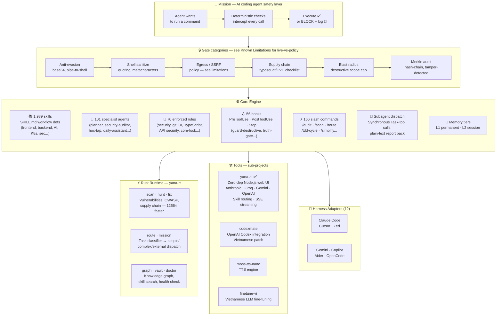

# Architecture reference

Moved from the main README (2026-07-05) so the top-level pitch stays short.
Updated 2026-07-07 to drop mermaid diagram nodes and bullets that described
mechanisms since confirmed fictional (BFT vote counting, a message bus with
replay protection, a "freeze all agents" command, an unverified honeypot
claim) — see `agent-communication-policy.md`, `54-bft-consensus-law.md`, and
`62-sovereign-overlord-gate-law.md`'s own "what this rule used to say"
sections for the full accounting of what was never real.

## Yana AI at a Glance

```
┌──────────────────────────────────────────────────────────────────┐
│                     Yana AI v0.43.1                        │
│         "A safety firewall between your AI coding             │
│                agent and your shell."                           │
│                                                                  │
│        Built by Vũ Văn Tâm · 17 · Vietnam                       │
└──────────────────────────────────────────────────────────────────┘
```



> **Reading the diagram:** every AI tool call flows `MISSION → GATES → CORE`. The Rust runtime (`yana-rt`) accelerates the scanner. Sub-project tools (yana-web etc.) use the same gate system. See [Known Limitations](known-limitations.md) for which gate categories are live, wired hooks today versus documented policy an agent applies by convention.

## How it works

```
Agent wants to run a command
         ↓
Anti-evasion scan      — blocks base64 decode+exec, pipe-to-shell interpreters
Shell sanitization     — quotes all variables, strips shell metacharacters
Egress / SSRF policy   — blocks known metadata endpoints, private IP ranges
Supply-chain vetting   — typosquat/CVE checklist before package installs
Blast-radius cap       — caps how many files/what scope a destructive command can touch
Merkle audit log       — every allowed AND blocked action logged, tamper-detected
Human gate             — irreversible actions (push, publish, delete) require explicit confirmation
         ↓
Execute (or block + log)
```

See [Known Limitations](known-limitations.md) for exactly which of these are live, wired hooks today versus documented policy, verified directly against the code rather than the docs describing it.

## Numbers

| | |
|---|---|
| 🧩 Skills | **1,989** workflow skill definitions |
| 🤖 Agents | **101** specialist agents |
| 📜 Safety rules | **70** enforced rules |
| 🪝 Hooks | **56** pre/post-execution hooks |
| ⚡ Slash commands | **166** |
| 🔧 Scripts | **107** |
| 🔌 Harness adapters | **12** (Claude Code, Cursor, Windsurf, Antigravity, Kiro, OpenCode, Zed, Gemini, Copilot, Aider...) |
| 🦀 Rust subcommands | **23** (`scan`, `graph`, `vault`, `route`, `mission`, `hunt`, `fix`, `doctor`...) |
| ✅ Rule checks in CI | **826** |

## Safety architecture

```
core/
├── hooks/          # 56 PreToolUse / PostToolUse / Stop hooks
├── rules/          # 70 enforced rules (security, correctness, UI, git)
├── scripts/        # safe-run.sh, verify-core-lock.sh, secure-logger.sh
├── gates/          # truth_gate.md, action_gate.md
├── agents/         # 101 specialist agent definitions
├── skills/         # 1,989 SKILL.md files
├── config/
│   ├── core-lock.json    # SHA-256 manifest — 240 core files pinned
│   └── skills-lock.json  # skill content hashes
└── memory/
    ├── L1_atomic/  # permanent facts — persist across sessions
    └── L2_session/ # session state — auto-expires
```

Key properties, verified against the actual code, not just the docs describing it:
- **Merkle audit chain** — every action logged as a hash-chained JSONL entry; tampering with an existing line is detectable by recomputing the chain (`verify-audit-chain.sh`)
- **Core-lock integrity** — a SHA-256 manifest (`core-lock.json`) detects drift, deletion, and unreviewed file injection in `core/rules`, `core/hooks`, `core/gates`, `core/scripts`
- **Reviewed infrastructure writes** — before a change lands in `core/rules/**`, `core/hooks/**`, `core/gates/**`, or `core/agents/**`, two independent reviewer agents (security-auditor plus a paired reviewer) are dispatched; a Safety-severity finding from either blocks the write until a human resolves it
- **Human gate** — irreversible actions (force-push, publish, deploy, delete) require an explicit human confirmation in the current session, not a standing approval
